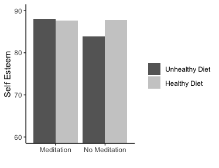

# Instructions

- You will again make your own RMarkdown file. It must knit to a HTML file. And it must look pretty enough that Shelly, the AIs, and your peer review buddy can easily read your responses and your code.

- This HW assignment is about interpreting findings! There is no math to be done. Hooray!

- Please turn in both documents (the .Rmd and the .html) to the **ASSIGNMENTS** page *and* the **PEER REVIEW DISCUSSION** on Canvas.

Good luck!

## Use the following prompt and image to answer the questions below: 

Researchers were interested in factors that contribute to improved self-esteem. They specifically contrasted completing short meditation sessions versus no meditation sessions, as well as healthy and unhealthy diets. Participants completed all cells/conditions of the study. Here is the pattern of results they found:

 - What kind of research design is this? Be as specific as possible.
 
 - If researchers had 50 participants in each condition, how many total participants did they have in this study? (hint: no formula needed)
 
 - For every main effect(s) and interaction(s), write one sentence indicating what they found. Please describe the interaction(s) both ways. You can assume any difference is "real" or "significant". Be sure to be clear about what you're describing for each.
 
 - A colleague finds that this particular measure of self-esteem doesn't correlate with depression the way that the colleague thought it would. Do you still believe the results of the study presented above? Why or why not? Be specific!
 
 - Your colleague writes up the results of this experiment and states that the notable differences are significant. However, they also use language throughout the paper to make it seem as though the differences are extremely large. Should readers believe this? Why or why not? Be specific!
 
 - The scale of the self-esteem measure is from 0-100. Knowing this, do these results raise any red flags for you? Is there anything you might be concerned about that would change your interpretation of the results?

