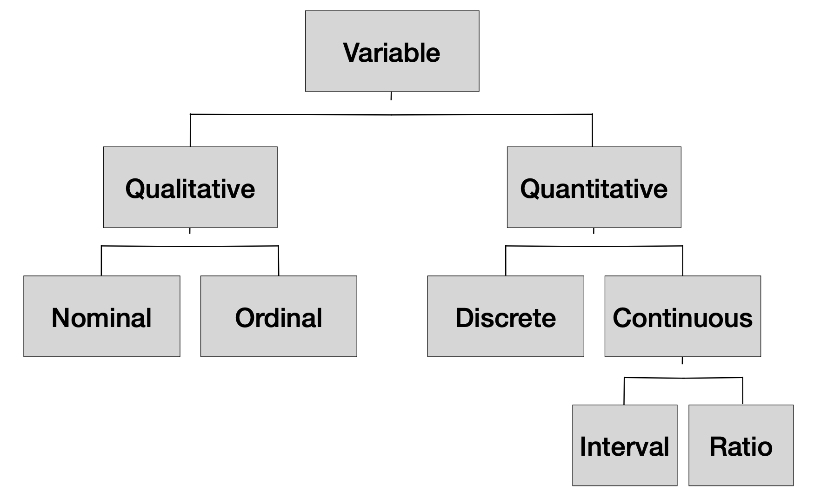
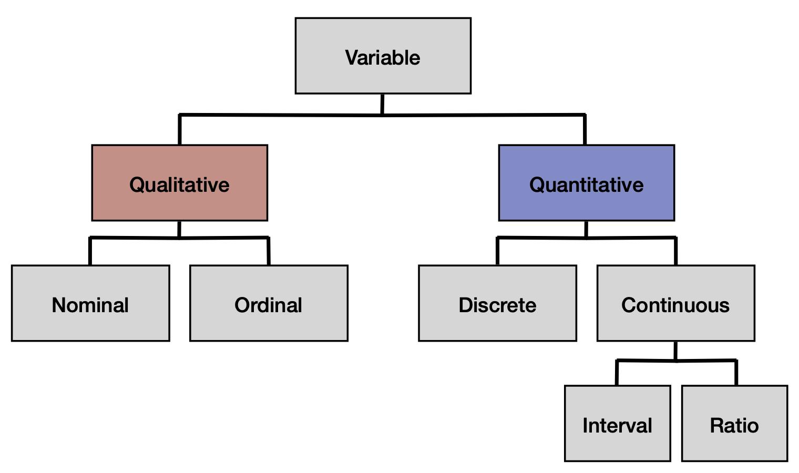
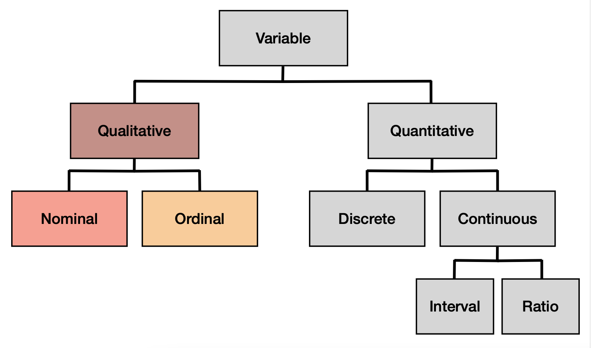
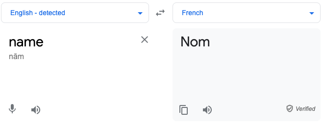
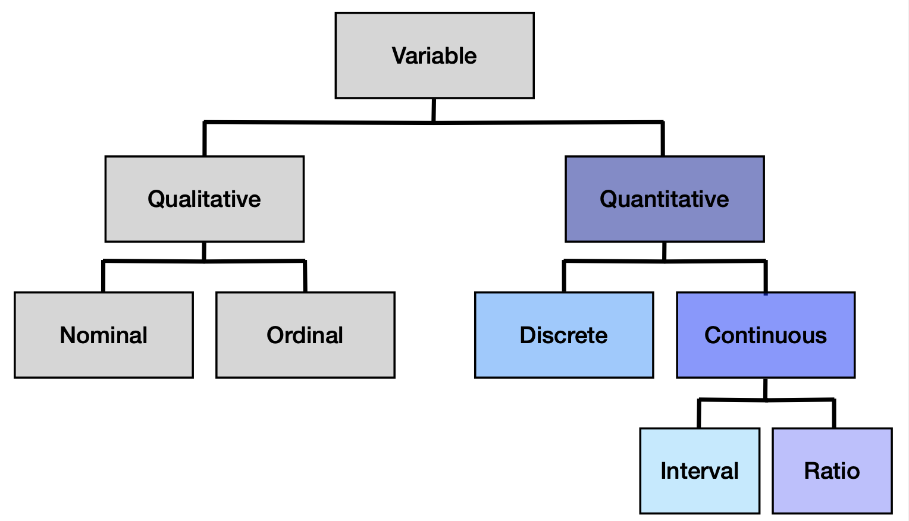
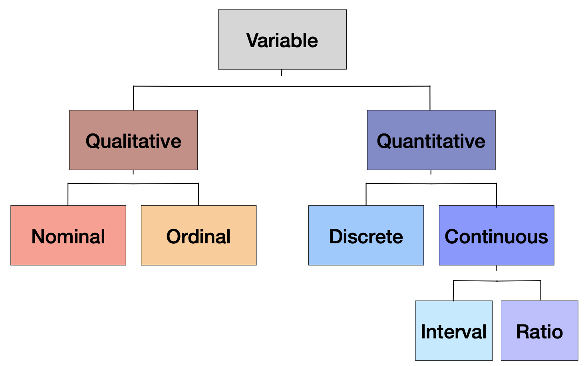

## Goals of this sequence

- Develop the basic quantitative skills necessary to be a research scientist
    - Not all the skills you will need (not the only courses you need)
    - Foundations of statistics, methods, and data science

- Contextualize those skills
    - Building a toolbox, not a cookbook
    - How can I use this? Under what circumstances? When should I not use this?
    
.small[ - Sequence
  - **5066**: Tools of statistics (distilling lots of data to interpretable numbers, sampling, hypothesis testing)
  - **5067**: Building models (how do translate our theory into testable relationships using the tools of 5066)
]
---

## Goals of this course

  - Conceptualize __statistics__ as a method for specifying and testing a model of how the world works
  
  - Execute and understand of the use and limitations of null hypothesis significance testing
  
  - Summarize, test, and display data using `R`
  
  - *Ideally* everyone will learn at least one thing they can use in their research this term.

---

## Challenges

Many basic statistical tests were developed a century ago. Your goal should not be to just do the test. It should be to understand what the test does, why you might want to use it, and how you can avoid abusing it

--

I'm a Psychologist and Neuroscientist. This class is in the Psychology department. It's goal is to train the next generation of Psychologists. Examples will primarily be in Psychology (occasionally some pop culture for funzies). 
---

## Setting Expectations

My job is to balance theory and application. Everyone is coming here with *extremely* different backgrounds. The course evals are always...mixed. 

--

**too fast?** - COME TALK TO ME. Also, spend lots of time outside of class; learning takes time.

--

**too slow?** - COME TALK TO ME. There are lots of extensions to these concepts. I can give you extra readings, point you in interesting directions, or provide resources for improving your `R` code

---

## Important Links

[Class Website](https://shellyc26.github.io/psy5066/index.html) -- syllabus, lecture slides, homeworks etc. 

[Slack Workspace](https://quant-i.slack.com/) -- here for answering questions, posting stats/`R` memes, building community

[Canvas](https://wustl.instructure.com/courses/94453) -- where you will turn in your homeworks, complete code reviews, and view your grades (including exam grades)

Data from class examples can be found on our [GitHub](https://github.com/shellyc26/psy5066) site in the `data` folder

[Learning Statistics with `R`](https://learningstatisticswithr.com/) -- textbook by Danielle Navarro

---

## Important Info

- **Most important information is on the slides**

- Readings serve to *supplement* and enhance

- Important equations will be presented in the slides

---

# Questions?

For the rest of today:
- Data Types
- (if time) Setting up your computer to play nicely using `RProjects`

---

## Kinds of statistics

- Descriptive (about the data)
- Inferential (about the world)

--

**Neither is more important than the other!!**

---

## Kinds of statistics

- Exploratory (I don't have a hypothesis or theory. I don't know what's going to happen)
- Confirmatory (If theory X is true, then the data I collect should look like Y)

--

**Neither is more important than the other!!**

.center[Exploratory ---------------------------------------- Confirmatory]

---

## Kinds of research

- Experimental (we introduce an intervention and look at the effects; researcher introduced assignment)
- Observational (we measure/survey our participants without trying to affect them; no researcher-introduced assignment)

--

Typically we pair some kinds of statistical tests with experimental work and other kinds of tests with observational work.

--

In reality, most statistical tests can be used with most kinds of research. It's not so much the kind of research that matters, but __which statistic helps to answer your question__ and __what types of variables do you have?__

- We'll discuss the first point throughout the course
- Let's discuss variables now

---
class: center

## Scales of measurement (Data types)

---
## Qualitative vs. Quantitative

.pull-left[
**Qualitative**:

- aka categorical, factors
- "not numeric", as in numbers serve as labels, not as things to add or subtract
]

--

.pull-right[
**Quantitative**:

- reflects magnitude
- values are actually numbers you can add/subtract
]

---
## Qualitative Variables
#### Nominal vs. Ordinal

.pull-left[
**Nominal**:

- Response options are groups
- There is no order
- Example -- What are different kinds of fruit?
    - apples: 1
    - blackberries: 2
    - coconut: 3
]

.pull-right[

]
---

## Qualitative Variables
#### Nominal vs. Ordinal

.pull-left[
**Nominal**:

- Response options are groups
- There is no order
- Example -- What are different kinds of fruit?
    - apples: 3
    - blackberries: 1
    - coconut: 2
]

.pull-right[

]

---

## Qualitative Variables
#### Nominal vs. Ordinal

.pull-left[
**Nominal**:

- Response options are groups
- There is no order
- Example -- What are different kinds of fruit?
    - apples: 312
    - blackberries: 19
    - coconut: 999
]

.pull-right[

]

---

## Qualitative Variables
#### Nominal vs. Ordinal

.pull-left[
**Nominal**:

- Response options are groups
- There is no order
- Example -- What are different kinds of fruit?
    - apples: 1
    - blackberries: 2
    - coconut: 3
]

.pull-right[
**Ordinal**:

- Response options are *ordered*
- No consistent distance between possible scores
- Example -- List the following fruits in order of preference
    - apples: 2
    - blackberries: 1
    - coconuts: 3
]

---

## Quantitative Variables
#### Discrete vs. Continuous

.pull-left[
**Discrete**:

- Takes numeric values that are countable
- Must be finite number of possibilities
- Examples
    - Number of children/family
    - Number of students/class
- Often confused with categorical; context matters

]

--

.pull-right[
**Continuous**

- Takes numeric values that are not necessarily countable
- Infinite number of possibilities
- Examples
    - Age
    - Height/weight
- AKA "scale" variables
]

---
## Quantitative Variables
#### Continuous

.pull-left[
**Interval**:

- Responses are ordered (like ordinal)
- Distance between responses is the same (unlike ordinal)
- No meaningful 0
- Examples
    - temp in Farenheit
- In my experience, not as common unless you treat Likert scale as interval (though it is technically ordinal)

]

--

.pull-right[
**Ratio**

- Same as interval, but now with a meaningful 0
- 0 indicates the absence of something
- Example
    - How many words did you recall on a memory test?
    - 0 words recalled is meaningful!

]

---

class: center

## Pitfalls?

---
## Pitfalls

Confusing Nominal and Ordinal
  - lose information about order you might want
  - or maybe you don't care and it doesn't matter

--

Confusing Interval and Ratio
  - lots of stats are interpreted in regards to 0
  - if there is no meaningful 0, how do you interpret?

--

Confusing Qualitative and Quantitative
  - happens more than you think; esp in the machine learning world
  - can straight up get the wrong numbers (will come back to this with correlation!)
  
---

class: inverse 

## Next time

Describing data

Remainder of class (if time)...`Rprojects`
