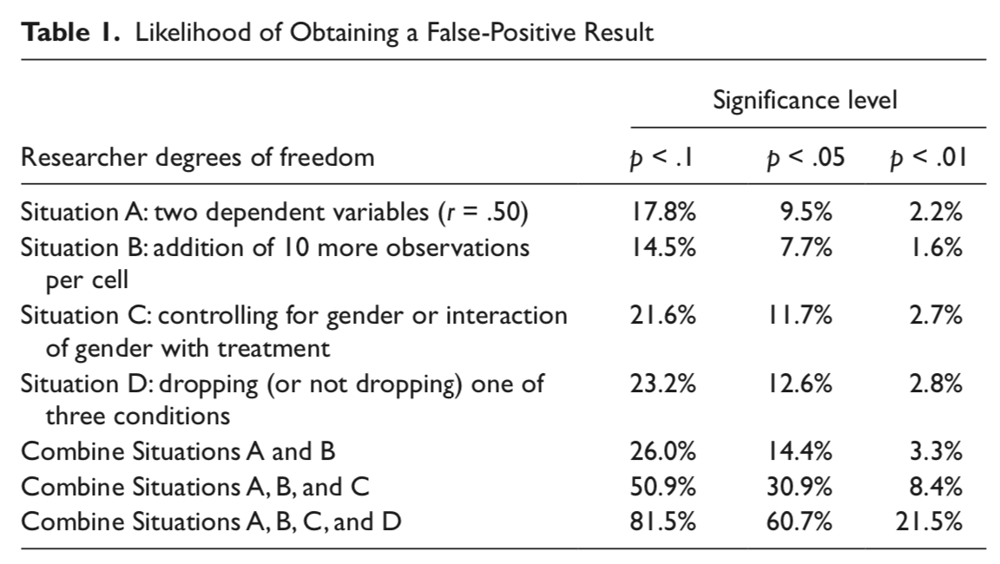
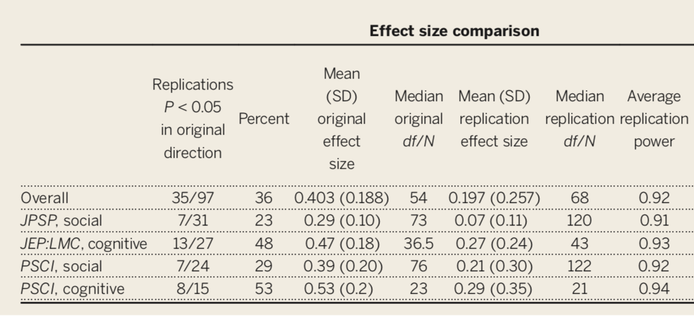
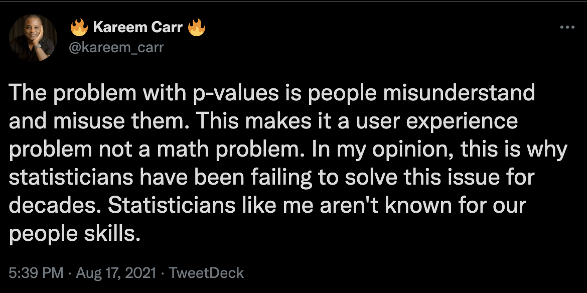

## Improve your R skills with R-Ladies STL
[R-Ladies STL](https://twitter.com/RLadiesSTL) aims to promote gender diversity in the R community -- everyone is welcome!
 
Events:

- [Wrangling Data in the Tidyverse](https://www.meetup.com/rladies-st-louis/events/288192284/) **10/4 6-8pm**

- [Intro to Iteration](https://www.meetup.com/rladies-st-louis/events/288178187/) **10/11 6-8pm**

- [Clinical Reorting with {gtsummary}](https://www.meetup.com/rladies-st-louis/events/287992151/) **10/17 6-8pm**

- [Intro to Quarto](https://www.meetup.com/rladies-st-louis/events/288256892/) **10/27 6-8pm**

---

## Previously

- Null hypothesis significance testing

- Type I and Type II errors

- Power

---

## Where does that leave us?

- What kind of science has NHST produced?

- The replication crisis

- What the future holds

---
## Critiques of NHST

Many will describe the current "replication crisis" or "reproducibility crisis" or "open science movement" as tracing its beginnings to 2011, mostly due to:

- [Bem. (2011). Feeling the future.](../readings/Bem_2011.pdf) 
- [Simmons, Nelson, & Simonsohn. (2011). False-positive psychology. ](../readings/Simmons_etal_2011.pdf)

But the reality is that NHST has always had its critics. And it's not for lack of eloquence that they have been ignored...

---

class:center, middle

>"The textbooks are wrong. The teaching is wrong. The seminar you just attended is wrong. The most prestigious journal in your scientific field is wrong." – Ziliak and McCloskey (2008)

---

class:center, middle

>"... surely the most bone-headedly misguided procedure ever institutionalized in the rote training of science students" – Rozeboom (1997)

---

class:center, middle

> "Statistical significance testing retards the growth of scientific knowledge; it never makes a positive contribution" – Schmidt and Hunter (1997)

---

class:center, middle

> "What's wrong with [NHST]? Well, among many other things, it does not tell us what we want to know, and we so much want to know what we want to know that, out of desperation, we nevertheless believe that it does!" – Cohen (1994)

---

class:center, middle
> “… an instance of a kind of essential mindlessness in the conduct of research" – Bakan (1966)

---

class:center, middle

>"… despite the awesome pre-eminence this method has attained in our journals and textbooks of applied statistics, it is based upon a fundamental misunderstanding of the nature of rational inference, and is seldom if ever appropriate to the aims of scientific research" – Rozeboom (1960)

---

## What kind of mess have we gotten ourselves into?

- $p < .05$ as a condition for publication

- Publication as a condition for tenure

- Novelty as a condition for publication in top-tier journals

- Institutionalization of NHST

- High public interest in psychological research

- Unavoidable role of human motives: fame, recognition, ego

---

## What kind of science have we produced?

- $p < .05$ as a primary goal

- Publication bias: “Successes” are published, “failures” end up in file drawers

- Overestimation of effect size in published work

- Underestimation of complexity (why did the failures occur?)

- Underestimation of power

- Inability to replicate

- Settling for vague alternative hypotheses: “We expect a difference”

???

Ask students to define replication

---

## What kind of science have we produced?

- Dichotomous thinking (based on $p$ ): research either “succeeds” or “fails” to find the expected difference

- No motivation to pursue failures to reject the null

- Harvesting (mostly) the low-hanging fruit in science to publish quickly and often.

- Weak theory
  - Low precision (“differences” are enough)
  - No non-nil null hypotheses
  - Weak, slow progress as a science
  - [see paper/tweet by Eiko Fried](https://twitter.com/EikoFried/status/1289181554737065985)

---
## Focusing on $p$ -values

Imagine rolling a die. 

- What’s the probability you roll a 2?
    - $P(2) = 1/6 = 16.7\%$

- If you roll the die twice, what’s the probability that you get a 2 at least once? $30.6\%$

- If you roll the die 5 times, what’s the probability that you get a 2 at least once? $59.8\%$
  
Roll the die enough times, and you'll get a 2 eventually. Significance testing when the null is true is like rolling a 20-sided die. 

---

## False Positive Psychology

[Simmons et al. (2011)](../readings/Simmons_etal_2011.pdf) pointed out that each study is not a single roll of the die.

Instead, each study, even those with a single statistical test, might represent many rolls of the die. 

- **Researcher degrees of freedom:** Decisions that a researcher makes that change the statistical test. 
  - Examples:
      - Additional dependent variabiles
      - Tests with and without covariates
      - Data peeking (testing effect as data comes in and stopping when result is significant)

---

Each time we see how a decision affected our result, we are rolling the dice again. 

???

from Simmons et al: The table reports the percentage of 15,000 simulated samples in which at least one of a set of analyses was significant. Observations were drawn independently from a normal distribution. Baseline is a two-condition design with 20 observations per cell. Results for Situation A were obtained by conducting three t tests, one on each of two dependent variables and a third on the average of these two variables. Results for Situation B were obtained by conducting one t test after collecting 20 observations per cell and another after collecting an additional 10 observations per cell. Results for Situation C were obtained by conducting a t test, an analysis of covariance with a gender main effect, and an analysis of covariance with a gender interaction (each observation was assigned a 50% probability of being female). We report a significant effect if the effect of condition was significant in any of these analyses or if the Gender × Condition interaction was significant. Results for Situation D were obtained by conducting t tests for each of the three possible pairings of conditions and an ordinary least squares regression for the linear trend of all three conditions (coding: low = –1, medium = 0, high = 1).

---

## Questionable Research Practices (QRPs)

.pull-left[

- ** $p$-hacking**
- HARKing
- cherry picking
- fishing
- data dredging
]

.pull-right[
Collecting data or analyzing your data in different ways until non-significant results become significant.

Prior to 2011, this was common practice. In fact, it was often taught as best practices.

  - "Explore your data."
  - "Understand your data."
  - "Test sensitivity..."
  
What's wrong with this? 

]

???
We should recognize now that this inflates Type I error. 
---
## Questionable Research Practices (QRPs)

.pull-left[

- $p$-hacking
- **HARKing**
- cherry picking
- fishing
- data dredging

]

.pull-right[
*H*ypothesizing *A*fter the *R*esults are *K*nown

You analyze data and find a significant result (might be unexpected), and post-hoc come up with a hypothesis. Importantly, you then *report* the findings as though this has been the case all along.

What's wrong with this? 
]

???
it's fine to get lucky and notice something weird. but present it as exploratory! the null is so damn specific... could be a chance finding!

---
## Questionable Research Practices (QRPs)

.pull-left[

- $p$-hacking
- HARKing
- **cherry picking**
- fishing
- data dredging

]

.pull-right[
Select/report only data/findings that support your hypothesis. If your data/findings do not support it, you hide it away in the "file drawer"

What's wrong with this? 
]

???
over-inflated effect sizes in the literature. we might believe it when in fact we shouldn't

---
## Questionable Research Practices (QRPs)

.pull-left[

- $p$-hacking
- HARKing
- cherry picking
- **fishing**
- data dredging

]

.pull-right[

Look at a ton of different combinations of variables to find something significant.

What's wrong with this?

]

???
the large number of statistical tests leads to a high risk of false positive findings.

---
## Questionable Research Practices (QRPs)

.pull-left[

- $p$-hacking
- HARKing
- cherry picking
- fishing
- **data dredging**

]

.pull-right[

Takes fishing to an extreme, but usually more synonymous with "data mining". Usually no hypothesis in mind. Just go crazy in some database or "big data" set, looking for things that pop up as significant. 

What's wrong with this?

]

???
the large number of statistical tests leads to a high risk of false positive findings. it's ok to data mine. just be careful and present it as such!

---

## Where we're at

The publication of False Positive Psychology, following the claim by [Ioannidis (2005)](../readings/Ioannidis_2005.pdf) that as many as half of published findings are false prompted researchers to take a second look at the "knowns" in our literatures. 

If we can demonstrate these "known" effects, then we're ok. Our effects are most likely true. 

--

And if that had happened, we probably wouldn't have two lectures in this class dedicated to problems with NHST and how to address them.

---

## Just repeat your experiment...

The *inability* to replicate published research has been viewed as especially troubling. 

- This has been a long-standing concern, but the poster child is undoubtedly ["Estimating the reproducibility of psychological science"](../readings/OSC_2015.pdf) by the Open Science Collaboration (Science, 2015, 349, 943).

---

Only 36% of the studies were replicated, despite high power and claimed fidelity of the methods.

---

## Why is it so hard to replicate?

- Poor understanding of context necessary to produce most effects
    - We do not recognize the boundary conditions of effects especially when the limiting conditions are kept constant

- Incomplete communication of the necessary conditions
    - Akin to reading just the first few ingredients for a recipe and then trying to duplicate the dish.

---
class: inverse, center, middle

# Have you ever tried to replicate a study?

---
## Why is it so hard to replicate?

Sparse communication fosters belief by others that effects are simpler and easier to produce than they really are.

The reality is that key elements have been left out:

- specific methodological or analytic details

- and the tests run before and after the ones that were published.

---

## Calls for change have included:

- Effect size estimates and CI but not $p$

- Require exact replication attempts as a condition of publication and funding.

- Require pre-registration.

- Publish everything and let meta-analysis sort it out.

---

## What kind of challenges will need to be addressed?

- Institutionalization of CI and ES but not $p$

- Journals must change their values

- How do we shift media values? Replication is not “sexy.”

- How do we shift academic values? What will be the impact on tenure? How do we re-calibrate “productivity?”  Citation indices?

---

## Is Psych bullshit?
The inability to replicate much work has been viewed as a singular failure of psychology as a science.

- But is that the best way to view it?

As data, the replication crisis, it is potentially quite informative and suggests some importance features of psychology as a science.

At a minimum, it tells us we don’t understand a phenomenon as well as we think we do.  That is hardly a failure of science, unless we don’t take the next steps to resolve our ignorance.

---
## Can science progress?

Failures to replicate are surprising, even troubling. We think of them as unfortunate occurrences. Bad luck even.  But should they be viewed that way?  

Surprises in science have a long history of playing a key role in scientific progress.   

---
class: center, middle

What can (or should) failures to replicate tell us? 

> A good laboratory, like a good bank or corporation or government, has to run like a computer. Almost everything is done flawlessly, by the book, and all the numbers add up to the predicted sums. The days go by. And then, if it is a lucky day, and a lucky laboratory, somebody makes a mistake . . . something is obviously screwed up, and then the action can begin. The next step is the crucial one. If the investigator can bring himself to say, "But even so, look at that!" then the new finding, whatever it is, is ready for the snatching. What is needed for progress to be made, is the move based on the error . . . The capacity to leap across mountains of information to land lightly on the wrong side represents the highest of human endowments.	--Lewis Thomas (1974) *The Medusa and the Snail*

---
class: center, middle

A failure to replicate should be viewed as particularly interesting.

> It is time to insist that science does not progress by carefully designed steps called "experiments" each of which has a well-defined beginning and end. Science is a continuous and often disorderly and accidental process. A first principle not formally recognized by scientific methodologists: when you run onto something interesting, drop everything else and study it. --B. F. Skinner (1968) *A case history in scientific method*

---

class: middle, center

>The ability not only to look straight at what you want to see, but also to watch continually, through the corner of your eye, for the unexpected. I believe this to be one of the greatest gifts a scientist can have. Usually, we concentrate so much upon what we intend to examine that other things cannot reach our consciousness, even if they are far more important. This is particularly true of things so different from the commonplace that they seem improbable. Yet, only the improbable is really worthy of our attention! If the unexpected is nevertheless found to be true, the observation usually represents a great step forward. --Hans Selye (1964) *From Dream to Discovery*

---
class: middle, center

> “The most exciting phrase to hear in science, the one that heralds new discoveries, is not ‘Eureka!’, but ‘That’s funny...” -Isaac Asimov

---
class: center, middle

> [Science] needs a better word for "error" . . . Or maybe "error" will do after all, when you remember that it came from an old root meaning to wander about, looking for something. -Lewis Thomas

---

## Wrapping Up

- You can't solve all jobs with a wrench

--

- NHST is just one of the tools in your toolbelt. 

- Effect sizes, confidence intervals, replications are all also tools to help give us a clearer picture.

--

---
class: inverse

## Next time...

Open Science (and methods for improving your inference)

If time, R stuff!

