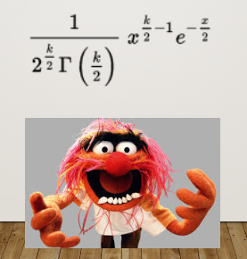

## Chi-Square Distribution

The **chi-square** ( $\chi^2$ ) distribution is very unique in that we really only have one parameter, $k$

- mean = $k$
- variance = $2k$

---

```{r, echo = FALSE, fig.width = 7, warning = FALSE, message = FALSE}
ggplot(data.frame(x = seq(0, 50)), aes(x)) +
  stat_function(fun = function(x) dchisq(x, df = 1), 
                aes(color = "k=1")) +
    stat_function(fun = function(x) dchisq(x, df = 2), 
                aes(color = "k=2")) +
    stat_function(fun = function(x) dchisq(x, df = 3), 
                aes(color = "k=3")) +
    stat_function(fun = function(x) dchisq(x, df = 4), 
                aes(color = "k=4")) +
    stat_function(fun = function(x) dchisq(x, df = 6), 
                aes(color = "k=6")) +
    stat_function(fun = function(x) dchisq(x, df = 9), 
                aes(color = "k=9")) +
    stat_function(fun = function(x) dchisq(x, df = 25), 
                aes(color = "k=25")) +
  scale_x_continuous("Variable X") +
  scale_y_continuous("Density") +
  ggtitle("The Chi-Square Distribution") +
  theme_classic()
```

---
## What kind of crazy function would lead to a distribution like this?!?!!



---
class: inverse, center, middle

## If a tree falls in the forest, and no one is around, does it make a sound?

---

## Trees Example

Let's say a total of 110 trees have fallen. We might *expect* that half of those trees make a sound and half of them don't.
  - 55 trees fall and do make a sound
  - 55 trees fall and do not make a sound

---

## Trees Example

We expect 55 trees to fall per category (sound and no sound). However, our data show that 10 fell and made a sound whereas 100 fell and did not make a sound.

--

This let's build a table that shows us what we have:

```{r}
trees = data.frame(TreesFallen = c(10, 100),
                   Expected = c(55, 55))
rownames(trees) = c("Registered Noise", "No Registered Noise")

trees
```

---

## Trees Example

```{r, echo = FALSE}
trees
```


$$ \chi^2_P = \Sigma\frac{(\text{observed frequency} - \text{expected frequency})^2}{\text{expected frequency}}$$
---

## Trees Example

```{r, echo = FALSE}
trees
```

Step 1: Get the ratio across rows:

$\frac{(10-55)^2}{55}$
$\frac{(100-55)^2}{55}$

.code-small[
```{r}
noise <- ((10-55)^2)/55
noise

noNoise <- ((100-55)^2)/55
noNoise
```
]
---
## Trees Example

Step 2: Sum these up

.code-small[
```{r}
noise + noNoise
```
]

---
## Trees Example

Step 3: Determine Degrees of Freedom

df = $(r-1)(c-1)$

df = $(2-1)(2-1)$

df = 1

---

## Trees Example

.left-column[
.small[
$\chi^2(1) = 73.636$
]
]

```{r, echo=FALSE}
ggplot(data.frame(x = seq(0, 100)), aes(x)) +
  stat_function(fun = function(x) dchisq(x, df = 1), 
                color = "black", linetype = "dashed") +
  scale_x_continuous("Variable X") +
  scale_y_continuous("Density") +
  geom_vline(aes(xintercept = 73.636), color = "red", size = 3) +
  ggtitle("Trees Example") +
  theme_classic()
```

---
## What did we learn?

The $\chi^2$ distribution gives us the probability to find the data (or those more extreme) given a theory (expected values)

--

Comparing that against some threshold for determining whether that probability is within the range of expectations or not

```{r}
pchisq(q = 73.636, df = 1, lower.tail = FALSE)
```

--

Our caclulation, like with the z-score, reflects our value minus some expectation, to understand how far away it is from that expectation.

---
## When to use?
- Classes of observations
- Non-continuous data

???
The normal is no longer useful if you have noncontinuous data

---
## Assumptions

- Each observation is in only one category
- Observations are independent
- N is large (or expected N is large)
  - 2 groups greater than 10 per group
  - More than 2 groups greater than 5 per group
  
---
## Remember Independence? 

$$p(A)p(B) = p(A\cap B)$$
---
## Let's expand... Tests of Association (or Independence)

- aka Pearson Chi-square test
- Developed to see how close we are to the estimated distribution
  - nominal data (ordinal and greater we can use corelations)
  
---
## Same Old Same
- If we are interested in knowing whether X is contingent (or dependent) upon Y, or whether X and Y are **independent**, we're going to need a bigger table.
- And we need to calculate our expected frequencies differently, where...
- Expected value = $R_iC_j/N$

---
class: inverse

Is attrition on a longitudinal study related to educational attainment?

???
People seem to be dropping out of your study. You hope that they drop out at random. But you're concerned that the people dropping out do so in a way that seems to be related to education levels. Maybe you think that the less educated a participant is, the more likely it is that they drop out of the study. 

---
## Attrition Example

Our data...

```{r,echo=FALSE}
att = data.frame(StayedIn = c(20, 25, 30),
                 DroppedOut = c(20, 15, 10))

row.names(att) = c("Failed to complete high school",
                   "High school degree",
                   "College degree")

att
```

---

## Attrition Example

```{r, echo=FALSE}
att
```

It's the same general formula, but we need to calculate our expected values a little differently...
$$ \chi^2_P = \Sigma\frac{(\text{observed frequency} - \text{expected frequency})^2}{\text{expected frequency}}$$

$$\text{Expected Value} = R_iC_j/N$$
---
## Attrition Example

The OG Data

```{r,echo=FALSE}
att = data.frame(StayedIn = c(20, 25, 30),
                 DroppedOut = c(20, 15, 10))

row.names(att) = c("Failed to complete high school",
                   "High school degree",
                   "College degree")

att
```


--

The Expected Value Calculations

```{r,echo=FALSE}
att2 = data.frame(StayedIn = c("40*75/120", "40*75/120", "40*75/120"),
                 DroppedOut = c("40*45/120", "40*45/120", "40*45/120"))

row.names(att2) = c("Failed to complete high school",
                   "High school degree",
                   "College degree")

att2
```

Expected frequency for staying in = 25

Expected frequency for dropping out = 15
---

## Attrition Example

Plug this in for "expected frequencies"
```{r,echo=FALSE}
att3 = data.frame(StayedIn = c("(20-25)^2/25", "(25-25)^2/25", "(30-25)^2/25"),
                 DroppedOut = c("(20-15)^2/15", "(15-15)^2/15", "(10-15)^2/15"))

row.names(att3) = c("Failed to complete high school",
                   "High school degree",
                   "College degree")

att3
```

--

So we get...

```{r,echo=FALSE}
att4 = data.frame(StayedIn = c(1, 0, 1),
                 DroppedOut = c(1.666667, 0, 1.666667))

row.names(att4) = c("Failed to complete high school",
                   "High school degree",
                   "College degree")

att4
```

--

Sum them up:
```{r}
1 + 0 + 1 + 1.666667 + 0 + 1.666667
```

---
## Attrition Example

$\chi^2(?) = 5.33$

--

What is our degrees of freedom?

- $df = (r-1)(c-1)$
- $df = (3-1)(2-1)$
- $df = 2*1$
- $df = 2$

--

$\chi^2(2) = 5.33$

```{r}
pchisq(5.33, df = 2, lower.tail = FALSE)
```


---
## What's up with these df?

We have 3 constraints:

- The cell frequenies must sum to the overall sample size
- The row totals must sum to the overall sample size
- The column totals must sum to the overall sample size

---

## Assumptions

Independent observations

Each obseravation is in one and only one category

N is large (usually taken to mean that expected N is at least 5 in each cell)

---

## Effect Sizes for Chi-Square

**Odds Ratio**
OR = number experiencing event divided by number who did not experience event.

```{r, echo=FALSE}
att
```

- $p(\text{Dropped Out} | <\text{high school}) = 20/40$
- $p(\text{Dropped Out} | \text{high school}) = 15/40$


???
We're going ACROSS THE ROWS to get the denominator

---

## Odds Ratio
OR = number experiencing event divided by number who did not experience event.

- Odds(Dropped Out | < High School = 20/40 = .5
- Odds(Dropped Out | High School = 15/40 = .375

--

- Odds Ratio = .5 / .375 = 1.33

*The odds of dropping out of the study rather than remaining in the study when they did not complete high school are 1.33 times the odds of dropping out if they completed high school, but not college*

---

## Rules of thumb

Cohen (1988) provided the following advice for interpreting odds ratios:

- 1.5 small
- 2.5 medium
- 4.3 large

---

## Phi Correlation

- Pearson correlation between two dichotomous variables is $\phi$
- This doesn't quite work with our attrition example, so let's look at another contingency table...

--

.small[
- Rosenstein & Horowitz (1996): Adolescent attachment and psychopathology
- Researchers were interested in whether attachment to mothers was associated with having a conduct disorder or affective disorder (clinical sample)
- Attachment:
  - Preoccupied: appear confused and entangled by attachment relationships
  - Dismissive: dismiss the importance or influence of attachment figure
- Disorder:
  - Conduct: persistent antisocial behavior that violates norms
  - Affective: major or recurrent depressive symptoms, mania, and/or mood disorders
]
---

## Attachment

```{r, echo=FALSE}
attachment = data.frame(AnyConduct = c(1, 3),
                        JustAffective = c(5,14))

row.names(attachment) = c("Dissmissive", "Preoccupied")

attachment
```

Practice:
- Work through the full chi-square test on your own time. You should get .003. See if you're right!
- Calculate the effect size (odds ratio). You can choose what you're calculating, but note that your interpretation will change!

---

## Phi Correlation

```{r, echo=FALSE}
attachment2 = data.frame(AnyConduct = c("1 (Cell 11)", "3 (Cell 21)"),
                        JustAffective = c("5 (Cell 12)", "14 (Cell 22)"))

row.names(attachment2) = c("Dissmissive", "Preoccupied")

attachment2
```

.small[
$$\phi = \frac{Cell_{11} Cell_{22} - Cell_{12} Cell_{21}}{\sqrt{(Cell_{11} + Cell_{12})(Cell_{21} + Cell_{22})(Cell_{11} + Cell_{21})(Cell_{12} + Cell_{22})}}$$
]
---
## Phi Correlation
.small[

$$\phi = \frac{Cell_{11} Cell_{22} - Cell_{12} Cell_{21}}{\sqrt{(Cell_{11} + Cell_{12})(Cell_{21} + Cell_{22})(Cell_{11} + Cell_{21})(Cell_{12} + Cell_{22})}}$$
]

$$\phi = \frac{(1*14) - (5*3)}{\sqrt{(1+5)(3+14)(1+3)(5+14)}}$$

$$\phi = .01$$

--

OR

$$\phi = \sqrt{\frac{\chi^2}{N}}$$

---
class: inverse

## Next time

Comparing means with all the $t$-tests