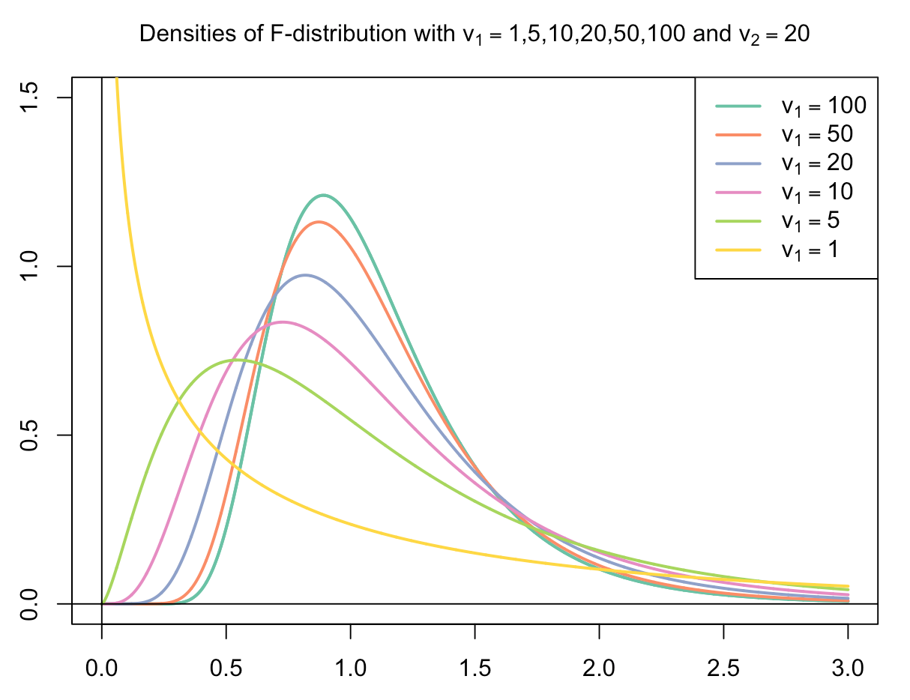

```{r packagesAndData, include=FALSE, warning=FALSE}
library(tidyverse)
library(ggpubr)
library(knitr)
colors = RColorBrewer::brewer.pal(4, "Set2")
```

## Announcements
- We will first grade Exam 2, then grade HW 3.

--

- I will post HW 4 by end of day on Wednesday. It is due 11/20

--

- Exam 3:
  - Heavily weighted to newer material
  - Older material covered would be things like, define a p-value, confidence intervals, and what types of tests would you use for different research questions. I will NOT make you re-calculate specific tests. 
  
--

- **Messi is teaching on Thursday 11/10**

---
## Recap

* We've compared a lot of means:

  - sample mean ( $\bar{x}$ ) to population mean ( $\mu$ ); paired or not paired
  - 2 sample means  ( $\bar{x_1}$ vs. $\bar{x_2}$ )

---

## This time

* $t$-tests through oneway ANOVA
* BUT, we're going to take a different approach...

--

**Model Comparisons**

---

name: one

## Scenario 1

**Gerrymandering**
- Depending on the estimate you pick, about 53% of voters in Wisconsin were Democrats in 2016. 
- So our best estimate of the percentage of voters that are Democrat in any *district* might be 53%
- Now that 2016 feels like a million years ago, you find that in actuality it was 52% of voters in Wisconsin were Democrats in 2016.
- *Question: Was our population estimate of 53% significantly different from our sample estimate of 52%?*

--

**one-sample $t$-test**

---

## Model Comparisons

In the normal **one-sample $t$-test**

  - $\bar{x} = \mu$
  - $H_0: \bar{x} - \mu = 0$
  - $H_A: \bar{x} - \mu \neq 0$

---
## Model Comparisons

Another way of thinking about it -- what does a model of the null hypothesis look like?

--

- If there is truly no difference between means (the null is true), then the best way to summarize the data is to use the population mean. Let's use that as our estimator. 

--

- If we use the population mean as our estimator, we can look at error or *residual*. The actual data points - estimator (a deviation score!). We want to do a good job of predicting. So we want this error to be as SMALL as possible!

--

- If there *is* a difference between means (the null should be rejected), then the best way of summarizing our data should be to use the sample mean.

--

- Our goal: which had the smallest prediction error?

---

## Model Comparisons

Let's break it down into **full** and **restricted** models:

- **Restricted Model:** reflects what we are testing *against*. 

--

- **Full Model:** allows us to fully include all information we might have.

--

- Size of the effect is calculated as the following: 

$$\frac{(E_r - E_f) / (df_r - df_f)}{E_f/df_f}$$

where:
  - $E_r$ is the error from the restricted model
  - $E_f$ is the error from the full model
  - $df_r$ is the degrees of freedom from the restricted model
  - $df_f$ is the degrees of freedom from the full model

---

## The Data

```{r}
dems <- data.frame(Dem = c(30, 69, 99, 77, 29, 37, 38, 37))
dems
```

---

## The Restricted Model
Step 1: Get the deviation scores. In the restricted model, we are subtracting from our population estimate of 53%. That is, 53% is our PREDICTION of the **restricted** model

```{r}
dems$deviationScores <- dems$Dem - 53
dems
```

---
## The Restricted Model
Step 2: Square the deviation scores

```{r}
dems$dev2 <- dems$deviationScores ^2
dems
```

---
## The Restricted Model
Step 3: Get the sum of the square deviation scores. This is our **ERROR** term. It is the squared errors. 

```{r}
Er <- sum(dems$dev2)
dems
Er
```

---
## The Restricted Model
Step 4: Determine the degrees of freedom. 

- Degrees of freedom deals with how much information is *free to vary*
- You get a feel for this the more you practice
- In this restricted model, there is nothing that we are "guessing" or estimating. So there is nothing to subtract. $df = n$, **df = 8**

```{r}
dfr <- 8
```

---

## The Full Model
Step 1: Get the deviation scores. In the full model, we are subtracting from our population estimate of 52%. That is, 52% is the PREDICTION of the **full** model.

```{r}
demsFull = dems %>% 
  select(Dem)

demsFull$deviationScores <- demsFull$Dem - 52
demsFull
```

---
## The Full Model
Step 2: Square the deviation scores

```{r}
demsFull$dev2 <- demsFull$deviationScores^2
demsFull
```

---
## The Full Model
Step 3: Get the sum of the square deviation scores. This is our **ERROR** term. It is the squared errors. 

```{r}
Ef <- sum(demsFull$dev2)
demsFull
Ef
```

---
## The Full Model
Step 4: Determine the degrees of freedom. 

- Degrees of freedom deals with how much information is *free to vary*
- You get a feel for this the more you practice
- In this full model, we are guessing/estimating our sample mean of 52. $df = n-1$, **df = 8 - 1 = 7**

```{r}
dff <- 7
```

---
## The Effect
$$\frac{(E_r - E_f) / (df_r - df_f)}{E_f/df_f}$$

```{r}
effect <- ((Er - Ef) / (dfr - dff)) / (Ef/dff)
effect
```

--

This is our $F$-statistic. $t^2 = F$. So to get our $t$-statistic, let's take the square root of our `effect`.

```{r}
tstat <- sqrt(effect)
round(x = tstat, digits = 3)
```

---
## Model Comparison Approach

Is `r round(x = tstat, digits = 3)` more extreme than our critical value? 

- For an $\alpha = .05$ in a two-tailed test with $df = 7$, the critical $t$ value is 2.3650. 

**Conclusion: No, it's not more extreme than the critical value. The weighted error term from the restricted model is smaller than the weighted error term from the full model -- 53 is a better estimator than 52. The means are not statistically significantly different**

---

## Model Comparison Approach

We just did a one-sample $t$-test! Let's verify our results:

```{r}
t.test(x = dems$Dem, mu = 53)
```

---
name: indep

## Scenario 2

- What if now we want to compare the difference in means (of % Democrats) between the 2010 election?
- *Question: are the means of % Democrats significantly different between 2010 and 2016?*

---

## The Data


```{r}
dems <- data.frame(Dem = c(30, 69, 99, 77, 29, 37, 38, 37,
                           30, 62, 50, 69, 27, 29, 44, 45),
                   Year = c(rep("2016", times = 8),
                            rep("2010", times = 8)))
dems$Year <- factor(dems$Year)

dems

```


---

## The Hypotheses

- $H_0: \bar{x}_{2010} - \bar{x}_{2016} = 0$
- $H_A: \bar{x}_{2010} - \bar{x}_{2016} \neq 0$

--

- Restricted Model: the best way of minimizing errors is to use the overall grand mean

- Full Model: the best way of minimizing errors is to use the group-specific mean. 

---

## The Means

Let's get the grand mean to use in our Restricted model and the means of each group (% Dem in 2010 vs. % Dem in 2016):

```{r, warning=FALSE, message=FALSE}
grandMean <- mean(dems$Dem)

groupMeans <- dems %>% 
  group_by(Year) %>% 
  summarize(means = mean(Dem))

grandMean

groupMeans
```

---

## The Restricted Model

```{r}
dems$Mean <- rep(grandMean, times = nrow(dems))
dems
```

---
## The Restricted Model

Step 1: Deviation Scores

```{r}
dems$deviationScores <- dems$Dem - dems$Mean
dems
```

---
## The Restricted Model

Step 2: Square Deviation Scores

```{r}
dems$dev2 <- dems$deviationScores ^2
dems
```

---
## The Restricted Model

Step 3: Sum of Squares -- our **ERROR** term

.pull-left[
.code-small[
```{r}
Er <- sum(dems$dev2)
dems
```
]
]

.pull-right[
.code-small[
```{r}
Er
```
]
]


---
## The Restricted Model
Step 4: Determine the degrees of freedom. 

- Degrees of freedom deals with how much information is *free to vary*
- You get a feel for this the more you practice
- In this restricted model, we are guessing/estimating our grand mean of 48.25. $df = n-1$, **df = 16 - 1 = 15**

```{r}
dfr <- 15
```

---

## The Full Model

```{r}
dems <- data.frame(Dem = c(30, 69, 99, 77, 29, 37, 38, 37,
                           30, 62, 50, 69, 27, 29, 44, 45),
                   Year = c(rep("2016", times = 8),
                            rep("2010", times = 8)))
dems$Year <- factor(dems$Year)

dems$Mean <- c(rep(groupMeans$means[2], times = 8),
               rep(groupMeans$means[1], times = 8))
dems
```

---

## The Full Model

Step 1: Deviation Scores

```{r}
dems$deviationScores <- dems$Dem - dems$Mean
dems
```

---
## The Full Model

Step 2: Square Deviation Scores

```{r}
dems$dev2 <- dems$deviationScores ^2
dems
```

---
## The Full Model

Step 3: Sum of Squares -- our **ERROR** term

.pull-left[
.code-small[
```{r}
Ef <- sum(dems$dev2)
dems
```
]
]

.pull-right[
.code-small[
```{r}
Ef
```
]
]

---
## The Full Model
Step 4: Determine the degrees of freedom. 

- Degrees of freedom deals with how much information is *free to vary*
- You get a feel for this the more you practice
- In this full model, we are guessing/estimating our 2 means (mean for 2010 and mean for 2016). $df = n-2$, **df = 16 - 2 = 14**

```{r}
dff <- 14
```

---
## The Effect
$$\frac{(E_r - E_f) / (df_r - df_f)}{E_f/df_f}$$

```{r}
effect <- ((Er - Ef) / (dfr - dff)) / (Ef/dff)
effect
```

--

This is our $F$-statistic. Remember that $t^2 = F$. So to get our $t$-statistic, let's take the square root of our `effect`.

```{r}
tstat <- sqrt(effect)
round(x = tstat, digits = 3)
```

---
## Model Comparison Approach

Is `r round(x = tstat, digits = 3)` more extreme than our critical value? 

- For an $\alpha = .05$ in a two-tailed test with $df = 14$, the critical $t$ value is 2.145. 

**Conclusion: No, it's not more extreme than the critical value. The weighted error term for the restricted is smaller than the weighted error term from the full. The grand mean was a better estimator than using individual group means. Therefore, the means are not statistically significantly different.**

---

## Model Comparison Approach

We just did an independent-samples $t$-test! Let's verify our results:

```{r}
t.test(dems$Dem ~ dems$Year)
```

---
name: aov

## Scenario 3

- We have a dataset that looks at the lengths and widths of petals & sepals of the iris flower. It includes 3 different species of irises. 
- *Question: are the sepal lengths different amongst the 3 species of irises?*


---

## The Data

```{r}
head(iris)

iris <- iris %>% 
  select(Sepal.Length, Species)
```

---

## The Hypotheses

- $H_0: \bar{x}_{setosa} = \bar{x}_{versicolor} = \bar{x}_{virginica}$
- $H_A: \bar{x}_{setosa} \neq \bar{x}_{versicolor} \neq \bar{x}_{virginica}$

--

- Restricted Model: the best way of minimizing errors is to use the overall grand mean
- Full Model: the best way of minimizing errors is to use the group-specific means 

---

## The Means

Let's get the grand mean to use in our Restricted model and the means of each group:

```{r, warning = FALSE, message=FALSE}
grandMean <- mean(iris$Sepal.Length)

groupMeans <- iris %>% 
  group_by(Species) %>% 
  summarize(means = mean(Sepal.Length))

grandMean

groupMeans
```

---

## The Restricted Model

```{r}
restricted <- iris
restricted$Mean <- rep(grandMean, times = nrow(restricted))
head(restricted)
```

---
## The Restricted Model

Step 1: Deviation Scores

```{r}
restricted$deviationScores <- restricted$Sepal.Length - restricted$Mean
head(restricted)
```

---
## The Restricted Model

Step 2: Square Deviation Scores

```{r}
restricted$dev2 <- restricted$deviationScores ^2
head(restricted)
```

---
## The Restricted Model

Step 3: Sum of Squares -- our **ERROR** term

```{r}
Er <- sum(restricted$dev2)
head(restricted)
Er
```

---
## The Restricted Model
Step 4: Determine the degrees of freedom. 

- Degrees of freedom deals with how much information is *free to vary*
- You get a feel for this the more you practice
- In this restricted model, we are guessing/estimating our grand mean of 5.843. $df = n-1$, **df = 150 - 1 = 149**

```{r}
dfr <- 149
```

---

## The Full Model

```{r}
full <- iris
full$Mean <- c(rep(groupMeans$means[1], times = 50),
               rep(groupMeans$means[2], times = 50),
               rep(groupMeans$means[3], times = 50))
head(full)
```

---

## The Full Model

Step 1: Deviation Scores

```{r}
full$deviationScores <- full$Sepal.Length - full$Mean
head(full)
```

---
## The Full Model

Step 2: Square Deviation Scores

```{r}
full$dev2 <- full$deviationScores ^2
head(full)
```

---
## The Full Model

Step 3: Sum of Squares -- our **ERROR** term

```{r}
Ef <- sum(full$dev2)
head(full)
Ef
```

---
## The Full Model
Step 4: Determine the degrees of freedom. 

- Degrees of freedom deals with how much information is *free to vary*
- You get a feel for this the more you practice
- In this full model, we are guessing/estimating our 3 means (mean for each species). $df = n-3$, **df = 150 - 3 = 147**

```{r}
dff <- 147
```

---
## The Effect
$$\frac{(E_r - E_f) / (df_r - df_f)}{E_f/df_f}$$

```{r}
effect <- ((Er - Ef) / (dfr - dff)) / (Ef/dff)
effect
```

--

This is our $F$-statistic. This is an ANOVA, so we can stick with the $F$-statistic. (back to this in a sec)

```{r}
round(x = effect, digits = 3)
```

---
## Model Comparison Approach

Is `r round(x = effect, digits = 3)` more extreme than our critical value? 

- A significant $F$-statistic is anything above 1. Yes, our value is larger than 1.

**Conclusion: The weighted error term of the restricted is larger than the weighted error term of the full. Using each group's mean was a better estimator, compared to the overall grand mean. Therefore, the means are statistically significantly different.**

---

## Model Comparison Approach

We just did a oneway ANOVA! Let's verify our results:

```{r}
summary(aov(Sepal.Length ~ Species, data = iris))
```

---

## Linking Distributions

- ANOVA is a comparison of means. But we are interested in variance. That is, we are trying to figure out the source of the variance (more on this next time)
- When we want to make inferences about sample variability, we need to know the sampling distribution.
- We can make use of the $\chi^2$ distribution here. It has a single parameter, $\nu$, related to the sample size, $N$. There is an important relationship between the normal distribution and the $\chi^2$ distribution:
  - The sum of squared standard normal variables will have a $\chi^2$ distribution. 

---
## Linking Distributions

- The $F$-distribution is a ratio of two $\chi^2$ variables -- 2 different variances
- However, it's weighted by degrees of freedom. But there needs to be a df for the numerator AND df for the denominator
- So the $F$-distribution has 2 parameters: 2 different degrees of freedom. As we've talked about it thus far, think of this as the df for the full and restricted models. Next time, we'll translate into ANOVA terminology

---
$$F_{\nu_1\nu_2} = \frac{\frac{\chi^2_{\nu_1}}{\nu_1}}{\frac{\chi^2_{\nu_2}}{\nu_2}}$$

The $F$-distribution is one-sided (like the $\chi^2$ ). You only care about the upper tail. You can't have a negative variance. If this is the ratio of 2 variances (ish), it's not going to be negative ( $F$-statistic $\geq 0$ )

---

.left-column[
.small[

The $t$, $\chi^2$, and $F$ distributions all depend on the normal distribution assumption. The normal distribution is the "parent" population.

As sample size increases, $t$ and $\chi^2$ converge on the normal. $F$ converges on : $\frac{\chi^2_{\nu_1}}{\nu_1}$
with the numerator depending on the normal
]
]



---

## But keep in mind

These probability distributions have a key assumption:

  - the sample is a random selection from the population
    

If the sample is not a random selection, the rules of probability don't apply.

---

## Utility

We have programs like `R`. In the workforce, no one will expect you to calculate this stuff by hand. So why go through the effort of showing you this?

--

A model is what **YOU** define. It's how you think the world works. The restricted model is really just an emobodiement of the null hypothesis! The full model is the embodiment of the alternative hypothesis!

--

Minimizing error terms is how we evaluate multitudes of models!

--

> *All models are wrong, but some are useful* - George Box

--

Plus, model comparison frameworks come up more formally in some advanced types of statistics. 

---

class: inverse

## Next time

Translate all of this into classic, textbook ANOVA terminology