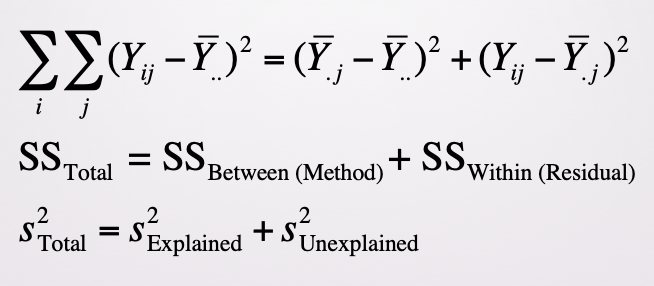

```{r packagesAndData, warning=FALSE, include=FALSE}
library(tidyverse)
library(knitr)
library(kableExtra)
```

## Recap

Model comparison approach
  - Restricted/Full is the embodiment of the Null/Alternative
  
---

## This time

Translating that into classic ANOVA terminology

Starting with Oneway ANOVA

---

## Oneway ANOVA

Sometimes we have more than two groups. $t$-tests won't cut it. 

---

## CDR - Clinical Dementia Rating

Assesses performance in 6 areas: memory, orientation, judgement & problem solving, community affairs, home & hobbies, and personal care. 

Composite Rating
  - 0 = none
  - .5 = very mild dementia
  - 1 = mild dementia
  - 2 = moderate dementia
  - 3 = severe dementia

---


## CDR - Clinical Dementia Rating

Assesses performance in 6 areas: memory, orientation, judgement & problem solving, community affairs, home & hobbies, and personal care. 

Composite Rating
  - **0 = none**
  - **.5 = very mild dementia**
  - **1 = mild dementia**
  - 2 = moderate dementia
  - 3 = severe dementia

--

We want to know if participants' anxiety scores are different for each of these groups. 

---

## The data

Participant Anxiety Scores (20-80) for each of the groups:

```{r, echo=FALSE}
cdr = data.frame(NoImpairment = c(30, 35, 30, 25, 40),
                 VeryMildImpairment = c(35, 40, 45, 45, 55),
                 MildImpairment = c(45, 55, 55, 50, 50))

kable(cdr)
```

---

## The data in long format

.pull-left[
```{r}
cdrLong = cdr %>% 
  pivot_longer(cols = 1:3,
               names_to = "ImpairmentType",
               values_to = "AnxietyScores") %>% 
  mutate_at(vars(1), list(factor)) %>% 
  arrange(ImpairmentType)
```
]

.pull-right[
```{r, echo=FALSE}
cdrLong %>% 
  kable("html") %>% 
  kable_styling(font_size = 16)
```
]

---

## Means

```{r}
grandMean = mean(cdrLong$AnxietyScores)
grandMean

meansCdr =  cdrLong %>% 
  group_by(ImpairmentType) %>% 
  summarize(meanAnxiety = mean(AnxietyScores))
meansCdr

## create a new column repeating the correct means

cdrLong$grandMean = rep(grandMean, times = nrow(cdrLong))
cdrLong$groupMeans = c(rep(meansCdr$meanAnxiety[1], times = 5),
                       rep(meansCdr$meanAnxiety[2], times = 5),
                       rep(meansCdr$meanAnxiety[3], times = 5))
```

---

```{r echo=FALSE}
cdrLong %>% 
  kable("html") %>% 
  kable_styling(font_size = 16)
```

---

## Restricted Model

```{r echo=FALSE}
cdrLong$restrictedDev = cdrLong$AnxietyScores - cdrLong$grandMean
cdrLong$restrictedDev2 = cdrLong$restrictedDev^2
Er = sum(cdrLong$restrictedDev2)
cdrLong %>% 
  kable("html") %>% 
  kable_styling(font_size = 16)
Er
```

---

## Restricted Model

Degrees of freedom = $n - 1$

We had to estimate the overall grand mean

```{r}
dfr = nrow(cdrLong) - 1
dfr
```


---

```{r echo=FALSE}
cdrLong = cdrLong %>% 
  select(-(5:6))

cdrLong %>% 
  kable("html") %>% 
  kable_styling(font_size = 16)
```

---

## Full Model

```{r echo=FALSE}
cdrLong$fullDev = cdrLong$AnxietyScores - cdrLong$groupMeans
cdrLong$fullDev2 = cdrLong$fullDev^2
Ef = sum(cdrLong$fullDev2)
cdrLong %>% 
  kable("html") %>% 
  kable_styling(font_size = 16)
Ef
```

---

## Full Model

Degrees of freedom = $n - 3$

We had to estimate 3 things; each of the group means

```{r}
dff = nrow(cdrLong) - 3
dff
```

---

## Wrapping it up!

$$ F = \frac{(1343.333-420)/(14-12)}{420/12} \\
F = \frac{461.667}{35} \\
F = 13.190 $$

Critical value is 3.885

---

## Tricks are for kids

- $E_R$ = squared deviations from the grand mean
- $E_F$ = squared deviations from the group means
- If equal $n$, $E_R - E_F = n \times \Sigma ( \text{Grand Mean - Group Mean})^2 $

---

## Tricks are for kids


$$ E_R - E_F = n \times \Sigma ( \text{Grand Mean - Group Mean})^2 $$
$$ E_R - E_F = 5 \times ((32- 42.333)^2 + (44-42.333)^2 + (51-42.333)^2) $$
$$ E_R - E_F = 5 \times (106.778 + 2.778 + 75.111) $$ 
$$ E_R - E_F = 923.333 $$
```{r}
Er - Ef
```

---

## ANOVA Formula

.pull-left[
$$ F = \frac{(E_R - E_F) / (df_R - df_F)}{E_F/df_F} $$

$$ F = \frac{923.333/2}{420/12} $$
]

--

.pull-right[

$$F = \frac{SS_B/df_\text{numerator}}{SS_W/df_\text{denominator}}$$
]

---

## Er - Ef

- Sum of square deviations from the grand mean *minus* sum of squared deviations from the group mean
- $E_R - E_F = n \times \Sigma ( \text{Grand Mean - Group Mean})^2$
- Sum of squared deviations **_between_** groups

--

## Ef

- Sum of squared deviations from the group mean
- Errors reflect how much an individual deviates from the group
- Sum of squared deviations **_within_** groups

---

## ANOVA Formula

.pull-left[

$$F = \frac{SS_B/df_\text{numerator}}{SS_W/df_\text{denominator}}$$
]

.pull-right[

$$F = \frac{MS_B}{MS_W}$$
]

---

## ANOVA Table or Source Table

```{r}
summary(aov(AnxietyScores ~ ImpairmentType, data = cdrLong))

2 + 12

923.333 + 420
```

---

## Why use ANOVA and not a bunch of *t*-tests?

- Inflates Type I error rate
- Family Wise Error Rate (FWER) is the probability that one or more of your "family" of multiple tests is false
- P(making an error) = alpha
- P(not making an error) = 1 - alpha
- P(not making an error in m tests) = (1-alpha)^m
- P(making at least 1 error in m tests) = 1 - (1-alpha)^m

--

Using ANOVA helps control for inflated FWER by using a single, cohesive statistical tests rather than a series of *t*-tests! It allows a test of the various means while maintaining an *a priori* alpha level. 

---

class: center, middle

## Why is it called the Analysis of Variance if we are interested in the means? 




The ratio of SS between (signal) with the SS within (noise)

---

## Eta Squared 

$$\eta^2 = \frac{SS_B}{SS_\text{Total}}$$

Interpretation: Proportion of the variability in the outcome variable that can be explained in terms of the predictor.

- $\eta^2 = 0$; there is no relationship at all between the outcome and the predictor
- $\eta^2 = 1$; the relationship between the outcome and predictor is perfect

If you take the square root of $\eta^2$, it can be interpreted as if it referred to the magnitude of a Pearson correlation. 

.small[see textbook page 440]

---

## Proportionate Reduction in Error (PRE)

To what extent does the full model reduce the errors made? 

$$PRE = \frac{E_R - E_F}{E_R}$$

- Scale of 0 to 1
- If it's 0, then knowing X does not help predict Y. The full model does not reduce the errors made.
- If it's 1, then knowing X 100% predicts Y. The full model completely reduces the errors made. 

---

## Assumptions, assumptions

The following should hold in order to assume that your observed $F$ maps on to the population distribution for $F$:

1. Normally distributed scores
2. Equal variances
3. Scores should be independent

--

What happens when your $n$ is unequal? Or your variances are not equal?

---

## Assumptions, assumptions

If you have unequal $n$, we need to use a slightly different formula for $E_F$

- $E_F$ reflects deviations from the group mean
- $\Sigma(\text{Sum of the squared deviations X sample size for the group})$
- Weight the sum of squares by the group size

---

## When is the *F* test robust? 

```{r echo=FALSE}
f = data.frame(c("Appropriate", "Good, unless there's a very large difference"),
               c("Appropriate", "???"))
colnames(f) = c("Equal Sample Sizes", "Unequal Sample Sizes")
rownames(f) = c("Equal Variances", "Unequal Variances")

kable(f)
```

--

- If you have large samples with very large variances, considered a *conservative* test
- If you have large samples with very small variances, considered a *liberal* test

---

class: inverse

## Next time

- Multiple comparisons & contrasts (Thursday)
- Twoway ANOVA (Tuesday)
- THANKSGIVING BREAK!!!