```{r packagesAndData, include=FALSE, warning=FALSE}
library(tidyverse)
library(ggpubr)
library(knitr)
library(kableExtra)
colors = RColorBrewer::brewer.pal(4, "Set2")
```

## Recap

  * We've taken a model comparison approach to comparing group means with ANOVA
    * Restricted 
    * Full 
    * F test
  * Explored different approaches to comparing means
    * Multiple comparisons
    * Contrast coefficients

---

## This time

* Adding another independent variable: 

**Between Subjects Factors**

---

## The Plan

* Two between-subjects factors
* Working example 
* Null in a two-factor design
* Full and restricted models in two-factor design
* Setting up the F table
    * Decomposing variance in two-factor
    * Degrees of freedom for different factors
* Calculating the main effects in a two-factor design
* Making R do the work

---

name: one

## Nomenclature

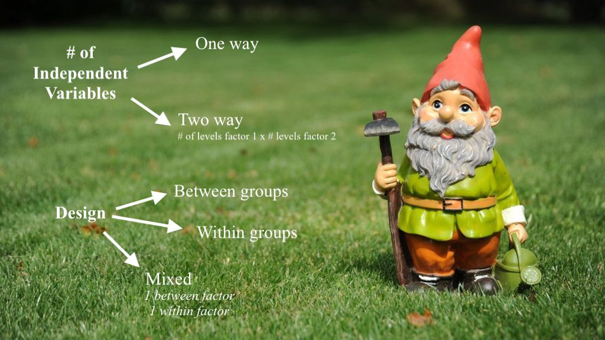

---

## Consider the following design

**Kindergarten and 1st Graders' knowledge of double letters in words**

.pull-left[
Allowed doubles
- *baff* & *bbaf*
- *lopiff* & *llopif*
- *dess* & *ddes*]

.pull-right[
Unallowed doubles
- *holl* & *hhol*
- *vaff* & *vvaf*
- *juss* & *jjus*]

--

## Data

Two-way between-subjects, completely crossed (balanced) 
```{r echo=FALSE}
data <- data.frame(grade = (c(rep("K", times = 8),
                              rep("1", times = 8))),
                   doublet = (c(rep("allowed", times = 4),
                                    rep("unallowed", times = 4),
                                    rep("allowed", times = 4),
                                    rep("unallowed", times = 4))),
                   correct = c(2, 3, 4, 2, 3, 4, 3, 4,
                               8, 9, 7, 10, 9, 10, 9, 10))
xtabs(~ grade + doublet, data)
```
---
## Null Hypothesis for "Main Effects" 

$H_01$: Main effect of grade: The two age groups perform similarly

$H_02$: Main effect of doublet legality: Children perform similarly with allowed and unallowed doublets

--

$H_01$: $\bar{x}_K = \bar{x}_{1st}$

$H_02$: $\bar{x}_{allowed} = \bar{x}_{unallowed}$

--

```{r}
(grandmean <- mean(data$correct))
(groupmeans <- aggregate(correct ~ grade + doublet, data, mean))
```

---

## Model Comparison Approach for Main Effects

- **Two Restricted Models:** reflects what we are testing *against*. 
  - grand mean is our best guess for the main effect of grade
  - grand mean is our best guess for the main effect of doublet position


--

- **Two Full Models:** allows us to fully include all information we might have.
  - best way of minimizing errors is to use grade-specific mean
  - best way of minimizing errors is to use doublet-specific mean

---

## F Table 

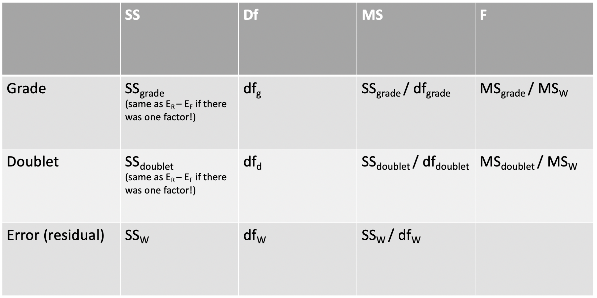
---

## The variance tree

--

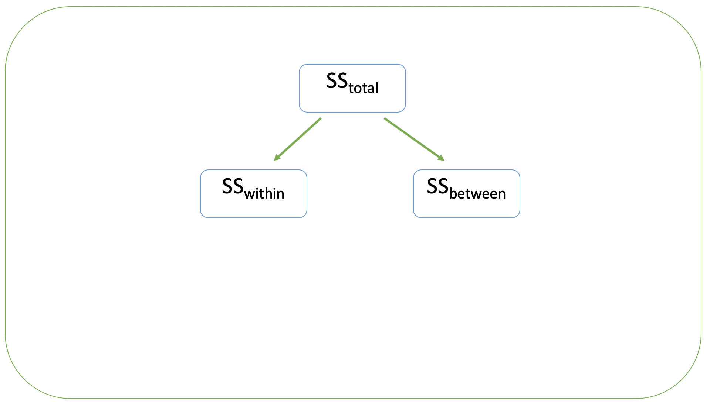
---
## The variance tree

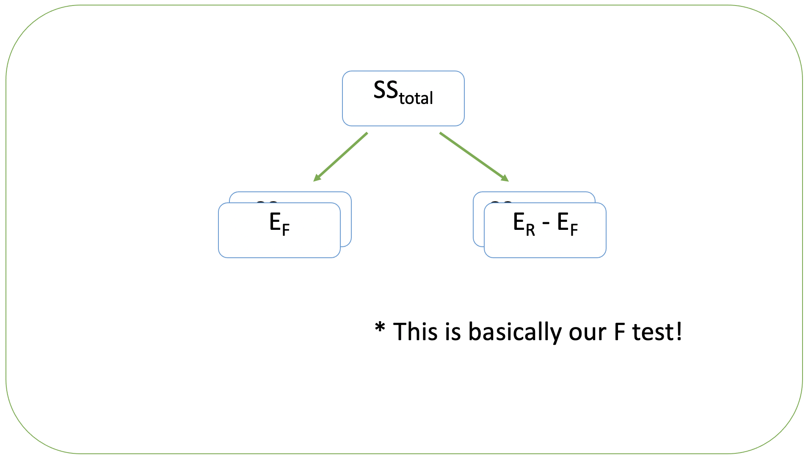

---
## The variance tree

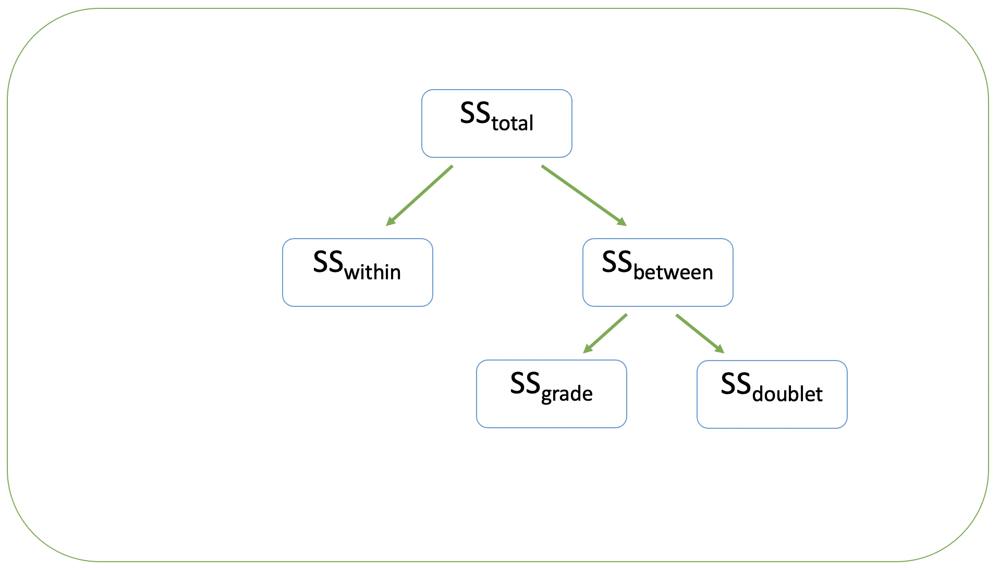

---
## The variance tree

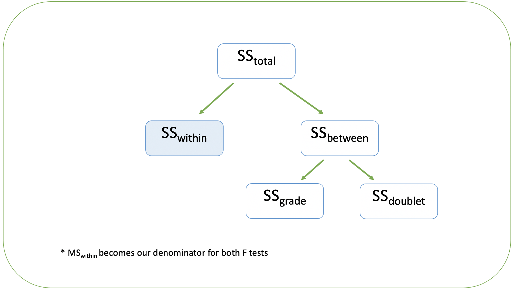

---
## The variance tree

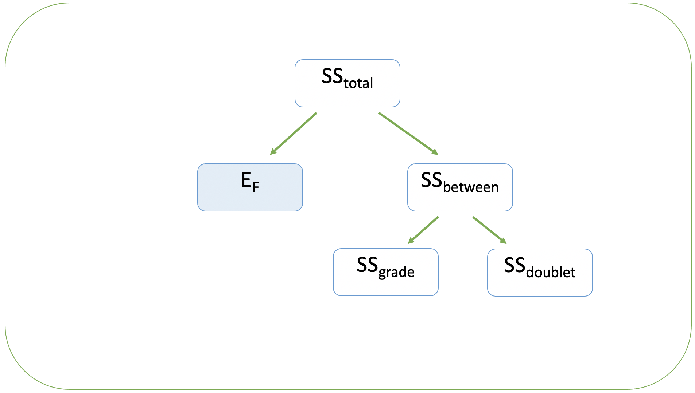
---

## Degrees of Freedom in two factor between subjects

- For *each* factor: 
  - $df_A = F_{A} - 1$
  - e.g., grade has **2 levels** (K, first)
    - $df_{grade} = 2 -1 = 2$

- For the withinerror or residual: 
  - $df_w = N - (R - 1) - (C - 1) - 1$
  - simplifies to $N - R - C + 1$
  - e.g., 16 observations, 1 additional mean for group factor, 1 additional mean for doublet factor, and 1 grand mean
    - $df_w = 16 - 1 - 1 - 1 = 13$
---

## Putting the pieces together

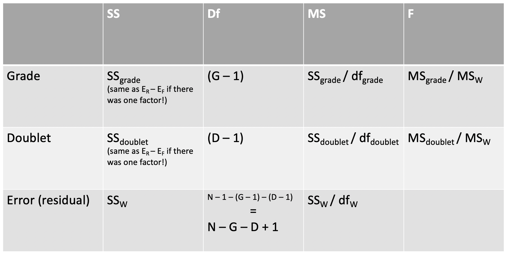

---

## Let's start with Grade!

$SS_{grade} = E_R - E_F$

Restricted: our best guess for any student is the grand mean + some error

Full: our best guess for any student is their grade's mean + some error
---

## Step 1: The Restricted Model for Grade

Get Er for grade. First, deviations by subtracting from our grand mean of 6.025. That is, 6.025 is our PREDICTION of the **restricted** model for our first factor: grade. Then square deviations and sum them up.

```{r}
data$prediction <- grandmean
(restricted_grade <- data %>%
  mutate(deviationScores = correct - prediction,
         dev2 = deviationScores ^ 2))
(Er_grade <- sum(restricted_grade$dev2))
```

---

## Step 2: The Full Model for Grade

Get Ef for grade. Our best guess is the group's mean. 

```{r}
(grade_means <- aggregate(correct ~ grade, data, mean))
```

---
## Step 2: The Full Model for Grade

First, deviations by subtracting each observation in a group from it's respective group mean. That is our deviations are each kindergartener's score - the kindergarten mean of 3.125. Each first grader's score - the first grade mean of 9. Then square deviations and sum them up. This is our **ERROR** term, our squared errors for grade. 

```{r echo=FALSE}
(full_grade <- data %>%
  mutate(prediction = c(rep(filter(grade_means, grade == "K")$correct, 8),
                        rep(filter(grade_means, grade == "1")$correct, 8)),
         deviationScores = correct - prediction,
         dev2 = deviationScores ^ 2))
(Ef_grade <- sum(full_grade$dev2))
```
---
## Step 3: Calculate SS. 

$SS_{grade} = E_r - E_f$

```{r}
(SS_grade <- Er_grade - Ef_grade)
```

---
## Step 4: Determine the degrees of freedom. 

- $df_{grade} = k_{grade}-1$
- where $k$ = number of levels in the factor

---

## F Table

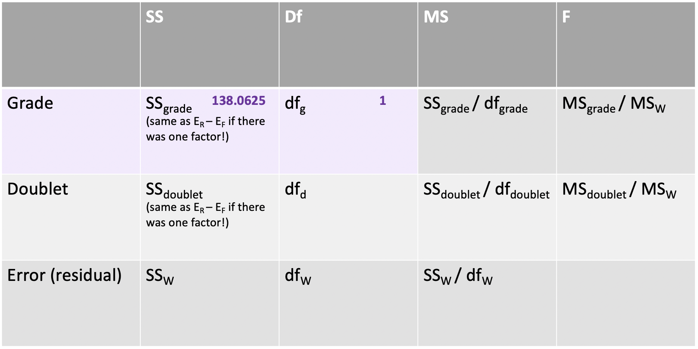

---

## Rinse and repeat for doublet legality

$SS_{doublet} = E_R - E_F$

Restricted: our best guess for any student is the grand mean + some error
- that is, regardless of whether students saw allowable or unallowable doublets, they have the same predicted number of correct items

Full: our best guess for any student is their doublet type group's mean + some error

---

## Step 1: The Restricted Model for Doublet Type

```{r}
data$prediction <- grandmean
(restricted_dbl<- data %>%
  mutate(deviationScores = correct - prediction,
         dev2 = deviationScores ^ 2))
(Er_dbl <- sum(restricted_dbl$dev2))
```

---

## Step 2: The Full Model for Doublet

```{r}
(dbl_means <- aggregate(correct ~ doublet, data, mean))
```

---
## Step 2: The Full Model for Doublet

```{r echo=FALSE}
(full_dbl <- data %>%
   arrange(doublet) %>%
   mutate(prediction = c(rep(filter(dbl_means, doublet == "allowed")$correct, 8),
                         rep(filter(dbl_means, doublet == "unallowed")$correct, 8)),
         deviationScores = correct - prediction,
         dev2 = deviationScores ^ 2))
(Ef_dbl <- sum(full_dbl$dev2))
```
---
## Step 3: Calculate SS. 

$SS_{dbl} = E_r - E_f$

```{r}
(SS_dbl <- Er_dbl - Ef_dbl)
```

---
## Step 4: Determine the degrees of freedom. 

- $df_{dbl} = k_{dbl}-1$
- where $k$ = number of levels in the factor

---

## F Table

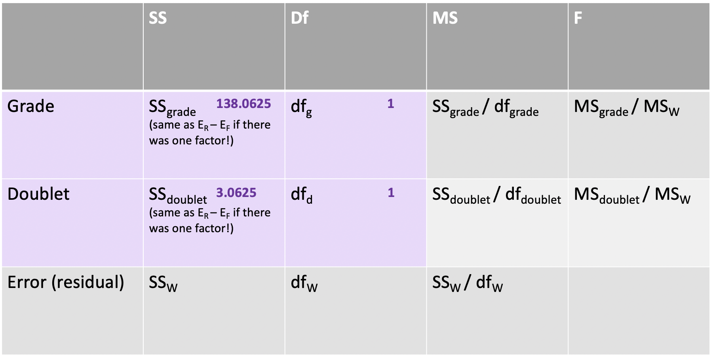

---

## What about that Error? 


This is our **leftover variation** after taking our grade and doublet variables into account. 

---
## Calculating SS error

$SS_{Total} = SS_{grade} + SS_{doublet} + SS_{error}$

--

Conceptually: 

$SS_{error} = SS_{Total}- SS_{grade} + SS_{doublet}$

---

## Calculating SS error (Full Model perspective)

Our full model allows for a grade effect and a doublet effect. 

So from the full model perspective, the best guess for any student is...

---

## Calculating SS error

```{r echo=FALSE}

(full_error <- data %>%
   mutate(prediction = c(rep(groupmeans[2,3], 4),
                         rep(groupmeans[4,3], 4),
                         rep(groupmeans[1,3], 4),
                         rep(groupmeans[3,3], 4)),
         deviationScores = correct - prediction,
         dev2 = deviationScores ^ 2))
```

```{r}
(SSe <- sum(full_error$dev2))
```

---

## F Table

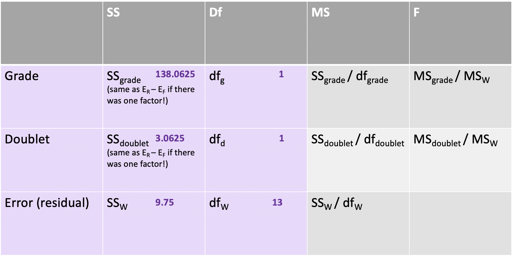
---

## F Table
```{r}
MS<- tibble(` ` = c("grade", "dbl", "error"),
             df = as.numeric(c(1, 1, 13)),
             SS = c(SS_grade, SS_dbl, SSe),
             MS = c(SS_grade/1, SS_dbl/1, SSe/13),
             F_val = as.numeric(c(MS[1]/MS[3], MS[2]/MS[3], "")))
kable(MS, digits = 3)
```

---

## F Table
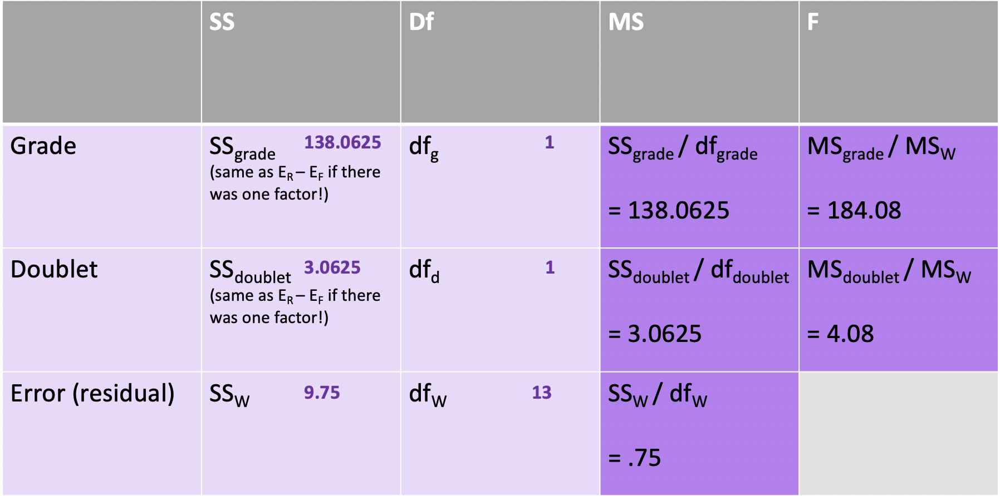

---

## A star is born

```{r, echo=FALSE}
MS <- MS %>% mutate(p_val = pf(F_val, df, df[3], lower.tail = F),
                    show_me_stars = c(ifelse(p_val < .001, "***", 
                                             ifelse(p_val > .05, ".", ""))))
kable(MS, digits = 4, booktabs = T)
```

---

## Without stars

1. We know that when F > 1, effect is significant

--

2. Use a critical value to determine whether to reject the null. 

```{r}
(F_crit = qf(.05, df1 = 1, df2 = 13, lower.tail = F))
```

$F_{grade} = 184.08$ is more extreme than our $F_{crit} = 4.67$ so we reject our $H_01$

$F_{dbl} = 4.08$ is *not* more extreme than our $F_{crit} = 4.67$ so we fail to reject our $H_02$

---

## Is it always this painful? 

No, because we have R! 

```{r}
summary(aov(correct ~ grade + doublet, data))
```

---
class: inverse

## Next time

- What if we expect performance to depend on **both** factors? 
- We would add an *interaction* to our ANOVA: grade x doublet.


