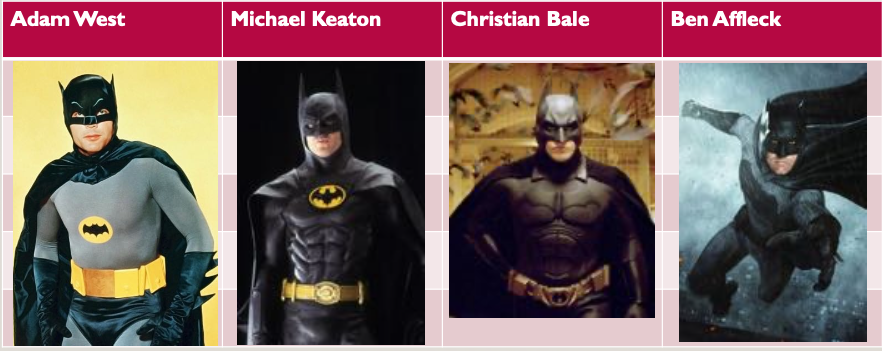
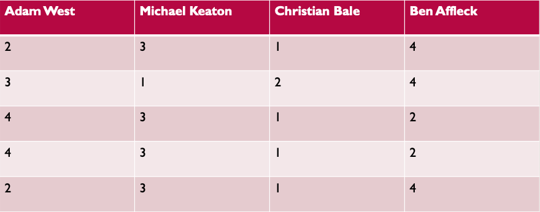
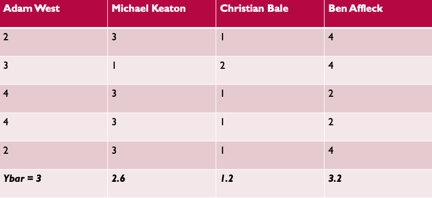
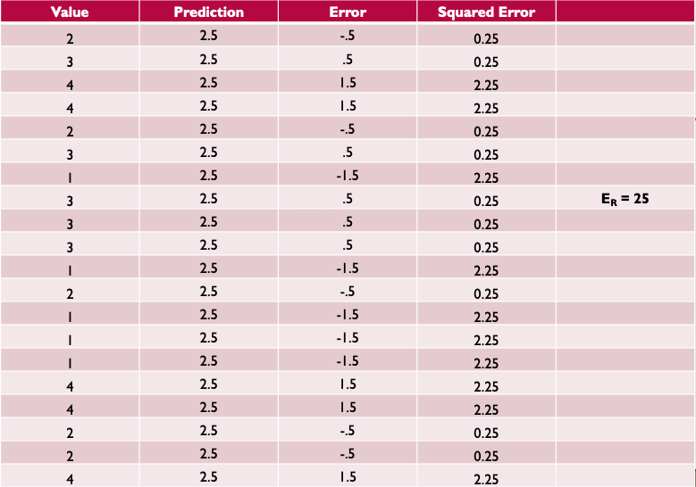
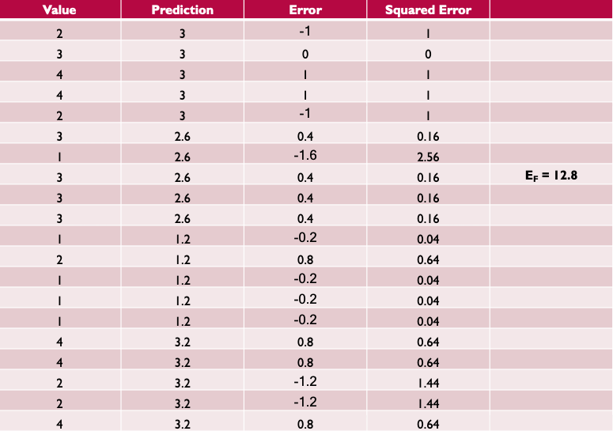
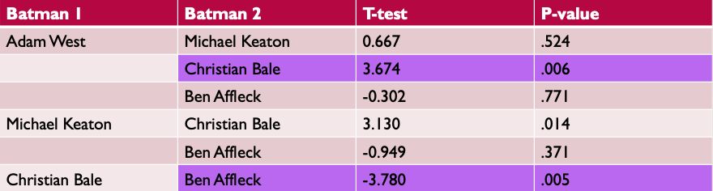
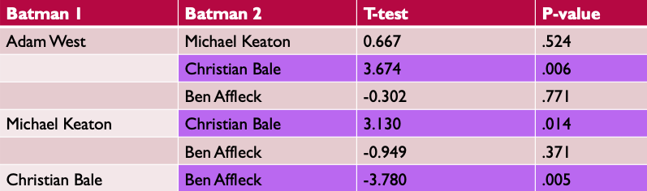
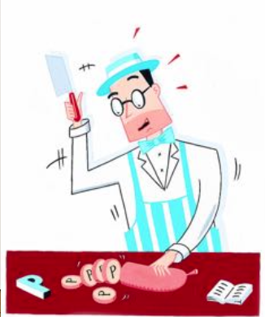
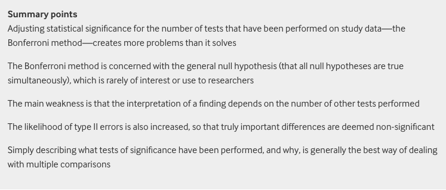

```{r xaringan-themer, include=FALSE, warning=FALSE}
library(xaringanthemer)
style_mono_accent(base_color = "#17139C",link_color = "#DD3E3E")

```

```{r packagesAndData, warning=FALSE, include=FALSE}
library(tidyverse)
library(knitr)
library(kableExtra)
```

## Recap

  - $E_R - E_F = SS_\text{Between}$
  - $SS_\text{Between}$ is the differences in means
  - $SS_\text{Within}$ is a hodgepodge of individual differences and random error
  
--

  - $\eta^2$ Rules of thumb
      - .01 - .059 = small
      - .06 - .139 = medium
      - \> .14 = large
  - PRE Rules of thumb:
      - 0 - .1 = small/weak
      - .1 - .4 = medium/moderate
      - \>.4 = large/strong

---

## When comparing more than 2 groups...

**Omnibus** test:

$$ H_0: \mu_1 = \mu_2 = \mu_3 = \mu_4 $$
--

The alternative hypothesis:


$$H_A: \mu_1 \neq \mu_2 \neq \mu_3 \neq \mu_4 \\
H_A: \mu_1 \neq \mu_2 = \mu_3 = \mu_4$$

---

## *t*-tests vs. Oneway ANOVA

You *could* run separate *t*-tests compring any two of the four groups:

.pull-left[
- $\mu_1 \neq \mu_2$
- $\mu_1 \neq \mu_3$
- $\mu_1 \neq \mu_4$
- $\mu_2 \neq \mu_3$
- $\mu_2 \neq \mu_4$
- $\mu_3 \neq \mu_4$
]

.pull-right[
Number of tests (*m*) is: 

$$m = \frac{a(a-1)}{2}$$
]

---

## Family-wise Error Rate (FWER)

The probability that one or more of your "family" of multiple tests is false
      
- P(making an error) = $\alpha$
- P(not making an error) = $1 - \alpha$
- P(not making an error in m tests) = $(1-\alpha)^m$
- P(making at least 1 error in m tests) = $1 - (1-\alpha)^m$

--

FWER for 6 tests with an $\alpha = .05$:

$$1-(1-.05)^6 \\
1-(.95)^6 \\
1-.735 \\
.265$$
      
---

## Why use ANOVA and not a bunch of *t*-tests?

- Inflates Type I error rate!

- Going from the probability of a Type I error being .05 to .265!!! Yikes!!!

- Using ANOVA helps control for inflated FWER by using a single, cohesive statistical tests rather than a series of *t*-tests! It allows a test of the various means while maintaining an *a priori* alpha level. 

---

## You can't choose your family. Kinda.

What is the family? Is it:

- all 6 tests?
- just $\mu_1$ vs. the other tests with $\mu_1$ in it? 
- $\mu_1$ vs. the AVERAGE of $\mu_2$, $\mu_3$, $\mu_4$?

--

Some say that the "family" of tests could mean...
- All tests related to a specific research question, within a single study
- All tests using the same data
- All tests related to a specific research question, across all studies
- All tests reported in a paper
- Any of the above plus the tests that were run for that topic but not reported

`r emo::ji("person_facepalming")`

---
class: center

## Who is the best Batman



---

## Who is the best Batman



---

## Who is the best Batman



---

## Who is the best Batman



---

## Who is the best Batman


---

## Who is the best Batman

$$F = \frac{(E_R - E_F) / (df_R - df_F)}{E_F/df_F} \\
F = \frac{(25-12.8)/(19-16)}{12.8/16} \\
F = 5.083$$

Critical value for $\alpha = .05$,  $F(3, 16) = 2.462$

--

#### What does this tell us? 

--

It doesn't answer the question the internet was made for!

---

## A Priori vs. Post Hoc

If *a priori* (aka planned ahead):
- You could use a whole bunch of $t$-tests. But that doesn't limit the number of tests that you are running! So you could get an inflated FWER and increase your chances of making a Type I error.
  - Rather than running a lot of $t$-tests, you could use a planned contrast (wait for it).
- Another option is to reduce your $\alpha$ for each comparison that you make as a "penalty"
  -  $t$-test + Bonferonni correction
- Contrasts (and maybe some Bonferonni correction, but mostly contrasts alone) is the ideal

---
## A Priori vs. Post Hoc

What if you really don't know the outcome? Post-hoc tests!
- Tukey
- Scheffe

---

class: inverse, center, middle

# Multiple Comparisons Corrections

---

## Pairwise Tests vs. Other Contrasts

.pull-left[

**Pairwise**:

- Is Christian Bale ranked higher than Adam West?
- Is Ben Affleck ranked lowest of all the Batmen?
]

.pull-right[

**Contrast**:

- Do Batmen from over 20 years ago rank lower than recent Batmen?
- Do people rank Michael Keaton as better than the average Batman?
]

---

## Bonferonni Correction

Take the number of planned tests that you have, and divide your alpha level equally amongst the tests.

$\alpha = .05$ and we have 6 planned tests, $.05/6 = .0083$. $.0083$ is our new alpha!

---

## With Bonferonni Correction

2 of our tests would be considered "significant", *p* less than .0083


---

## Without Bonferonni Correction

3 of our tests would be considered "significant", *p* less than .05



---

## Bonferonni Correction

What issues might present with the Bonferonni correction for multiple comparisons?

<center>



---
## Bonferonni Correction

[Perneger (1998)](https://doi.org/10.1136/bmj.316.7139.1236)



---

## If you only care about pairwise...

- Tukey's HSD (Honestly significant difference)

- What is the minimal difference between two means needed to declare something significantly different?

---

## Tukey's HSD

- What is the minimal difference between two means needed to declare something significantly different?

- Usually, we're looking for the $q$ statistic, but we can rearrange the equation!

$$q = \frac{\text{Mean 1 - Mean 2}}{\sqrt{\frac{\text{MS Within}}{\text{N per group}}}} \\
\text{Mean 1 - Mean 2} = q\sqrt{\frac{\text{MS Within}}{\text{N per group}}}$$

---

## Tukey's HSD

$\text{Mean 1 - Mean 2} = q\sqrt{\frac{\text{MS Within}}{\text{N per group}}}$

- MS within = .8, N per group = .5, q = 4.05 (you get this from a table based on your df and number of groups; or I give it to you)

- Mean 1 - Mean 2 = 1.62

> The minimial difference between 2 means to declare something significantly different needs to be 1.62

---

## Back to the data

Means:

- Adam West = 3
- Michael Keaton = 2.6
- Christian Bale = 1.2
- Ben Affleck = 3.2

--

Comparing Adam West to Christian Bale, 3 - 1.2 = 1.8 (sig)
Comparing Christian Bale to Ben Affleck, 3.2 - 1.2 = 2 (sig)
Comparing Adam West to Michael Keaton, 3 - 2.6 = .4 (not sig)

... the rest are not significant

---

## When all else fails

- **Scheffe** test

- Benefits: can be used for pairwise and/or other contrasts; often used with unequal sample sizes

- Downsides: ridiculously conservative

- Howell (2007): *"I can't imagine when I would ever use it, but I include it here because it is such a standard test"*

---
class: inverse, center, middle

# Contrasts

---

## General formula for a contrast

$$F = \frac{\psi^2}{MS_\text{Within}\Sigma(c_j^2/n_j)}$$

$\psi$ (Psi) is our contrast

$c$ reflects the **coefficients** for that contrast

---

## Is there a recency effect in our data?

- Are current Batmen rated as better than past Batmen?

- $H_0$: Average (Adam West and Michael Keaton) = Average (Christian Bale and Ben Affleck)
- $H_A$: Average (Adam West and Michael Keaton) $\neq$ Average (Christian Bale and Ben Affleck)

---

## Defining the contrasts

**Coefficients must equal 0**

- -.5(Adam West and Michael Keaton) vs. .5(Christian Bale and Ben Affleck)

- The $c$'s in this contrast are -.5, -.5, .5, .5

---

## Calculate $\psi$

Means:

- Adam West = 3
- Michael Keaton = 2.6
- Christian Bale = 1.2
- Ben Affleck = 3.2

-------

$$\psi = -.5(3) + -.5(2.6) + .5(1.2) + .5(3.2) \\
\psi = -0.6$$

---

## Calculating the F

- Mean square error within is .8 (go back to omnibus test)
- $\psi = -0.6$
- $n$ per group = 5

$$F = \frac{\psi^2}{MS_\text{Within}\Sigma(c_j^2/n_j)} \\
F = \frac{-.6^2}{.8\Sigma[(-.5^2/5) + (-.5^2/5) + (.5^2/5) + (.5^2/5)]} \\
F = 2.25$$

Critical value $F(1, 16) = 4.49$

Cannot reject $H_0$. There is not sufficient evidence to say that the average of older Batmen is different from the average of younger Batmen

---
class: inverse

## Next time...

Twoway (factorial) ANOVA

If your work is with neuroimaging, this is required reading for why mutliple comparisons are a problem: 

- Bennett, C. M., Baird, A. A., Miller, M. B., & Wolford, G. L. (2010). Neural Correlates of Interspecies Perspective Taking in the Post-Mortem Atlantic Salmon: An Arugment For Proper Multiple Comparisons Correction. Journal of Serendipitous and Unexpected Results, 1(1), 1–5.
- https://teenspecies.github.io/pdfs/NeuralCorrelates.pdf

