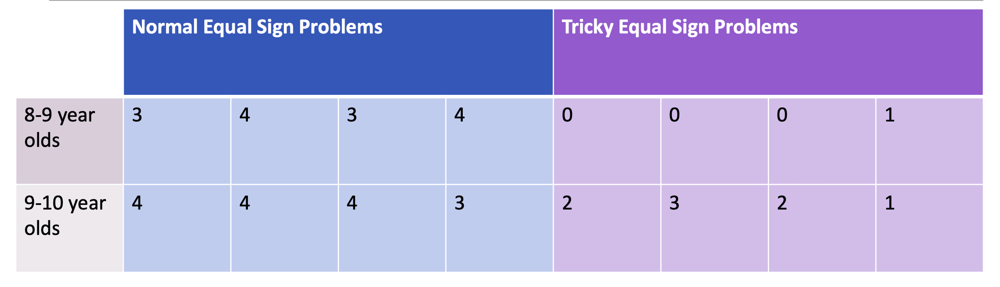
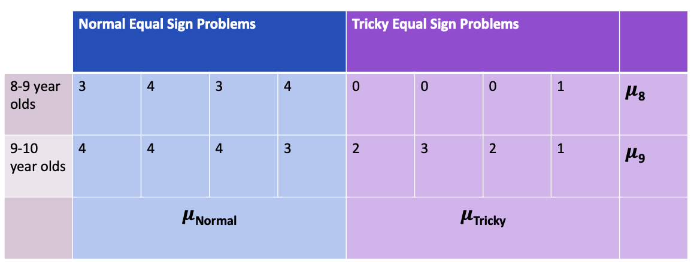
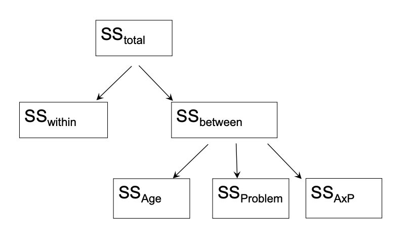
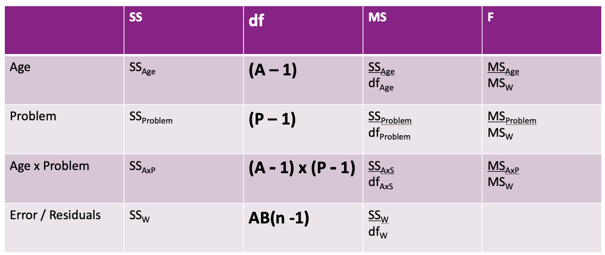

```{r packagesAndData, include=FALSE, warning=FALSE}
library(tidyverse)
library(ggpubr)
library(knitr)
library(kableExtra)
colors = RColorBrewer::brewer.pal(4, "Set2")
```

```{r setup, include=FALSE}
knitr::opts_chunk$set(echo = TRUE)
```

## Last time

Twoway ANOVA
- 2 between subjects factors
- Can have as many levels as necessary
  * 3x5 ANOVA still has 2 independent variables
- Explored main effects

--

## This time
- What happens when those 2 variables impact each other (not only impact the dependent variable)?

---

## Math is hard

Here are our data...



---

## Math is hard: Null Hypotheses for **Main Effects**

.pull-left[

$H_{0.1}$ : The two age groups perform similarly


$H_{0.1}: \mu_8 = \mu_9$

]

.pull-right[

$H_{0.2}$ : Children perform similarly on normal and tricky math problems


$H_{0.2}: \mu_{\text{normal}} = \mu_{\text{tricky}}$

]

---

## Math is hard


---

## Adding a 3rd Null Hypothesis

$H_{0.3}$ : *The differences between age groups are the same regardless of problem type (tricky or normal)*

$H_{0.3}$ : *Differential performance on problem types is independent of age group*

--

`r emo::ji("point_up")` These are the same! They are symmetric.

---

## Math is hard: Means on means


---

## Math is hard: Means on means


---

## Equations

Previously, we've talked about the restricted and the full model. We can write those as formal equations:

$Restricted: Y_{ij} = \mu + e_{ij}$

$Full: Y_{ij} = \bar{Y_{j}} + e_{ij}$

--

**Oneway ANOVA**

$Restricted: Y_{ij} = \mu + e_{ij}$

$Full: Y_{ij} = \bar{Age_{j}} + e_{ij}$

---

## Three Restricted Models

When testing the Age main effect...

$$Restricted: Y_{ij} = \mu + \text{Problem}_k + AP_{jk} + e_{ijk}$$

When testing the Problem main effect...

$$Restricted: Y_{ij} = \mu + \text{Age}_j + AP_{jk} + e_{ijk}$$

When testing the **interaction** between Age & Problem...

$$Restricted: Y_{ij} = \mu + \text{Age}_j + \text{Problem}_k + e_{ijk}$$
---

## Diagrams


$SS_{\text{within}}$ is our Ef; $SS_{\text{between}}$ is our Er - Ef; $MS_{\text{within}}$ is the denominator for all *F*-tests

---

## ANOVA (Source) Table


---

## ANOVA (Source) Table

Fill in the easy stuff first


---

## Df for the Full Model

Always the (Number of Participants - Number of Estimated Parameters in Full Model)

How many means did we calculate? 

--

\begin{equation}
AB(n-1) \\
2 \times 2 (4-1) \\
4 \times3 \\
12
\end{equation}

---

## ANOVA (Source) Table



---

## ANOVA (Source) Table


---

## ANOVA (Source) Table

