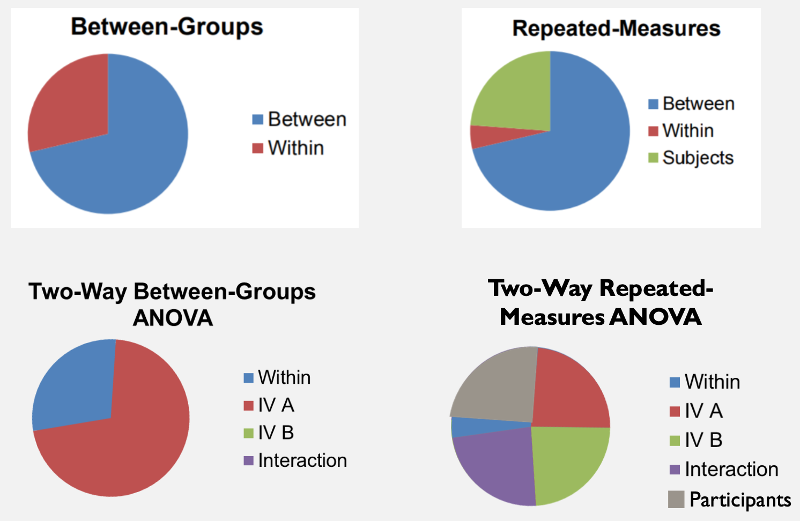
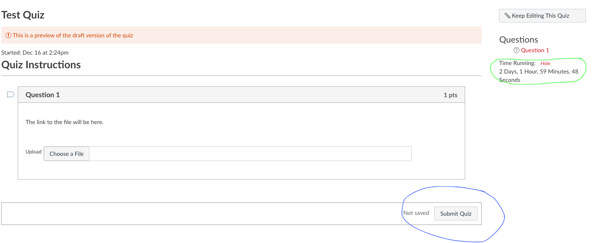

```{r packagesAndData, include=FALSE, warning=FALSE}
library(tidyverse)
library(ggpubr)
library(knitr)
library(kableExtra)
colors = RColorBrewer::brewer.pal(4, "Set2")
```

## Today

A series of shpiels 

- **Within-subjects designs**
- Non-parametric tests
- Exam 3 + semester wrap up

---
class: inverse

# Within-subjects

---

## What is it?

- Other names: within-groups, repeated measures

- Each subject contributes a score to each level of an independent variable

- We've done this before...paired $t$-test

  - Pre vs. Post 
  
---

## Why does this matter?

- Some of the variability in the scores within a level of a factor is predictable if you know which participant contributed the score.

- If you could remove the variability that goes with the differences between the participants, you could reduce the variability within a level of the factor. 
  
  - Same participants, or paired in some way (matched)
  
---

## Repeated Measures ANOVA 

- You can calculate, and then discard, the variability among the means that comes from differences between the subjects

  - What does this mean if you want to know about individual differences?
  
--

- The remaining variability in the dataset is then partitioned into 2 components:

  1. variance due to differences between treatments/conditions/levels
  2. variance due to error (like measurement error, random noise etc.)

---

## What changes in the calculations? 

- Restricted Model: $\Sigma D_i^2$

  - The null is that there is no difference in the participants' scores between conditions
  - Take the difference scores, square them, sum them up
  - $df_r$ = how many difference scores there are; you do not remove a df because you don't use a mean
  
---
## What changes in the calculations? 

- Full Model: $\Sigma(D_i - \bar{D})^2$

  - The full model/alternative hypothesis is that there is a difference in the participants' scores between conditions
  - Take each individual's difference score and find the deviatio for that difference score from the mean difference score of the sample. Square it, sum it up. 
  - EX: pre = 8, post = 10, diff = 2
  - EX: if the average of the difference scores was 5, you would then do `2 - 5 = -3`
  - $df_f$ = number of difference scores - 1; you lose 1 df because you calculated the mean of difference scores
  
---

## The Consequences -- Good

- Same participants = less time and effort

- Statistical POWER!
  - What goes into our F-statistic? $\frac{MS_{btwn}}{MS_{error}}$ 
  - The smaller $MS_{error}$, the larger the $F$-statistic
  - The repeated design allows you to remove the between-subject variability, so $MS_{error}$ gets smaller
  
---

## The Consequences -- Bad

- Often not feasible

- Order effects

  - All participants are assigned to eat 3 different flavors of ice cream and rate each of them on a scale of 1 to 10
  - They all eat Chocolate -> Vanilla -> Strawberry
  - How do you know that eating chocolate ice cream first doesn't change the way vanilla tastes to participants? 
  - You need to counterbalance! (some get c -> v -> s, some get v -> s -> c etc...)
  
- Time elapsed can be...tricky

  - Take Josh Jackson's Applied Longitudinal class

---

## To Summarize



---
class: inverse

# Non-parametric Tests

---

## Normality Assumption

- For $t$-test, we said the data needed to be normally distributed
  - can use QQ plots (quantile-quantile plots)
  - can use Shapiro-Wilk test
  
--

- For ANOVA, it's slightly different...
  - $H_0 : Y_{ij} = \mu + \epsilon_{ij}$
  - $H_0 : Y_{ij} = \mu-j + \epsilon_{ij}$
  - The assumption is that \epsilon_{ij}, or your residuals, need to be normally distributed -- lots more next semester
  - Can use QQ plots and Shaprio-Wilk -- QQ plots more common

---

## Who cares?

If we violate our assumptions, *any of them*, we cannot make any valid inferences! 


---
## Non-parametric tests

Enter parametric tests. Often these are based on using the rank order of data (and the median instead of the mean).

Helpful when:

  - Dependent variable is nominal
  - Indepenedent or dependent variable is ordinal
  - Sample size is small
  - Underlying population is skewed (reaction times, household income)

--

Limitations:

  - CI and effect size calculations aren't always possible (or if they are, they're a pain)
  - Less powerful typically
  - Increased risk of a Type II error; maybe that's OK?
  - Nominal/ordinal scales provide less detail than continuous data
  
---

## Which test to use

.small[
| Parametric Test | Situation | Non-Parametric Version|
|-----------------|-----------|-----------------------|
|Single sample *z* |Compare sample mean to population mean with known sigma | ¯\\_(ツ)_/¯  |
|Single sample *t* |Compare sample mean to population mean with unknown sigma |*Wilcoxon Signed-Rank Test*|
|Paired samples *t* |Compare 2 means with within-groups design|*Wilcoxon Signed-Rank Test*|
|Independent samples *t* |Compare 2 means with between-groups design|*Mann-Whitney U Test*|
|Oneway ANOVA (btwn groups)|Compare 3+ levels of IV|*Kruskal-Wallis H Test*|
|Oneway ANOVA (repeated measures)|Compare 3+ levels of IV|*Friedman Test* |
|Twoway ANOVA|2+ IVs (main effects/interactions)|*Kruskal-Wallis H Test* |
|Correlation| Relationship between 2 continuous vars| *Spearman Rank-Order Correlation*|
]

---
class: inverse

# Exam 3 

---

## Exam 3

- Opens on **Monday 12/21 at 9am**

- Closes on **Thursday 12/31 at 9am** (Sayonara, 2020 -- you were the worst)

- Will be listed as a Quiz

- Use CHROME as your web browser. Safari doesn't like this. Unclear how Firefox handles it.

- Turn OFF your ad blocker. Canvas doesn't have ads.


---

## Exam 3

- You will have **50 hours** to complete the exam. Once you OPEN the quiz, the countdown timer begins
  - If you close the window, the countdown timer will still be running
  - IT WILL LOCK YOU OUT AFTER 50 HOURS...DON'T BE LATE



---
class: inverse

# Next semester...

Regression all day, every day (or at least every Tues/Thurs)