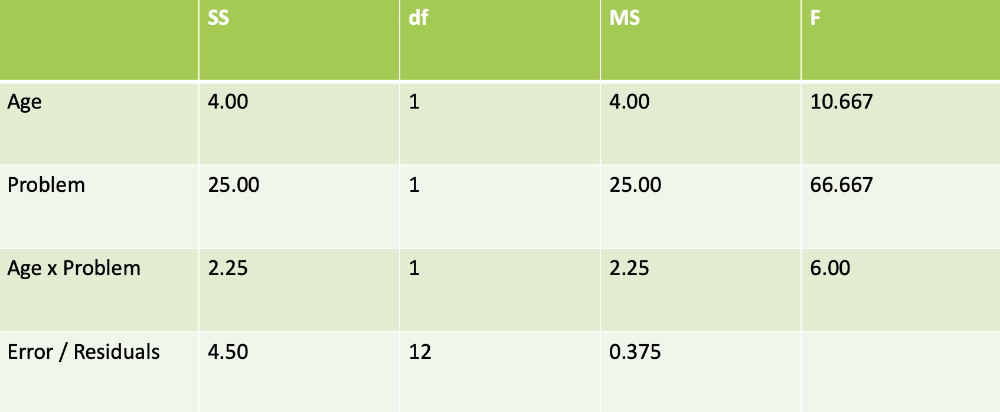

```{r packagesAndData, include=FALSE, warning=FALSE}
library(tidyverse)
library(ggpubr)
library(knitr)
library(kableExtra)
colors = RColorBrewer::brewer.pal(4, "Set2")
```

## Last time

- 2x2 ANOVA with interactions
- NHST and effect sizes

--

## Today

A series of shpiels 

- Finish up between-subjects ANOVA
- Within-subjects designs
- Non-parametric tests

---

## OG data


---

## What we did...

- Found the means for each cell in our 2x2 ANOVA

- Took away the effect of each of the 2 factors (Age and Problem)

- Added back the grand mean

---

## Another way of doing the interaction


$H_{0.3}$ : *The differences between age groups are the same regardless of problem type (tricky or normal)*


---

## Null hypothesis for interactions

$H_{0.3}$ : *The differences between age groups are the same regardless of problem type (tricky or normal)*

$H_{0.3} : (\mu_{N8} - \mu_{N9}) = (\mu_{T8} - \mu_{T9})$

$H_{0.3} : (\mu_{N8} - \mu_{N9}) - (\mu_{T8} - \mu_{T9}) = 0$

$H_{0.3} : \mu_{N8} - \mu_{N9} - \mu_{T8} + \mu_{T9} = 0$

--


 **First rule of contrasts is that they must sum to 0**
---

## Coontrasts are your friends!

$$F = \frac{\psi^2}{MS_\text{Within}\Sigma(c_j^2/n_j)}$$

$$ \psi = (1)(3.50) + (-1)(3.75) + (-1)(0.25) + (1)(2.00)  = 1.50 $$
$$F = \frac{1.50^2}{.375\Sigma(c_j^2/n_j)}$$
$$F = \frac{1.50^2}{.375(\frac{1^2}{4} + \frac{-1^2}{4} + \frac{-1^2}{4} + \frac{1^2}{4})}$$

$$F = \frac{2.25}{.375} = 6$$
---

## Did we get it right?


---

## Testing Ourselves

New 2x2 design comparing treatments to reduce depression

  * Therapy = Cognitive Behavioral vs. Meditation Training
  * Medication = With meds vs. Without meds
  

---

## Fill in the blanks


---
## Fill in the blanks -- Answer


---

## Fill in the blanks


---
## Fill in the blanks -- Answer


---
## Assumptions of ANOVA

1. Experimental errors are normally distributed (more later)

2. Equal variances between treatments. Aka homogeneity of variances.

3. Independence of samples (more next)

--

What happens when we break some of these assumptions?

---
class: inverse, center

# Within-subjects

---

## What is it?

- Other names: within-groups, repeated measures

- Each subject contributes a score to each level of an independent variable (breaking independence assumption)

- We've done this before...paired $t$-test

  - Pre vs. Post 
  
---

## Why does this matter?

- Some of the variability in the scores within a level of a factor is predictable if you know which participant contributed the score.

- If you could remove the variability that goes with the differences between the participants, you could reduce the variability within a level of the factor. 
  
  - Same participants, or paired in some way (matched)
  
---

## Repeated Measures ANOVA 

- You can calculate, and then discard, the variability among the means that comes from differences between the subjects

  - What does this mean if you want to know about individual differences?
  
--

- The remaining variability in the dataset is then partitioned into 2 components:

  1. variance due to differences between treatments/conditions/levels
  2. variance due to error (like measurement error, random noise etc.)

---

## What changes in the calculations? 

- Restricted Model: $\Sigma D_i^2$

  - The null is that there is no difference in the participants' scores between conditions
  - Take the difference scores, square them, sum them up
  - $df_r$ = how many difference scores there are; you do not remove a df because you don't use a mean
  
---
## What changes in the calculations? 

- Full Model: $\Sigma(D_i - \bar{D})^2$

  - The full model/alternative hypothesis is that there is a difference in the participants' scores between conditions
  - Take each individual's difference score and find the deviation for that difference score from the mean difference score of the sample. Square it, sum it up. 
  - EX: pre = 8, post = 10, diff = 2
  - EX: if the average of the difference scores was 5, you would then do `2 - 5 = -3`
  - $df_f$ = number of difference scores - 1; you lose 1 df because you calculated the mean of difference scores
  
---

## The Consequences -- Good

- Same participants = less time and effort

- Statistical POWER!
  - What goes into our F-statistic? $\frac{MS_{btwn}}{MS_{error}}$ 
  - The smaller $MS_{error}$, the larger the $F$-statistic
  - The repeated design allows you to remove the between-subject variability, so $MS_{error}$ gets smaller
  
---

## The Consequences -- Bad

- Often not feasible

- Order effects

  - All participants are assigned to eat 3 different flavors of ice cream and rate each of them on a scale of 1 to 10
  - They all eat Chocolate -> Vanilla -> Strawberry
  - How do you know that eating chocolate ice cream first doesn't change the way vanilla tastes to participants? 
  - You need to counterbalance! (some get c -> v -> s, some get v -> s -> c etc...)
  
- Time elapsed can be...tricky

  - Take Josh Jackson's Applied Longitudinal class
  - Take Mike Strube's Hierarchical Linear Modeling class
---

## Venn Diagram Exercise

How do we break down variances?

---
class: inverse

# Analysis of Covariance (conceptually)

---

## Logic of ANCOVA

Say you want to do an ANOVA, but there's an additional variable (continuous or categorical) whose influence you wish to *control for*. We call that a **covariate**. 

Ex:

- Effect of treatment, controlling for initial levels of some disorder

- Controlling for known effects like age, sex, SES, etc...

---

## Logic of ANCOVA

We just need to add another term to our restricted and full models.

Restricted: 

$$Y_{ij} = \mu + Covariate + e_{ij}$$
Full: 
$$Y_{ij} = \mu + Age_{j} + Covariate + e_{ij}$$

---

## ANCOVA Thoughts

The Good:

- Can increase power by reducing $SS_{within}$
- Some use to control for initial levels of a disorder (meh)

--

The Bad:

- We will talk about regression extensively next semester; IMHO, use formal regression framework instead
- You're losing a degree of freedom in both your full and restricted models. So if you include a covariate that doesn't matter much, and now you've lost a df, then you might inadvertently wind up with less statistical power. Oy! 


---
class: inverse

# Non-parametric Tests

---

## Normality Assumption

- For $t$-test, we said the data needed to be normally distributed
  - can use QQ plots (quantile-quantile plots)
  - can use Shapiro-Wilk test
  
--

- For ANOVA, it's slightly different...
  - $H_0 : Y_{ij} = \mu + \epsilon_{ij}$
  - $H_1 : Y_{ij} = \mu_j + \epsilon_{ij}$
  - The assumption is that $\epsilon_{ij}$, or your residuals, need to be normally distributed -- lots more next semester
  - Can use QQ plots and Shaprio-Wilk -- QQ plots more common
  
---

## QQ Plots

Try this (you might be limited to # of times you can click):

[https://xiongge.shinyapps.io/QQplots/](https://xiongge.shinyapps.io/QQplots/)

Check out [this Stack Exchange](https://stats.stackexchange.com/questions/101274/how-to-interpret-a-qq-plot) on how to interpret QQ plots.

---

## Who cares?

If we violate our assumptions, *any of them*, we cannot make any valid inferences! 


---
## Non-parametric tests

Enter non-parametric tests. Often these are based on using the rank order of data (and the median instead of the mean).

Helpful when:

  - Dependent variable is nominal
  - Independent or dependent variable is ordinal
  - Sample size is small
  - Underlying population is skewed (reaction times, household income)

---

## Non-parametric tests

Limitations:

  - CI and effect size calculations aren't always possible (or if they are, they're a pain)
  - Less powerful typically
  - Increased risk of a Type II error; maybe that's OK?
  - Nominal/ordinal scales provide less detail than continuous data
  
---

.small[
| Parametric Test | Situation | Non-Parametric Version|
|-----------------|-----------|-----------------------|
|Single sample *z* |Compare sample mean to population mean with known sigma | ¯\\_(ツ)_/¯  |
|Single sample *t* |Compare sample mean to population mean with unknown sigma |*Wilcoxon Signed-Rank Test*|
|Paired samples *t* |Compare 2 means with within-groups design|*Wilcoxon Signed-Rank Test*|
|Independent samples *t* |Compare 2 means with between-groups design|*Mann-Whitney U Test*|
|Oneway ANOVA (btwn groups)|Compare 3+ levels of IV|*Kruskal-Wallis H Test*|
|Oneway ANOVA (repeated measures)|Compare 3+ levels of IV|*Friedman Test* |
|Twoway ANOVA|2+ IVs (main effects/interactions)|*Kruskal-Wallis H Test* |
|Correlation| Relationship between 2 continuous vars| *Spearman Rank-Order Correlation*|
]


---
class: inverse

# Next time

Validity!