```{r xaringan-themer, include=FALSE, warning=FALSE}
library(xaringanthemer)
style_mono_accent(base_color = "#17139C",link_color = "#DD3E3E")

```

```{r packagesAndData, include=FALSE, warning=FALSE}
library(tidyverse)
library(ggpubr)
library(knitr)
library(kableExtra)
colors = RColorBrewer::brewer.pal(4, "Set2")
```

```{r setup, include=FALSE}
knitr::opts_chunk$set(echo = TRUE)
```

## Last time

Twoway ANOVA
- 2 between subjects factors
- Can have as many levels as necessary
  * 3x5 ANOVA still has 2 independent variables
- Explored main effects

--

## This time
- What happens when those 2 variables impact each other (not only impact the dependent variable)?

---

## Math is hard

Here are our data...

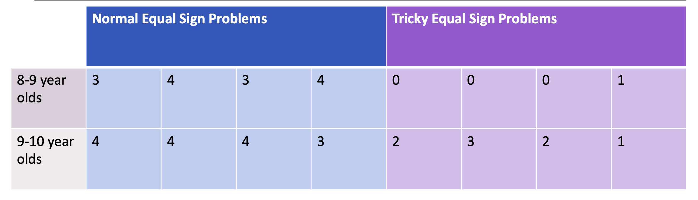

---

## Math is hard: Null Hypotheses for **Main Effects**

.pull-left[

$H_{0.1}$ : The two age groups perform similarly, regardless of how hard the math problem is


$H_{0.1}: \mu_8 = \mu_9$

]

.pull-right[

$H_{0.2}$ : Children perform similarly on normal and tricky math problems, regardless of how old the kids are


$H_{0.2}: \mu_{\text{normal}} = \mu_{\text{tricky}}$

]

---

## Math is hard

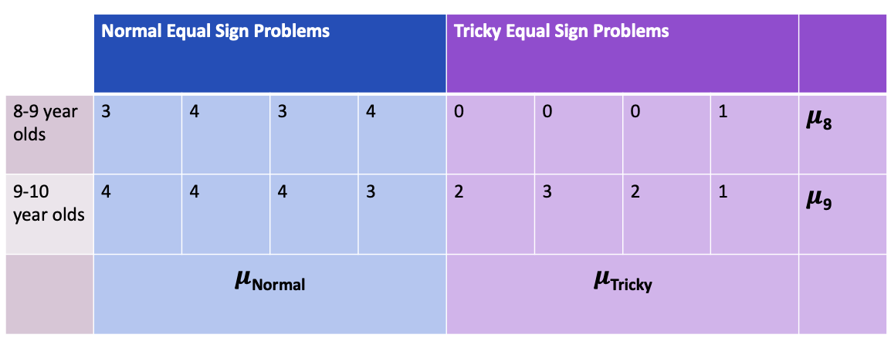
---

## Adding a 3rd Null Hypothesis

$H_{0.3}$ : *Differential performance from age group is independent of problem type*

$H_{0.3}$ : *Differential performance on problem types is independent of age group*

--

`r emo::ji("point_up")` These are the same! They are symmetric.

--

They are factors are NOT dependent on one another. 

---

## Math is hard: Means on means

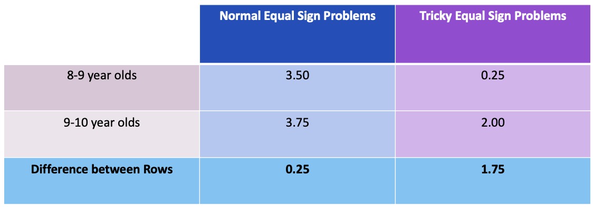

---

## Math is hard: Means on means

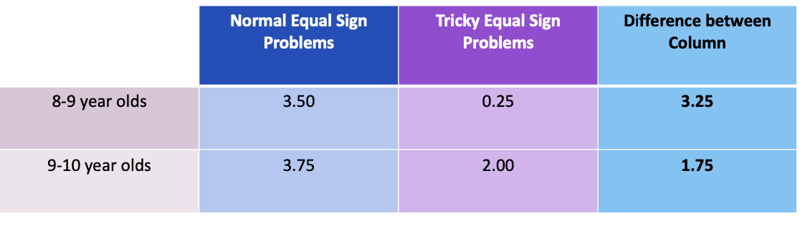
---

## Equations

Previously, we've talked about the restricted and the full model. We can write those as formal equations:

$Restricted: Y_{ij} = \mu + e_{ij}$

$Full: Y_{ij} = \bar{Y_{j}} + e_{ij}$

--

**Oneway ANOVA**

$Restricted: Y_{ij} = \mu + e_{ij}$

$Full: Y_{ij} = \bar{Age_{j}} + e_{ij}$

---

## Three Restricted Models

When testing the Age main effect...

$$Restricted: Y_{ij} = \mu + \text{Problem}_k + AP_{jk} + e_{ijk}$$

When testing the Problem main effect...

$$Restricted: Y_{ij} = \mu + \text{Age}_j + AP_{jk} + e_{ijk}$$

When testing the **interaction** between Age & Problem...

$$Restricted: Y_{ij} = \mu + \text{Age}_j + \text{Problem}_k + e_{ijk}$$
---

## Diagrams

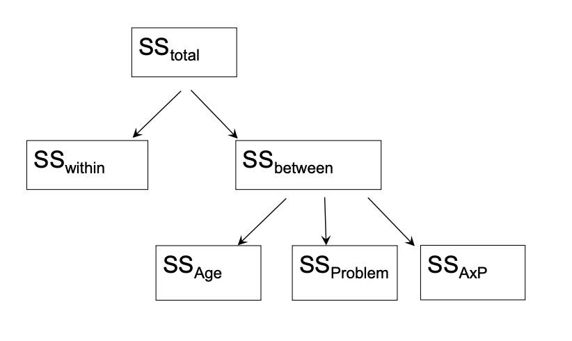
$SS_{\text{within}}$ is our Ef; $SS_{\text{between}}$ is our Er - Ef; $MS_{\text{within}}$ is the denominator for all *F*-tests

---

## ANOVA (Source) Table

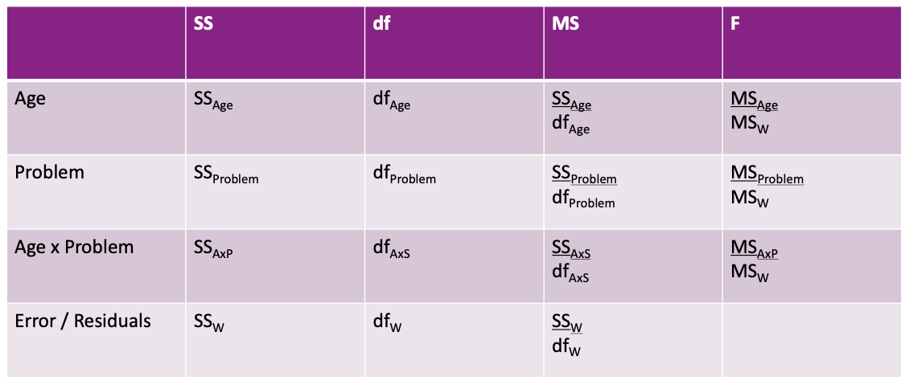

---

## ANOVA (Source) Table

Fill in the easy stuff first

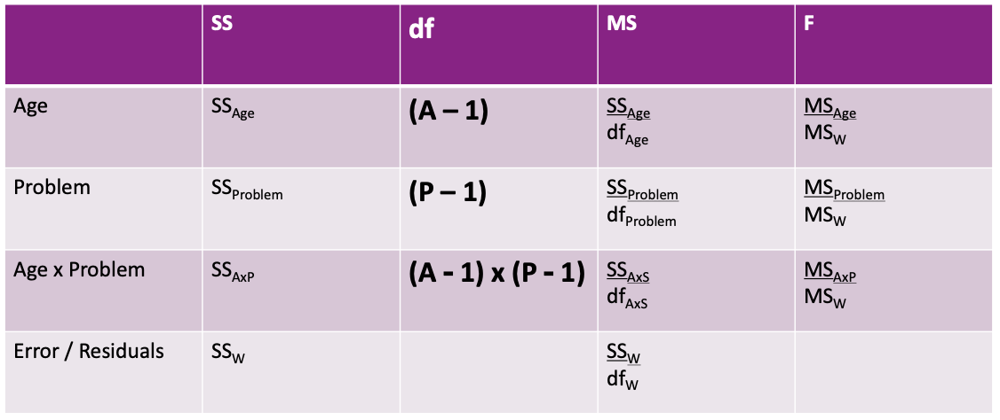

---

## Df for the Full Model

Always the (Number of Participants - Number of Estimated Parameters in Full Model)

How many means did we calculate? 

--

\begin{equation}
AP(n-1) \\
2 \times 2 (4-1) \\
4 \times3 \\
12
\end{equation}

---

## ANOVA (Source) Table

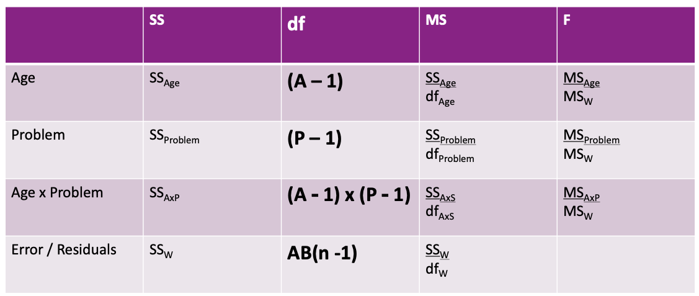

---

## ANOVA (Source) Table

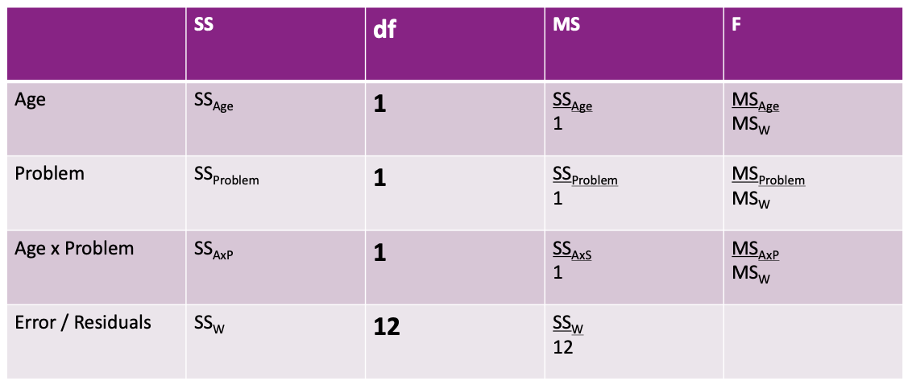

---

## How to calculate $SS_{Age}$

$SS_{Age} = E_R - E_F$

$Restricted: Y_{ij} = \mu + \text{Problem}_k + AP_{jk} + e_{ijk}$

$Full: Y_{ij} = \mu + \text{Age}_j + \text{Problem}_k + AP_{jk} + e_{ijk}$

---

## Get the $E_R$ for Age

<center>
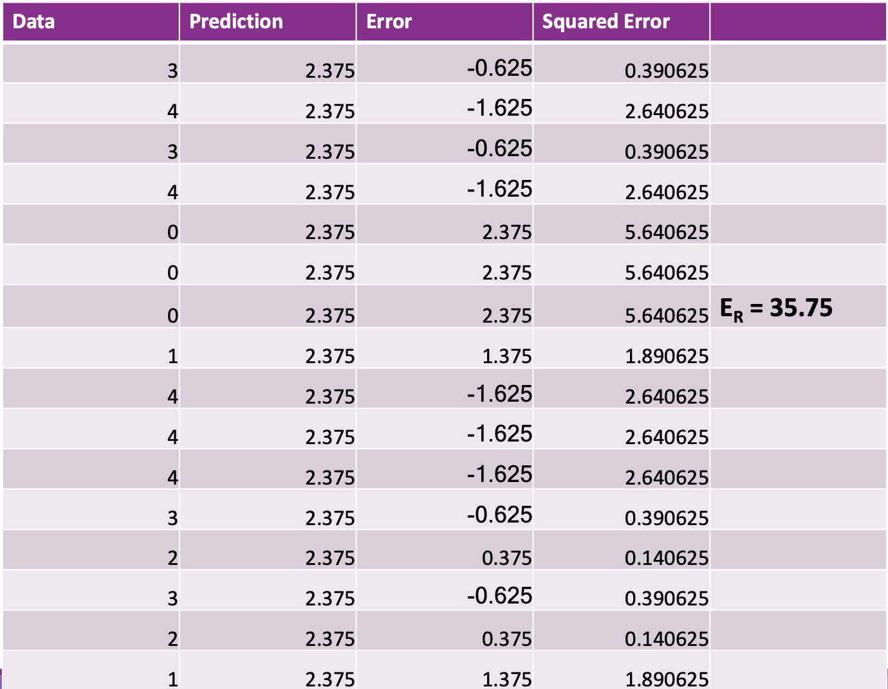
</center>

---

## Get the $E_F$ for Age

<center>
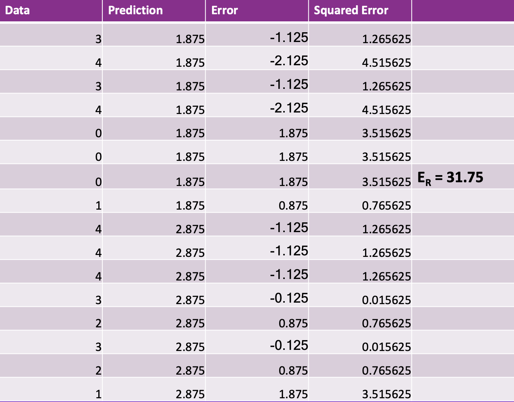
</center>

---

## How to calculate $SS_{Age}$

$SS_{Age} = E_R - E_F$

```{r}
35.75 - 31.75
```

<center>
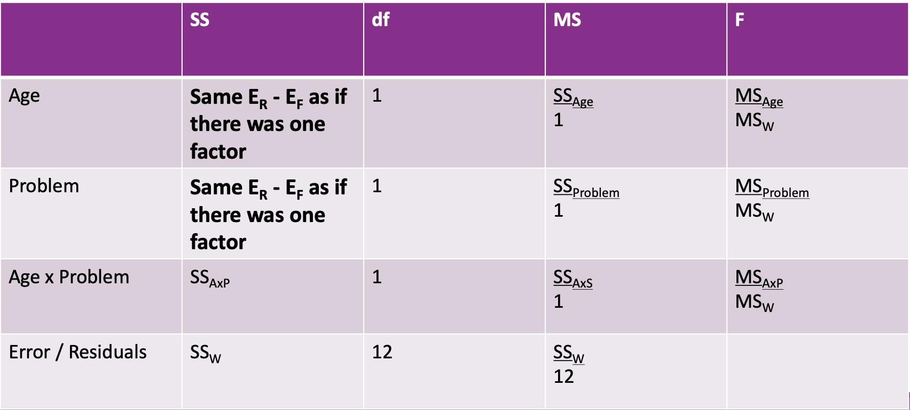
</center>

---

## ANOVA (Source) Table

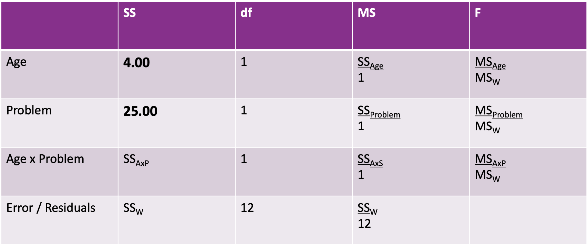

---
## ANOVA (Source) Table

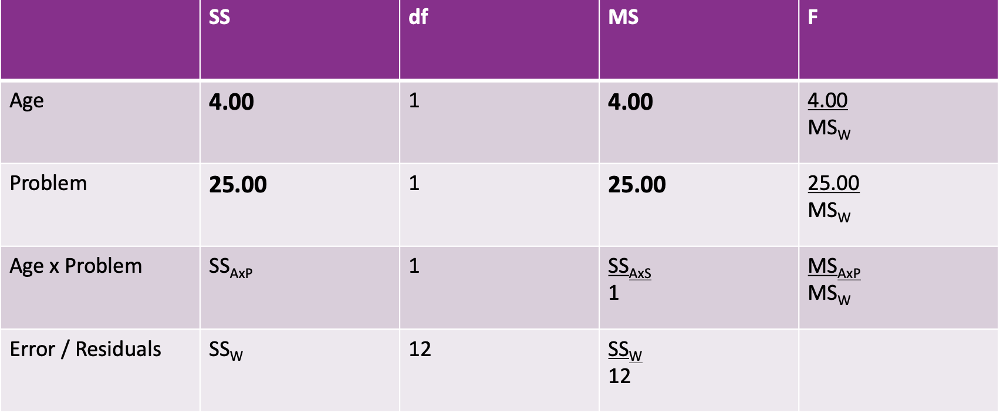

---
## Calculating the Interaction ( $SS_{AxP}$ )

$H_{0.3}$ : *Differential performance from age group is independent of problem type*

$H_{0.3}$ : *Differential performance on problem types is independent of age group*

---

### What does the restricted model say?

Your score = grand mean + some age effect + some problem effect + error

Predicted Score = grand mean + (diffrence between age effect and grand mean) + (difference between problem effect and grand mean)

Predicted Score = Grand Mean + (MeanRow – Grand Mean) + (MeanColumn – Grand Mean)

Predicted Score = Grand Mean + MeanRow – Grand Mean + MeanColumn – Grand Mean 

Predicted Score = MeanRow + MeanColumn – Grand Mean

*Difference between Restricted and Full Models = Squared deviations for each cell from this predicted score*

---

## Interaction Effect

*Difference between Restricted and Full Models = Squared deviations for each cell from this predicted score*

We need to get the deviations + squared deviations of each cell mean from the predicted score

--

$\Sigma(\text{Cell mean - Predicted Score})^2$

$\Sigma(\text{Cell mean - (Mean row + Mean column - Grand mean)})^2$

$\Sigma(\text{Cell mean - Mean row - Mean column + Grand mean})^2$

---

## OG Data

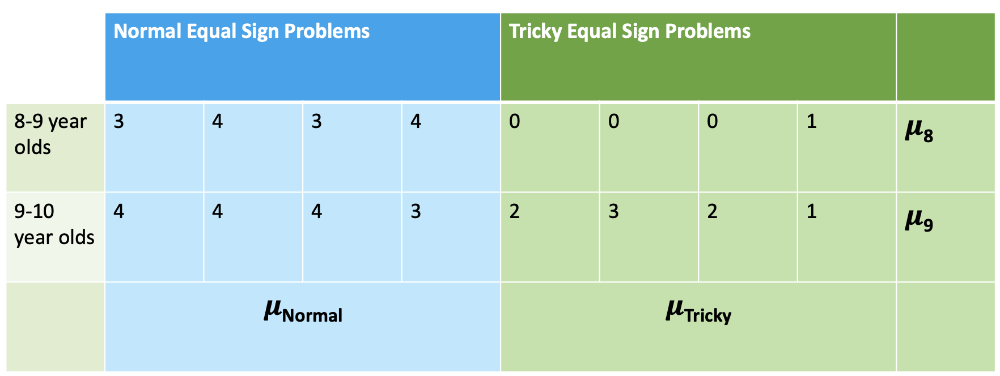

---

## Marginal Means

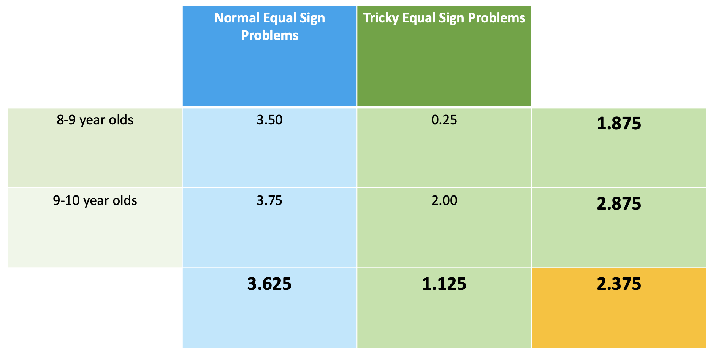

---

## Calculating the Interaction Effect

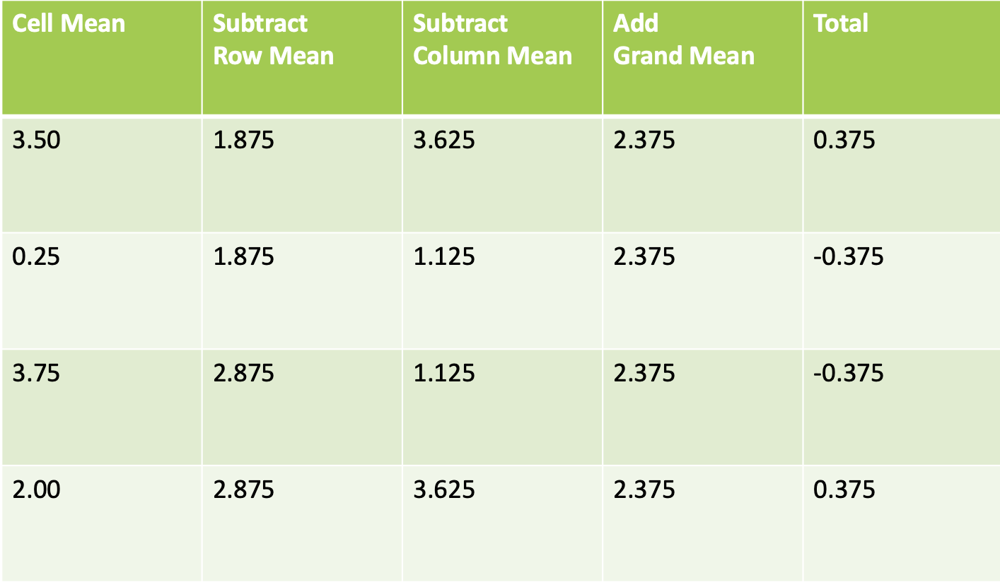

--

**Sum of deviations is 0!**

---
## Calculating the Interaction Effect

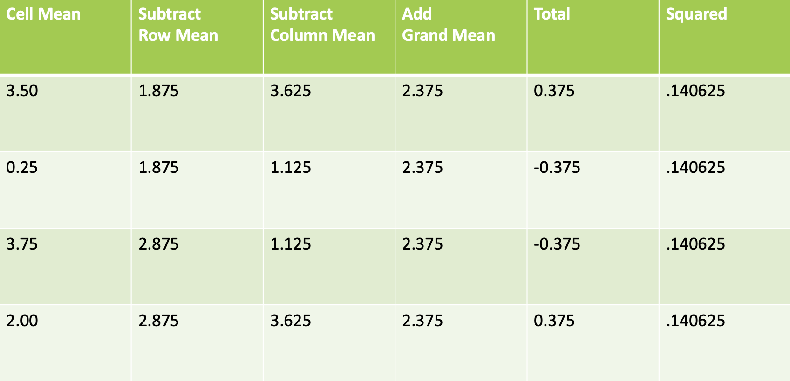

--

Sum them up = 0.5625

Multiply by n per group = 0.5625 * 4 = 2.25

---

## What we just did

- Found the means for each cell in our 2x2 ANOVA

- Took away the effect of each of the 2 factors (Age and Problem)

- Added back the grand mean

- *The extent to which each cell differs from its respective column and row is the difference between a model without an interaction (Restricted) and a model with one (Full)*

---

## ANOVA (Source) Table

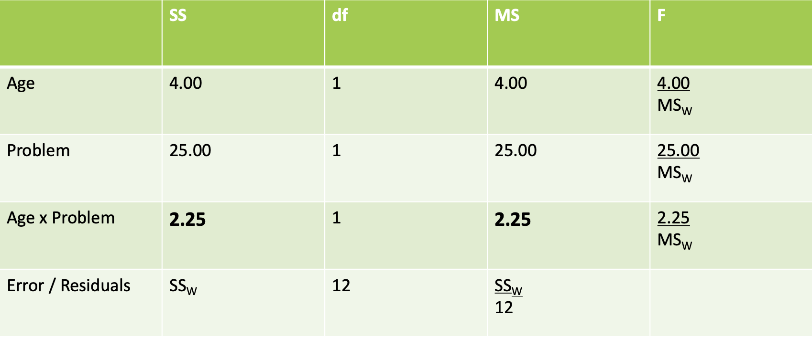

---

### $SS_{\text{within}}$

Error from the full model

The full model allows for the Age effect, the Problem effect, and the Interaction effect. 

So from the full model perspective, the best guess for observation is...

---
## $SS_{\text{within}}$

<center>
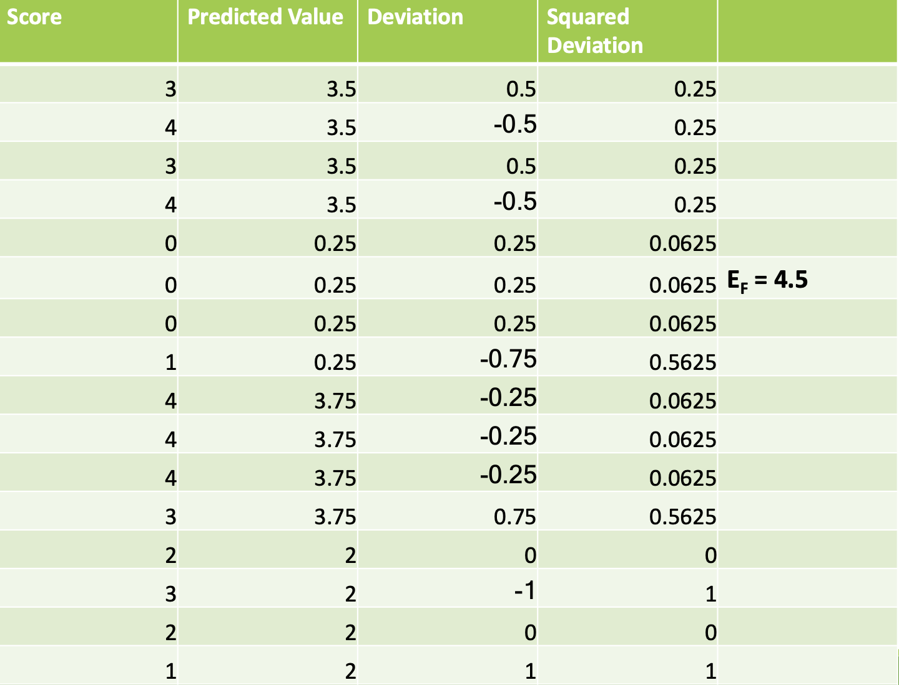
</center>

---

## ANOVA (Source) Table

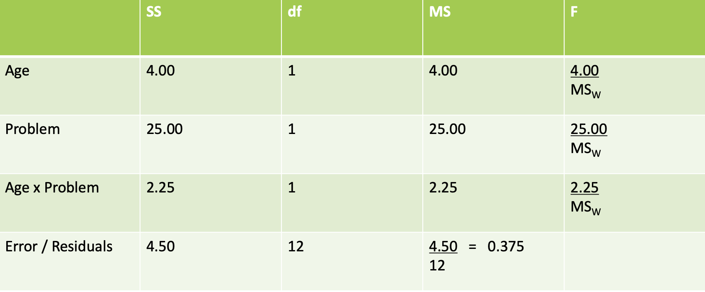

---

## ANOVA (Source) Table

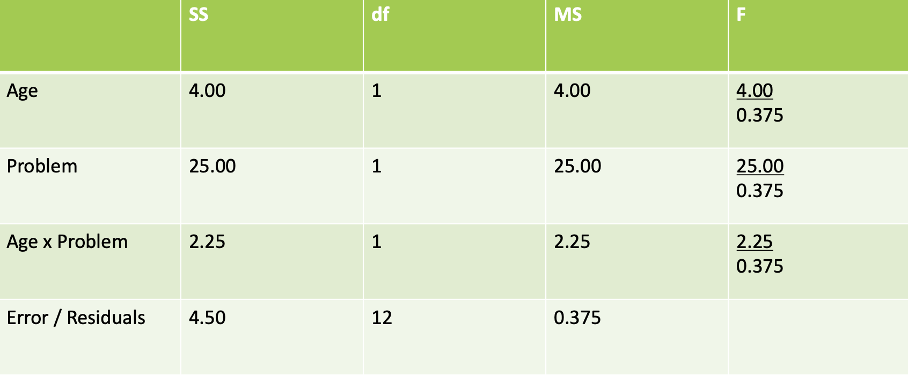

---

## ANOVA (Source) Table

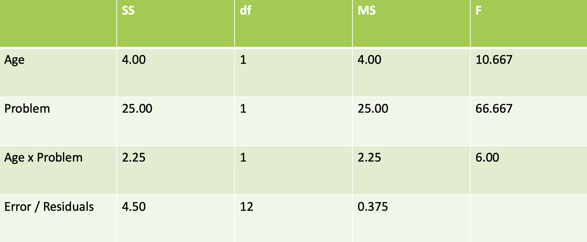

```{r}
qf(p = .05, df1 = 1, df2 = 12, lower.tail = FALSE)
```

---

## What do we conclude?

We have 3 rejected null hypotheses. We interpret:

1) There is a main effect of age; the means of age groups are not equal

2) There is a main effct of problem type; the means of normal vs. tricky math problems are not equal

3) The difference in age groups differs by problem type (and vice versa)

---

## Effect Sizes


---

## Eta-squared

$\eta^2 = \frac{SS_{Effect}}{SS_{Total}}$

.pull-left[
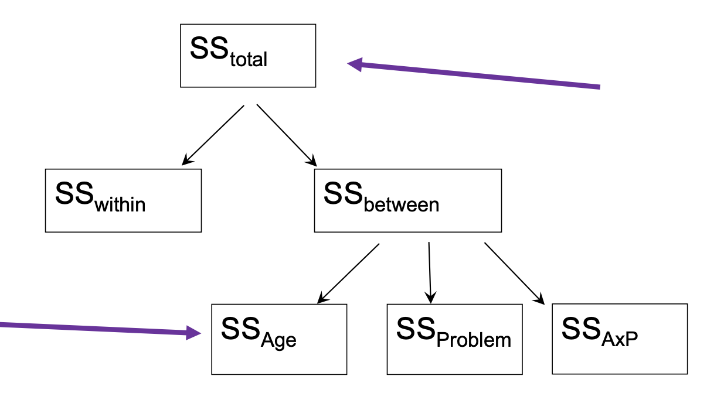
]

.pull-right[

$\eta^2 = \frac{4}{35.75} = .112$
]

Proportion of the variation in Y that is associated with membership of the different groups defined by X. How much variance in our outcome is associated with Age? 11.2% of *total* variance can be accounted for by Age. 
---
## Eta-squared

$\eta^2 = \frac{SS_{Effect}}{SS_{Total}}$

.pull-left[

]

.pull-right[

$\eta^2 = \frac{4}{35.75} = .112$
]

Hard to compare across studies bc dependent on study's total variance.

---

### Partial eta-squared
$\eta_p^2 = \frac{SS_{Effect}}{SS_{Effect} + SS_{Error}}$

.pull-left[
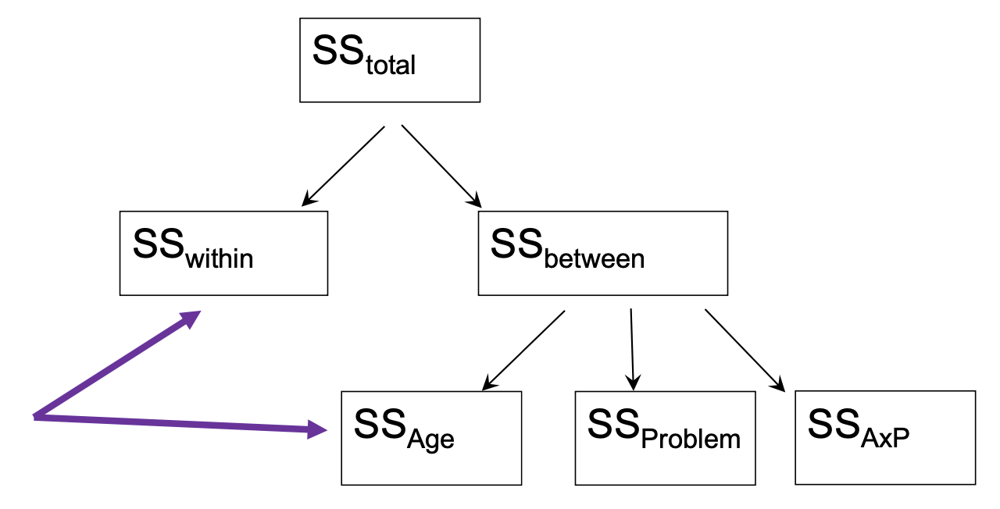
]

.pull-right[

$\eta^2 = \frac{4}{4 + 4.5} = .471$
]

Proportion of the variation in Y that can be explained by X, after accounting for all other variables in th model. How much variance in our outcome is associated with Age, after accounting for Problem, and their interaction? 47.1%.

Same rules of thumb for $\eta^2$; calculations differ when sample sizes are unequal or when there are more than 2 factors

---

## In `R`

```{r warning=FALSE, message=FALSE}
library(here)
mathproblem = read.csv(here("data/mathproblem.csv"))
mathproblem
```

---

## In `R` - No Interaction

```{r}
summary(aov(Score ~ Age + Problem, data = mathproblem))
```

--

**What's wrong with this?**

---

## In `R` - No Interaction

```{r}
mathproblem[2,2] <- "Eight"
mathproblem$Age <- factor(mathproblem$Age)
mathproblem$Problem <- factor(mathproblem$Problem)

summary(aov(Score ~ Age + Problem, data = mathproblem))
```

---

## In `R` - With Interaction

```{r}
summary(aov(Score ~ Age + Problem + Age*Problem, data = mathproblem))
summary(aov(Score ~ Age * Problem, data = mathproblem))
```

---

## Plotting

```{r warning = FALSE, message = FALSE, echo = FALSE}
library(ggplot2)
library(RColorBrewer)

summarizedData = mathproblem %>% 
  group_by(Age, Problem) %>% 
  summarize(meanScore = mean(Score),
            sdScore = sd(Score)) %>% 
  mutate(upperSD = meanScore + sdScore,
         lowerSD = meanScore - sdScore)

ggplot(data = summarizedData, aes(x = Age, y = meanScore, color = Problem)) +
  geom_col(position = position_dodge(width=.9), fill = "white", size = 2) +
  geom_errorbar(aes(ymin = lowerSD,
                    ymax = upperSD),
                position = position_dodge(width=.9),
                width = .2) +
  geom_point(data = mathproblem,
              aes(x = Age, y = Score, color = Problem),
             position=position_jitterdodge(),
             size = 4,
             alpha = .5) +
  theme_classic() +
  labs(x = "Age Category",
       y = "Mean Score",
       title = "2x2 ANOVA with Interaction")
  
```

---

class: inverse

## Next time

- Within-subjects designs

- Validity

- Exam 3 review

- Teary goodbyes (until next semester)

