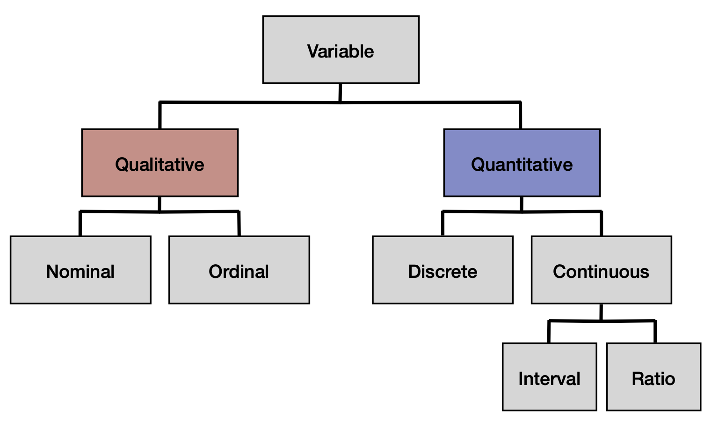
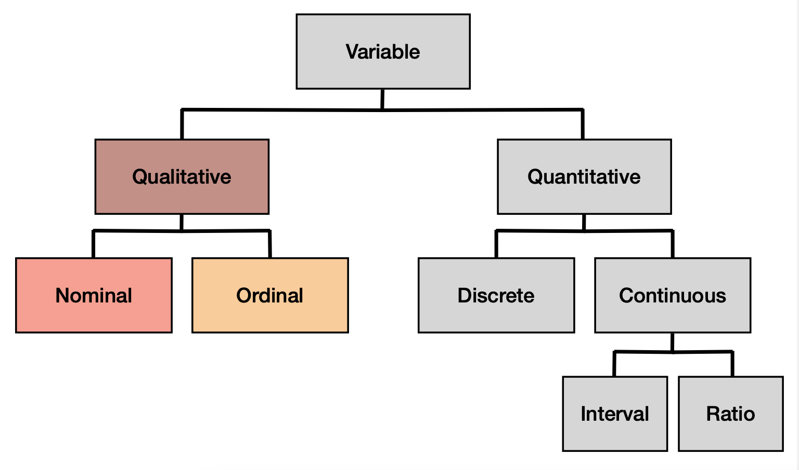
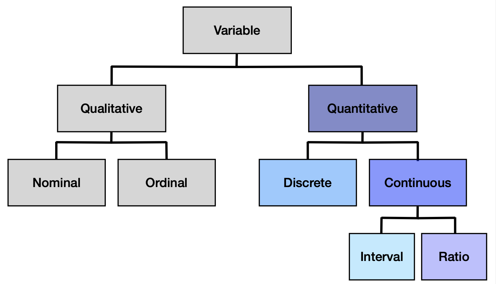

```{r xaringan-themer, include=FALSE, warning=FALSE}
library(xaringanthemer)
style_mono_accent(base_color = "#17139C",link_color = "#DD3E3E")

```

class: center

## Scales of measurement (Data types)


---
## Qualitative vs. Quantitative



.pull-left[
**Qualitative**:

- aka categorical, factors
- "not numeric", as in numbers serve as labels, not as things to add or subtract
]

--

.pull-right[
**Quantitative**:

- reflects magnitude
- values are actually numbers you can add/subtract
]


---
## Qualitative Variables
#### Nominal vs. Ordinal



.pull-left[
**Nominal**:

- Response options are groups
- There is no order
- Example -- What are different kinds of fruit?
    - apples: <span style="color: red;">1</span>
    - blackberries: <span style="color: red;">2</span>
    - coconut: <span style="color: red;">3</span>
]

.pull-right[

]
---

## Qualitative Variables
#### Nominal vs. Ordinal


.pull-left[
**Nominal**:

- Response options are groups
- There is no order
- Example -- What are different kinds of fruit?
    - apples: <span style="color: green;">3</span>
    - blackberries: <span style="color: green;">1</span>
    - coconut: <span style="color: green;">2</span>
]

.pull-right[

]

---

## Qualitative Variables
#### Nominal vs. Ordinal


.pull-left[
**Nominal**:

- Response options are groups
- There is no order
- Example -- What are different kinds of fruit?
    - apples: <span style="color: blue;">312</span>
    - blackberries: <span style="color: blue;">19</span>
    - coconut: <span style="color: blue;">999</span>
]

.pull-right[

]

---

## Qualitative Variables
#### Nominal vs. Ordinal


.pull-left[
**Nominal**:

- Response options are groups
- There is no order
- Example -- What are different kinds of fruit?
    - apples: 1
    - blackberries: 2
    - coconut: 3
]

.pull-right[
**Ordinal**:

- Response options are *ordered*
- No consistent distance between possible scores
- Example -- List the following fruits in order of preference
    - apples: 2
    - blackberries: 1
    - coconuts: 3
]

---

## Quantitative Variables
#### Discrete vs. Continuous


.pull-left[
**Discrete**:

- Takes numeric values that are countable
- Must be finite number of possibilities
- Examples
    - `#` of children/family
    - `#` of students/class
- Often confused with categorical; context matters

]

--

.pull-right[
**Continuous**

- Takes numeric values that are not necessarily countable
- Infinite number of possibilities
- Examples
    - Age
    - Height/weight
- AKA "scale" variables
]

---
## Quantitative Variables
#### Continuous


.pull-left[
**Interval**:

- Responses are ordered (like ordinal)
- Distance between responses is the same (unlike ordinal)
- No meaningful 0
- Examples
    - temp in Farenheit
- .small[Not as common unless you treat Likert scale as interval (it is technically ordinal)] 

]

--

.pull-right[
**Ratio**

- Same as interval, but now with a meaningful 0
- 0 indicates the absence of something
- Example
    - How many words did you recall on a memory test?
    - 0 words recalled is meaningful!

]

---

class: center

## Pitfalls?


---
## Pitfalls

Confusing Nominal and Ordinal
  - lose information about order you might want
  - or maybe you don't care and it doesn't matter

--

Confusing Interval and Ratio
  - lots of stats are interpreted in regards to 0
  - if there is no meaningful 0, how do you interpret?

--

Confusing Qualitative and Quantitative
  - happens more than you think; esp in the machine learning world
  - can straight up get the wrong numbers (will come back to this with correlation!)
  
---

class: inverse 

## Next time

Describing data

