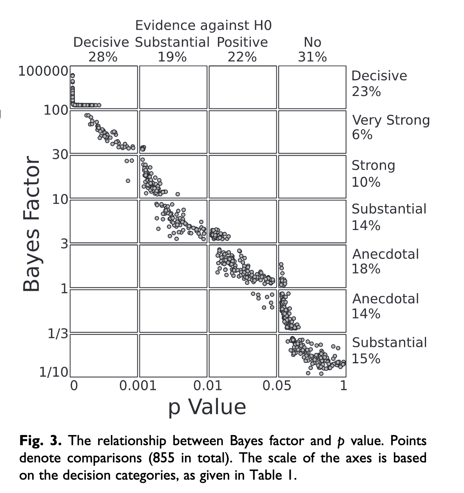

```{r, echo=FALSE, warning=FALSE, message=FALSE, results='hide'}
library(tidyverse)
```

## Frequentist Viewpoint

- Frequentist vs. Bayesian
- **Frequentist** view is sometimes called the "in the long run" view. It defines probability as what is expected to happen in the long run, if the event in question (e.g., tossing a coin, rolling a die) is repeated over and over. *(This is what we've been talking about)*

  - Ex: We know that a fair coin will come up on heads 50% of the time: $P(H) = .5$
  - A coin flipped a 2 times might come up heads both times (100%), but a head flipped 1000 times would not likely come up heads 1000 times. *In the long run, the proportion of heads will converge on the expected probability.*

---
## Frequentist Viewpoint

This "long run" view of probability means that in "short run" the outcomes will not behave as expected—the outcomes will show variability around the expected probability outcome. ]

<p>&nbsp;</p>

The utility here is that we know what the truth is and can see how closely we approximate it in the long run, but also see what happens in realistic short run circumstances:

- Tossing a coin: proportion of heads, P(H) = .5

- Rolling a die: proportion of sixes, P(6) = .1666

- Selecting a Scrabble tile: proportion of Zs, P(Z)=.01

---

The frequentist view is popular because it is objective. The events in question are observable and the definition of probability (proportion of an event in the long run) is calculated in the same way by everyone.

<p>&nbsp;</p>

On the other hand, in real life, "the long run" may not have a simple or realistic meaning: 

<p>&nbsp;</p>

"The probability that Shelly has her phone with her today is .8, or 80%."

<p>&nbsp;</p>

At one level, we all have an intuitive feel for what this means and understand it to tell us that Shelly likely does not have her phone.

---

But, in the strict sense, that statement doesn’t have a sensible meaning in the language of a frequentist view.

<p>&nbsp;</p>

I either do or I do not have my phone with me today (there are only two outcomes in the sample space); it makes no sense to say that I have 80% of my phone with me today and the event is not repeatable (having my phone today) in the strict sense, so the “long run” doesn’t seem to apply.

<p>&nbsp;</p>

Instead, we have to say something like, on days like today (which can be repeated), the probability that Shelly has her phone with her is .8.  

<p>&nbsp;</p>

Probability and statistics involve many such convenient fictions...

???

They allow us to get on with the job of forecasting from models to data or making inferences when going from data to models.

---

The link between probability and statistics is clear when we make the move to inference—the major task in science.

<p>&nbsp;</p>

In probability, the model (the probability distribution, the generating function) is known and informs us what will be true about the data.  

<p>&nbsp;</p>

In statistical inference, the model is not known and we let the data inform us about the plausibility of different models that might be true.  

<p>&nbsp;</p>

We have to make assumptions about those models in order to sensibly answer the inference question.

---

If this coin is fair (proposed model), I expect the proportion of heads to be .5 in the long run.

<p>&nbsp;</p>

After a long run (data collection), I find the proportion of heads to be .75.  I reject the "fair coin model."  I could be wrong but will try to limit the mistakes.  

<p>&nbsp;</p>

This is statistical inference.  It relies upon assuming some generating process for the events (a model), typically defined by a theoretical probability distribution (here the binomial).  That framework allows us know the likelihood that we are wrong in our inference, especially in the short run.

<p>&nbsp;</p>

Probability and probability distributions provide a frame of reference for making inferences.

---

### Distributions and their distinctions.

**Population distribution:** the usually hypothetical set of all possible measurements.  

<p>&nbsp;</p>

- In the frequentist view this would be an infinitely long series of events.  

<p>&nbsp;</p>

- In practice, we have to settle for “really long.”

<p>&nbsp;</p>
<p>&nbsp;</p>

**Sample distribution:** the set of measurements in hand, assumed to be a random sample from the population. 

<p>&nbsp;</p>

- I will use statistics about the sample to infer what is true about population parameters.

---

### Distributions and their distinctions.

**Sampling distribution:** Any sample will be off the mark in the value of a statistic relative to the population.  These statistic values will have a distribution across different random samples of the same size from the same population.  The variability in that distribution will tell us about the precision of the sample as a population estimate and the confidence we can have in claims we make about parameters.

<p>&nbsp;</p>

- Long run version (repeated sampling interpretation)

<p>&nbsp;</p>

- Theoretical version

*More on both of these when we talk about sampling.*

---

## Bayesian statistics

In contrast to the frequentist view, the Bayesian view takes prior beliefs into account in determining the probability of an event.  

- It is a model of rational thinking that adjusts current beliefs about the probability of an event given previous knowledge or beliefs.  

- Because those prior beliefs could come from anywhere, the approach is sometimes labeled "subjectivist," but it need not be hopelessly subjective.

The key contribution can be summarized in Bayes’ Theorem:

$$\Large \text{A given B} = P(A|B) = \frac{P(B|A)P(A)}{P(B|A)P(A) + P(B|\neg A)P(\neg A)}$$

---

### Bayesian example

I have the personal theory that, generally speaking, Bayesians are smug.  I meet a smug person. What is the probability that I have met a Bayesian?

$$\large \text{Bayesian | Smug} = P(B|S) = \frac{P(S|B)P(B)}{P(S|B)P(B) + P(S|\neg B)P(\neg B)}$$
$P(B) = .1 \text{(Bayesian are not common, overall)}$

$P(S|B) = .8$

$P(S|\neg B) = .3$

$$\large \text{Bayesian | Smug} = P(B|S) = \frac{(.8)(.1)}{(.8)(.1) + (.3)(.9)} = `r round((.8*.1)/(.8*.1 + .3*.9),3)`$$
---

$P(B) = .1$

$P(S|B) = .8$

$P(S|\neg B) = .3$

$P(B|S) = `r round((.8*.1)/(.8*.1 + .3*.9),3)`$

From a pure baserate standpoint I should assume the probability is .1 that this person is a Bayesian.  Bayesian reasoning tells me to take my prior beliefs into account given what I believe to be true about the relation of smugness to Bayesian status.

<p>&nbsp;</p>
--
But, it also tells me not to be too enthusiastic about this Bayesian attribution.  I should not just flip around my conditional probability of "smugness given Bayesian" and claim the probability is .8 that I’ve just encountered a Bayesian. 

--
<p>&nbsp;</p>
In the language of Bayes Theory, P(B) is called the **prior probability**, P(B|S) is the **posterior probability**, which is an adjustment of P(B) in the face of additional information (smugness).

---

The liberal sprinkling of the term, belief, in all this is what garners the label, subjectivist.

<p>&nbsp;</p>

There is no need for P(B) or P(S|B) to be point estimates.  We can express uncertainty about these beliefs by making them *probability distributions*. The result is a posterior probability distribution.  I can use actual data to help me decide which of several different models about Bayesian-smugness beliefs is the better account.

<p>&nbsp;</p>

There is no controversy when the prior information is based on solid scientific evidence.

---

## Another Bayesian example

My doctor calls me with the results of a diagnostic test for a very rare but always fatal medical condition. I ask about the nature of the test and he tells me it has a sensitivity of .99 and specificity of .99, based on a large number of clinical studies.  How worried should I be? What is the probability that I will actually get this disease?

--

Assume that in the population, 1 out of every 10,000 people gets the condition: P(Disease) = .0001. 

The sensitivity tells me that P(Positive Test|Disease) is .99.

The specificity tells me that P(Positive Test|No Disease) is .01.

What is the probability that I will get this disease given that I have a positive test?  P(Disease|Positive Test) = .0098

???

Before transitioning, need to know probability of rare disease.

$$\frac{(.99)(.0001)}{(.99)(.0001)+(.01)(.9999)}$$

---
## $p$-values

Soon enough, we'll get to how $p$-values are derived from data. But it's worth bringing them up now, because they are statments about probability. 

What are $p$-values representing the probability of?

--

Which view of probability, frequentist or Bayesian, are $p$-values associated with?

---

## Likelihood under different views

.pull-left[
### Frequentist

$$p = P(\text{Data}|H_0)$$
]

.pull-right[
### Bayesian
$$\text{Bayes Factor} = \frac{P(\text{Data}|H_A)}{P(\text{Data}|H_0)}$$
]

Which is right?

* $p$-values and Bayes Factor are highly correlated ([Wetzels et al., 2011](../readings/Wetzels_etal_2011.pdf)).


???

Note that $H_A$ can be a range of possible parameters, in which case, you get the weighted probability across many, or the integral if a continuous range. 

---

```{r, echo = F, out.width='75%'}

```

.small[([Wetzels et al., 2011](../readings/Wetzels_etal_2011.pdf))]

???
But major disagreement in conclusion.

- When $p$-value falls between .01 and .05, there is a 70% chance that Bayes Factor suggests only anecdotal evidence in favor of alternative. 

Take-away -- Bayes Factor is more conservative when it comes to finding evidence against the null hypothesis. Is that better, or worse?

---

class: inverse

## Next time...

Sampling distributions
$t$-distributions