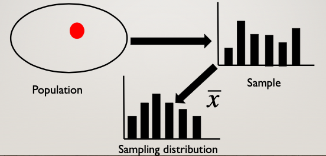

```{r setup, warning=FALSE, message=FALSE, include = FALSE}
library(tidyverse)
```


## What do we want?

We want to make inferences about a population

  - But the population is too large to measure directly
  - So we need to estimate the population parameters
  
---

## Population

- The population distribution is a *theoretical probability distribution* that has some mathematical form

- We want ot know how the population distribution influences the distribution of **sample** statistics

- Ultimately we want to use a sample distribution to understand the population distribution

---

## What is the *point* of inferential stats?

Point estimation: we use our sample statistics to take our best guess of the population parameter

We know that our estimates will vary from sample to sample

We're using our sample as an estimate
  - Sample mean $\bar{X}$ is an **_estimator_**
  - A specific sample is an **_estiamte_**

---

## Population vs. Sample

|             | Population<br>Distribution |  Sample<br>Distribution |
|:-----------:|:-----------:|:-----------:|:-----------:|
| Distiribution consists of:    |    Individual observations<br> $x$    | Individual observations<br> $x$       | 
| Central tendency |    $\mu$   | $\bar{x}$      | 
| Dispersion | $\sigma^2$ | $s^2$ |
|            | $\sigma$ | $s$ |
| Type       | Parameter | Statistic |
| T vs. O    | Theoretical | Observed |


---

## Sampling Distribution

- The major goal that we have in statistical inference is to make confident claims about the *population* based on a small representation of it, the *sample*.

- Any sample will be off the mark in how well it captures the important features of a population. The **sampling distribution** tells us how far off the mark we can expect a sample statistic to be. 


---
## Sampling Distribution
- We use features of the sample (*statistics*) to inform us about features of the population (*parameters*).
- The quality of this information goes up as sample size goes up -- **the Law of Large Numbers**. 

All sample statistics are wrong, but they become more useful as sample size increases. 

So...
  - how big does the sample need to be?
  - for a given sample size, how precise is a sample statistic as a representation of the population?

---
.left-column[
### Population distribution
.small[The parameters of this distribution are unknown.

We use the sample to inform us about the likely characteristics of the population.]

]

```{r, echo = F, warning = F, message = F}
ggplot(data.frame(x = seq(-4, 4)), aes(x)) +
  stat_function(fun = function(x) dnorm(x), geom = "area") +
  scale_x_continuous("Variable X") +
  scale_y_continuous("Density") +
  labs(title = expression(Population~mu*"=0"~sigma~"=1"))+
  theme(text = element_text(size = 20))

```

---

.left-column[

### Samples from the population 

.small[
Each *sample distribution* will resemble the population. That resemblance will be better as sample size increases: The Law of Large Numbers.

Statistics (e.g., mean) can be calculated for any sample.
]
]

```{r, echo=FALSE, warning=F, message=F}
library(ggpubr) #for multiple plots
sample_size = 30
set.seed(101919)
for(i in 1:4){
  sample = rnorm(n = sample_size)
  m = round(mean(sample),3)
  s = round(sd(sample),2)
  p = data.frame(x = sample) %>%
    ggplot(aes(x = x)) +
    geom_histogram(color = "white") +
    geom_vline(aes(xintercept = m), color = "purple", size = 2, alpha = .5)+
    scale_x_continuous(limits = c(-4,4)) +
    scale_y_continuous("", breaks = NULL) +
    labs(title = as.expression(bquote("Sample"~.(i)~", m ="~.(m)~", sd ="~.(s))))
  assign(paste0("p",i), p)
}

ggarrange(p1,p2,p3,p4, ncol =2, nrow = 2)
```

???
here, the sample sizes is 30 fo each of these 4 graphs. each of theses is a sample. and each sample has it's only mean and sd. 
---

.left-column[
.small[
A statistic (e.g., mean) from a large number of samples also have a distribution: the **samplING distribution**.

The mean of the **sampling distribution** converges on $\mu$

]
]

```{r sampling1, echo = F, warning = F, message = F}
reps = 5000
means = rep(0, reps)
se = 1/sqrt(sample_size)
set.seed(101919)
for(i in 1:reps){
  means[i] = mean(rnorm(n = sample_size))
}
data.frame(mean = means) %>%
  ggplot(aes(x = mean)) + 
  geom_histogram(aes(y = ..density..), 
                 fill = "purple", 
                 color = "white") +  
  stat_function(fun = function(x) dnorm(x, mean = 0, sd = se), inherit.aes = F, size = 1.5) +
  labs(title = "Sampling Distribution")
```

---

.left-column[
.small[
This distribution has a standard deviation that tells us how typical or rare values of the sample statistic are likely to be.

The sampling distribution of the mean is of particular interest, it's called the **standard error of the mean** (SEM). 
]
]


```{r sampling2, echo = F, warning = F, message = F}
reps = 5000
means = rep(0, reps)
se = 1/sqrt(sample_size)
set.seed(101919)
for(i in 1:reps){
  means[i] = mean(rnorm(n = sample_size))
}
data.frame(mean = means) %>%
  ggplot(aes(x = mean)) + 
  geom_histogram(aes(y = ..density..), 
                 fill = "purple", 
                 color = "white") +  
  stat_function(fun = function(x) dnorm(x, mean = 0, sd = se), inherit.aes = F, size = 1.5) +
  labs(title = "Sampling Distribution")
```

???

Sampling distributions can be constructed around any statistic -- ranges, standard deviations, difference scores. The standard errors of those distributions are also standard errors. (E.g., the standard error of the difference.)

---



---
## Sampling Distributions

- Distribution of values of a particular statistic ( $\bar{x}$, $s^2$, $s$) across all possible samples of N observations
  - To keep it simple, let's just focus on the mean 
  - Statistic will be our *estimator* of the population

- **Sampling distriubtion $\neq$ sample distribution**

---
## Sampling Distributions

A theoretical probability distribution of all possible values of some statistic, computed from samples of the same size randomly drawn from the same population

Provides the frequency/probability with which values of statistics are observed or are expected to be observed when random samples of size N are drawn from a given population

---
## Interactive Example

PLAY WITH THIS!

[Sampling distribution example](http://shiny.calpoly.sh/Sampling_Distribution/)

---
## Sampling Distribution Approximates the Normal

One of the most important discoveries in statistics is that the sampling distributions of many statistics are approximately **normal** even when the sample (and population) distributions are not.

  - For example, the mean of a random sample will not precisely equal the population mean. But, how far off will it be? And what distribution shape will these possible sample mean values have?

The error represented by how far off a sample mean is from the population mean is called **sampling error**.  

---
## Central limit theorem

According to the **central limit theorem**, as sample size increases, the sampling distribution of the mean approaches normality, even when the data upon which the mean is based are not normally distributed.

The sample size necessary to be "approximately normal" depends on the nature of the underlying data.  The less normal it is, the larger the sample size necessary in order for the sampling distribution of the means to become normal.

"Around sample size of 30" is a common rule of thumb.
- Note, however, that this rule of thumb is sufficiently only to assume that the sampling distribution is normal. It doesn't magically mean your sample will be normally distributed

???

Regardless of the CLT, if the data are skewed, we might wonder if the mean is the best estimator to use here.

---

.left-column[Ends up that quite a few sample statistics approach normality as sample size increases.

Here is the sample standard deviation from a normal distribution with $\sigma = 1$.
]

```{r, echo = F, warning = F, message = F}
set.seed(102419)
reps = 1000
n2 = vector("numeric", reps)
n5 = vector("numeric", reps)
n25 = vector("numeric", reps)
n100 = vector("numeric", reps)

for(i in 1:reps){
  n2[i] = sd(rnorm(n = 2))
  n5[i] = sd(rnorm(n = 5))
  n25[i] = sd(rnorm(n = 25))
  n100[i] = sd(rnorm(n = 100))
}

data.frame(N = rep(c(2,5,25,100), each = reps), s = c(n2, n5, n25, n100)) %>%
  ggplot(aes(x = s)) + 
  geom_histogram(fill = "purple") + 
  scale_x_continuous("Standard Deviation")+
  scale_y_continuous("Density") +
  facet_wrap(~N, scales = "free_y")
```

---

.left-column[And the range.]

```{r, echo = F, warning = F, message = F}
set.seed(102419)
reps = 1000
n2 = vector("numeric", reps)
n5 = vector("numeric", reps)
n25 = vector("numeric", reps)
n100 = vector("numeric", reps)

for(i in 1:reps){
  n2[i] = range(rnorm(n = 2))[2] - range(rnorm(n = 2))[1]
  n5[i] = range(rnorm(n = 5))[2] - range(rnorm(n = 5))[1]
  n25[i] = range(rnorm(n = 25))[2] - range(rnorm(n = 25))[1]
  n100[i] = range(rnorm(n = 100))[2] - range(rnorm(n = 100))[1]
}

data.frame(N = rep(c(2,5,25,100), each = reps), s = c(n2, n5, n25, n100)) %>%
  ggplot(aes(x = s)) + 
  geom_histogram(fill = "purple") + 
  scale_x_continuous("Range")+
  scale_y_continuous("Density") +
  facet_wrap(~N, scales = "free_y")
```
???
Note here that we're not just narrowing in, but our mean estimate is getting larger. 

Remember bias?

---

## Relationship Between Population & Sampling

- If the population is normally distributed, the sampling distribution of the mean will be normally disributed

- If the population distribution is not normally distributed, the sampling distribution of the mean will become increasingly normally disributed as sample size increases

- We can use the normal distribution to make inferences about the unknown population mean, based on the sample mean and sample standard deviation

---
## Sampling Mean = Population Mean

$$ E(\bar{x}) = \mu$$

Expected value is the long run average

---
## Sampling Mean = Population Mean
$$
\begin{equation}
\bar{x} = \frac{(x_1 + x_2 + ... x_N)}{N} \\
E(\bar{x}) = E\bigg(\frac{(x_1 + x_2 + ... x_N)}{N}\bigg) \\
E(\bar{x}) = \frac{E(x_1) + E(x_2) + ... E(x_N)}{E(N)} \\
E(\bar{x}) = \frac{\mu + \mu + ...\mu}{N} \\
E(\bar{x}) = \frac{N\mu}{N} \\
E(\bar{x}) = \mu
\end{equation}
$$

---
## Expected Value Variance
You can also have a "long run" or expected variance, too. Equivalent to the population variance.

$\sigma = E(\bar{x}^2) - (E(\bar{x}))^2$

First term:
 - square your $x$ (each score is squared)
 - multiply each value by probability (if 5 scores, 1/5)
 - take the sum

Second term:
 - get the mean of $x$
 - square it

---
## Sampling SD $\neq$ Population SD

$$\sigma_M^{2} = E(\bar{x}^2) - (E(\bar{x}))^2$$

[insert long proof here...]

$$E(\bar{x}^2) = \frac{\sigma_M^{2}}{N} + \mu^2$$

---
## Variability in the Sampling Distribution

**Standard Error of the Mean**
  - The standard deviation of the sampling distribution
  - Directly related to the variability of the underlying data:

$$\sigma_{m} = \frac{\sigma_X}{\sqrt{N}}$$

- The smaller the SEM, the more likely it is that your sample estimate of the mean will be closer to the population estimate of the mean
- SEM is a function of sample size! The more accurate your sample mean, the closer you are to approximating the population, and the smaller the standard error 

???
We do not know $\sigma$ but we can estimate it based on the sample statistic:

$$\hat{\sigma} = s = \sqrt{\frac{\sum(x - \bar{x})^2}{N-1}}$$

---

## More SEM

$$\hat{\sigma} = s = \sqrt{\frac{\sum(x - \bar{x})^2}{N-1}}$$

This is the sample estimate of the population standard deviation.  This is an unbiased estimate of $\sigma$ and relies on the sample mean, which is an unbiased estimate of $\mu$.

This is different from the sample standard deviation, which divides the sum of squares by $N$ rather than $N-1$.

$$SEM = \sigma_M = \frac{\hat{\sigma}}{\sqrt{N}} = \frac{\text{Estimate of pop SD}}{\sqrt{N}}$$
.small[(Most methods of calculating standard deviation assume you're estimating the popluation from a sample and correct for bias.)]

---
## Making Statements

The sampling distribution of means can be used to make probabilistic statements about means in the same way that the standard normal distribution is used to make probabilistic statements about scores.

For example, we can determine the range within which the population mean is likely to be with a particular level of confidence.

Or, we can propose different values for the population mean and ask how typical or rare the sample mean would be if that population value were true.  We can then compare the plausibility of different such “models” of the population.

???
The key is that we have a sampling distribution of the mean with a standard deviation **(the SEM)** that is linked to the population:

---
## Confidence Intervals

The sampling distribution of the mean has variability, represented by the SEM, reflecting uncertainty in the sample mean as an estimate of the population mean.

The assumption of normality allows us to construct an interval within which we have good reason to believe a sample mean will fall if it comes from a particular population:

$$\mu - (1.96\times SEM) \leq \bar{X} \leq \mu + (1.96\times SEM) $$

We can reorganize this to allow statements about the population mean, which is usually not known:

$$\bar{X} - (1.96\times SEM) \leq \mu \leq \bar{X} + (1.96\times SEM) $$
???
Sampling distributions are normally distributed
---
## Confidence Intervals

$$\bar{X} - (1.96\times SEM) \leq \mu \leq \bar{X} + (1.96\times SEM) $$

- This is referred to as the **95% confidence interval (CI)**
- Note the assumption of normality, which should hold by the Central Limit Theorem, if N is sufficiently large.

The 95% CI is sometimes represented as:

$$CI_{95} = \bar{X} \pm [1.96\frac{\hat{\sigma}}{\sqrt{N}}]$$


---

.left-column[
.small[
What if N is not “sufficiently large?”  The normal distribution assumes we know the population mean and standard deviation. But we don’t. We only know the sample mean and standard deviation, and those have some uncertainty about them. 

That uncertainty is reduced with large samples, so that the normal is “close enough.”  In small samples, the $t$ distribution provides a better approximation.
]
]

```{r, echo = FALSE, fig.width = 7, warning = FALSE, message = FALSE}
ggplot(data.frame(x = seq(-4, 4)), aes(x)) +
  stat_function(fun = function(x) dnorm(x), 
                aes(color = "Normal", linetype = "Normal")) +
  stat_function(fun = function(x) dt(x, df = 1), 
                aes(color = "t(1)", linetype = "t(1)")) +
  stat_function(fun = function(x) dt(x, df = 5), 
                aes(color = "t(5)", linetype = "t(5)")) +
  stat_function(fun = function(x) dt(x, df = 25), 
                aes(color = "t(25)", linetype = "t(25)")) +
  stat_function(fun = function(x) dt(x, df = 100), 
                aes(color = "t(100)", linetype = "t(100)")) + 
  scale_x_continuous("Variable X") +
  scale_y_continuous("Density") +
  scale_color_manual("", 
                     values = c("red", "black", "black", "blue", "blue")) +
  scale_linetype_manual("", 
                        values = c("solid", "solid", "dashed", "solid", "dashed")) +
  ggtitle("The Normal and t Distributions") +
  theme(text = element_text(size=20),legend.position = "bottom")
```

---
## $t$ distribution

- The primary difference between the normal distribution and the $t$ distribution is the fatter tails
  - This produces wider confidence intervals
  - The penalty we have to pay for our ignorance about the population

- The form of the confidence interval remains the same. We simply substitute a corresponding value from the $t$ distribution (using df = $N -1$).


$$CI_{95} = \bar{X} \pm [1.96\frac{\hat{\sigma}}{\sqrt{N}}]$$

$$CI_{95} = \bar{X} \pm [t_{.975, df = N-1}\frac{\hat{\sigma}}{\sqrt{N}}]$$

---
## Confidence Intervals

What does it NOT mean?
  - there is a 95% probability that the true mean lies inside the confidence interval

--

What it *actually* means:
  - If we carried out random sampling from the population a large number of times...
  - and calculated the 95% confidence interval each time...
  - then 95% of those intervals can be expected to contain the population mean.


---

.left-column[
.small[
###Simulation

At each sample size, draw 5000 samples from known population ( $\mu = 0$ , $\sigma = 1$ ). 

Calculate CI for each sample using $s$ and record whether or not 0 was in that interval.

Calculate CI using for each sample using $\sigma$.

]
]

```{r, echo = F, message = F}
reps = 5000

sizes = seq(5,200,5)

prop = rep(0, length(sizes))
prop_sig  = rep(0, length(sizes))

set.seed(101919)

for(n in 1:length(sizes)){
  sample_size = sizes[n]
  correct = vector(length = reps)
  correct_sig = vector(length = reps)
  for(i in 1:reps){
    sample = rnorm(sample_size)
    m = mean(sample)
    s = sd(sample)
    sm = s/sqrt(sample_size)
    lb = m-(1.96*sm)
    ub = m+(1.96*sm)
    missed = lb > 0 | ub < 0
  correct[i] = !missed
  
    sigma = 1
    sm_sig = sigma/sqrt(sample_size)
    lb_sig = m-(1.96*sm_sig)
    ub_sig = m+(1.96*sm_sig)
    missed_sig = lb_sig > 0 | ub_sig < 0
  correct_sig[i] = !missed_sig
  }
  prop[n] = sum(correct)/reps
  prop_sig[n] = sum(correct_sig)/reps

}

data.frame(n = sizes, p = prop, ps = prop_sig) %>%
  gather("estimate", "value", -n) %>%
  mutate(estimate = ifelse(estimate == "p", "Estimate of sigma", "Sigma")) %>%
  ggplot(aes(x = n, y = value, color = estimate)) +
  geom_smooth( se = F) +
  geom_hline(aes(yintercept = .95), color = "black") +
  scale_color_discrete("How do you\ncalculate SEM?") +
  labs(x = "Sample size", y = "Proportion of CIs that\ncontain the population mean") +
  theme(text = element_text(size = 20), legend.position = "bottom")

```

---

In the past, my classroom exams (aggregating over many classes) have a mean of 90 and a standard deviation of 8.

My next class will have 100 students. What range of exam means would be plausible if this class is similar to past classes (comes from the same population)?


```{r}
M = 90
SD = 8
N = 100

sem = SD/sqrt(N)

ci_lb_z = M - sem * qnorm(p = .975)
ci_ub_z = M + sem * qnorm(p = .975)
print(c(ci_lb_z, ci_ub_z))


ci_lb_z = M - sem * qt(p = .975, df = N-1)
ci_ub_z = M + sem * qt(p = .975, df = N-1)
print(c(ci_lb_z, ci_ub_z))
```

---

I give a classroom exam that produces a mean of 83.4 and a standard deviation of 10.6. A total of 26 students took the exam.

What is the 95% confidence interval around the mean?

```{r}
M = 83.4
SD = 10.6
N = 26

sem = SD/sqrt(N)

ci_lb_z = M - sem * qnorm(p = .975)
ci_ub_z = M + sem * qnorm(p = .975)
print(c(ci_lb_z, ci_ub_z))


ci_lb_z = M - sem * qt(p = .975, df = N-1)
ci_ub_z = M + sem * qt(p = .975, df = N-1)
print(c(ci_lb_z, ci_ub_z))
```
---


|             | Population<br>Distribution |  Sample<br>Distribution | Sampling<br>distribution |
|:-----------:|:-----------:|:-----------:|:-----------:|:-----------:|
| Distiribution consists of:    |    Individual observations<br> $x$    | Individual observations<br> $x$   | Statistics<br> $\bar{x}, s, s^2$ | 
| Central tendency |    $\mu$   | $\bar{x}$      | $\mu_M$ |
| Dispersion | $\sigma^2$ | $s^2$ | $\sigma^2_M$ |
|            | $\sigma$ | $s$ | SEM $\sigma_M$ |
| Type       | Parameter | Statistic | Statistic of statistics |
| T vs. O    | Theoretical | Observed | Theoretical

---

class:inverse

## Next time...

Exam 1 


(ahhhhhhhhhhh!)