```{r setup, include=FALSE}
options(htmltools.dir.version = FALSE)
knitr::opts_chunk$set(warning = F,
                      message = F,
                      fit.retina = 3,
                      fig.align = "center")

hook_source <- knitr::knit_hooks$get('source')
knitr::knit_hooks$set(source = function(x, options) {
  x <- stringr::str_replace(x, "^[[:blank:]]?([^*].+?)[[:blank:]]*#<<[[:blank:]]*$", "*\\1")
  hook_source(x, options)
})
```

```{r, echo = F, warning = F, message = F, results = 'hide'}
library(psych)
library(tidyverse)
library(broom)
library(formatR)
```

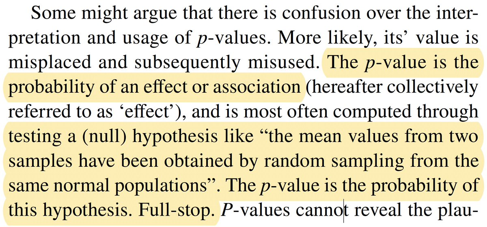

---

## `ggplot2`

- [Intro to `ggplot2`](introGgplot.pdf)

- [Customization](customizationGgplot.pdf)

- [Adding Stuff](multiPanelGgplot.pdf)

- [Layers](layersGgplot.pdf)

---

## Recap

- Goal of this week is to get you to stop and think about your plots *before* you make them. What are the kinds of things you should be considering? 

---
## What is Data Viz?

Data visualization is both an art *and* a science

Art:
  - Aesthetically pleasing
  - The story you're trying to tell
  
Science:
  - Graphical representation of specific types of data
  - The story you're trying to tell

---
class: inverse

## Warning


#### Making figures for academic purposes $\neq$ making figures for pure data viz purposes

If you go into data science (and aren't constrained by academia), you'll want to check out R shiny (for interactive plots), web design, typography, etc. 

If your PI asks you build a dashboard, think long and hard before committing. 

---
## Today

- What kinds of things should you be thinking about when it comes to data viz *for academic papers*? 

- What **not** to do (I'm gonna rant a bit)

- Hopefully helpful resources (no memorizing!)

---
## What should we be thinking about?

1. Telling your story

2. Contrast

3. Accessibility

---
## Telling your story

- Raw data are not intuitive. For the most part, you can't look at a spreadsheet of numbers and decipher any patterns. Especially with really big spreadsheets!

- We need a way to graphically show the data so that our human eyes can try to make sense of the data. 

- It is *so* easy to **LIE** with data! Balancing act of conveying your message and not lying. 

- As our datasets become more complex and high dimensional, data visualization can become more challenging. 

- The goal is NOT to show every bit of data you have collected. It's to show the relationship you care about in an honest manner.
---
name: good

## What makes a good figure?

- Clear, descriptive title

- Axes are clearly labeled with variables and units of measurement
  - **Label. Your. Damn. Axes.** 

- Scale is:
  - consistent across axis
  - easily interpreted
  - chosen so that data are evenly distributed (remember restricted range from correlation?)
  
- Data points are represented clearly, with a good key/legend

- Graph is the *appropriate* type for your data (nominal, ordinal, interval, ratio etc.)

---
## Appropriateness

There are no 100% right answers, but there are wrong ones...

- Pie charts are never the answer; **3D pie charts are the worst of the worse**
  - Instead, try stacked bar plot or even better, stacked dot plot
  
- **3D bar plots are never the answer**

- Typically, you should show either the raw data or at least a distribution
  - Shelly is anti bar plot, generally
  - Shelly is anti box plots on their own (nice when combined)
  - Shelly is skeptical of lines -- need to be careful

---
## Why Bar Plots Can Suck

.pull-left[
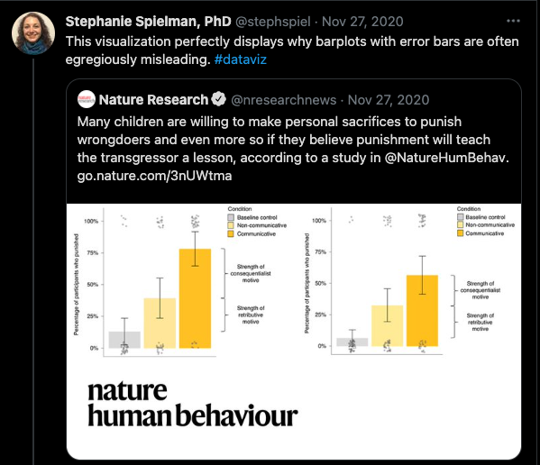
]

.pull-right[
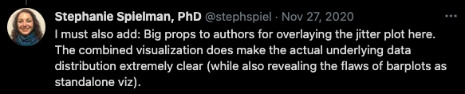

- Different alternatives exist, with dot plots being the best option probably

- Bars are more appropriate when you have proportions or counts; but even still -- dotplots

- [Excellent thread](https://tinyurl.com/3e6222a4) with many resources on how to maximize the utility of dotplots 
]

---
class: center, middle

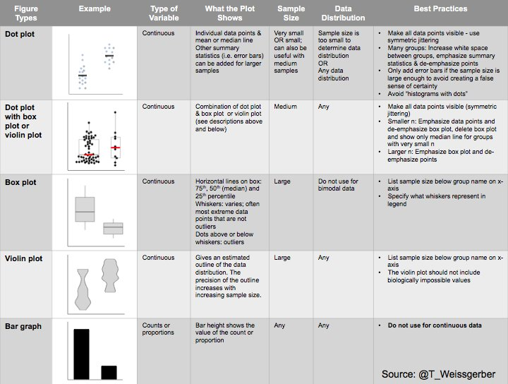
---

## Why box plots on their own can suck


.tiny[https://www.autodesk.com/research/publications/same-stats-different-graphs]

---

## Why adding lines can be misleading

<center>

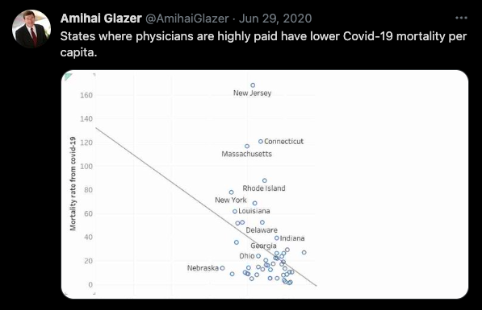
</center >

---
## Lines Cont...

<center>

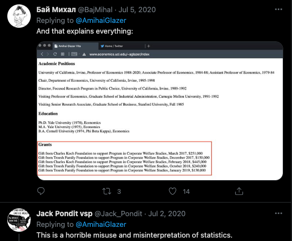
</center >

---
name: avoid

## Things to avoid

- Chartjunk

- Misleading text/axes

- Inaccurate plotting

- So many COVID-19 data visualizations...

---

## Chartjunk

.pull-left[

]

.pull-right[
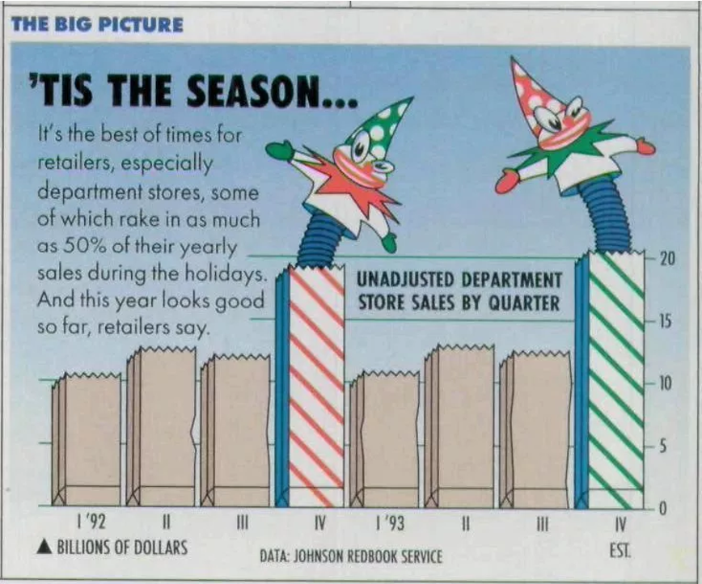
]

???
chartjunk is anything that gets in the way of reading the information displayed. this is stuff like unnecessary lines or grids behind the graph. patterns within the graph that might create the impression of movement or vibration like the diagonal lines. or something called DUCKS which are any dressings added to the graph that are distracting. like this weird monster or the clowns. it can be fancy fonts or 3d effects or again, anything that detracts from the data itself. 

---

## Misleading Text/Axes


---

## Inaccurate Plotting

[This strange plot](https://sirota.substack.com/p/georgias-misleading-covid-map) was put out by Georgia's Health Department. It's trying to show that basically there haven't been any real changes in COVID-19 statewide. But look at the values in the legend...They've changed them to basically keep the same graph. WUT?!


---

.pull-left[

# Misleading Shapes
]

.pull-right[


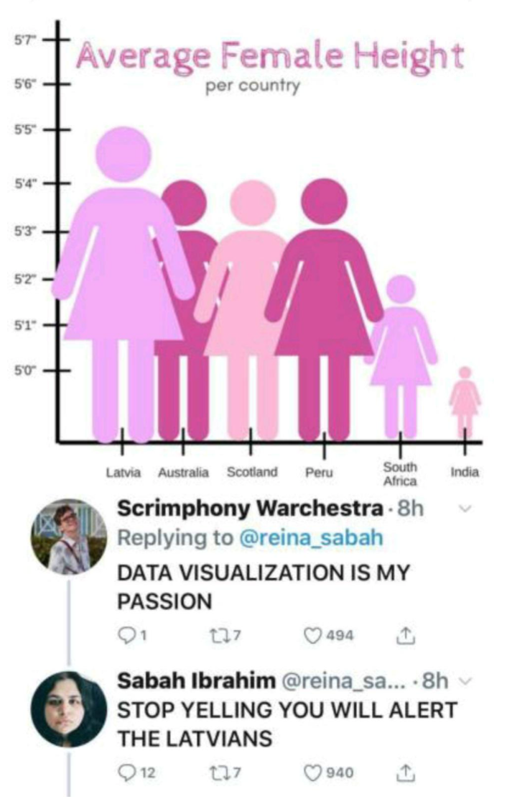
]
---
name: acc

## Accessibility is IMPORTANT

- Colorblindness sucks. ~1 in 12 men are colorblind (much lower in women)

- People have poor vision (glasses, anyone?)

- Journals scale your figure sizes down so that it fits within the article (like within a column of text)

--

What can we do?

- Colors
- Contrast
- Big text size (bigger/bolder you can get away with less color contrast)

---

## Color Palettes

Also super helpful! `RColorBrewer` and `ggsci` are great. But there are millions of others. 

**All you need are hex codes** (6 digits, alphanumeric). This is true for all color palettes (including monochromatic). 

Different types of palettes (unordered, sequential, divergent etc.). Look [at this blog post](https://blog.datawrapper.de/which-color-scale-to-use-in-data-vis/) to learn more about these

---
class: center, middle

## Bad use of colors

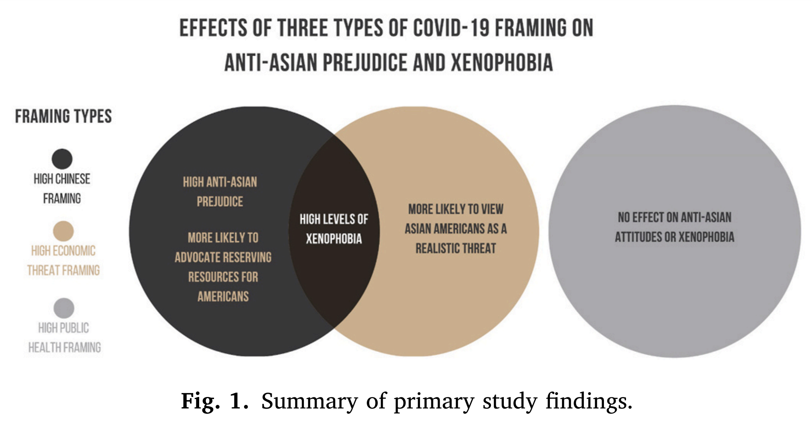

---


## Contrast

When you have something side-by-side, you can have different colors. OR you can have the same color but a different shade/tone/tint. 

.pull-left[
```{r, eval=FALSE}
ggplot(data = iris, aes(x = Species, y = Petal.Length)) +
  geom_boxplot(aes(fill = Species)) +
  scale_fill_manual(values = c("#0b2c0b",
                               "#228b22",
                               "#bdefbd")) +
  labs(title = "Hey look, A Title") +
  theme_classic(base_size = 24)
```
]

.pull-right[
```{r, echo=FALSE}
ggplot(data = iris, aes(x = Species, y = Petal.Length)) +
  geom_boxplot(aes(fill = Species)) +
  scale_fill_manual(values = c("#0b2c0b", "#228b22", "#bdefbd")) +
  labs(title = "Hey look, A Title") +
  theme_classic(base_size = 24)
```
]


---

## Grayscale

The most obvious of this is grayscale (technically, it's not a hue, and you're dealing with saturation, but that's completely unimportant for this intro):

<center>

</center>


---

## Providing Contrast is Important

It lets the reader *easily* extract meaningful information. 

Colors, shapes, size (as in bubble plots), sometimes transparency etc.

Need help picking different shades/tones/tints of the same color? A ton of websites can help! Ex: [https://www.colorhexa.com/](https://www.colorhexa.com/)

---

## Text Size

#### Don't make your font size super uber small!

Some of us are getting old and our eyesight is fading .small[_(I'm not bitter...yes I am...)_]

Also, academic journals scale down your figures. Better to make the text size larger so that when it gets scaled down, it's still readable.


---

## Aspect Ratios

You want to display your figures faithfully, but you don't want to take up extra space you don't need. Think about the aspect ratio of your plots!

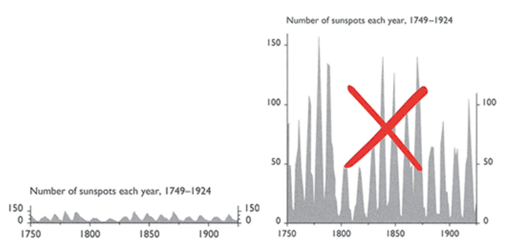

.tiny[Tufte, Visual Explanations. Graphics Press, Cheshire, Conn, 1997]

---

## Small Multiples
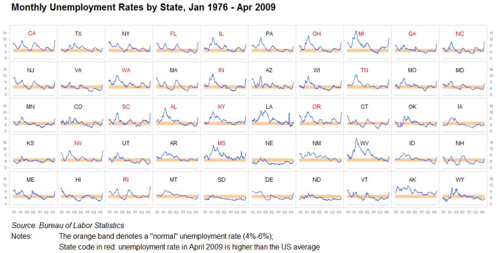
.tiny[https://www.juiceanalytics.com/writing/better-know-visualization-small-multiples]

---
## Small Multiples with COVID

<center>
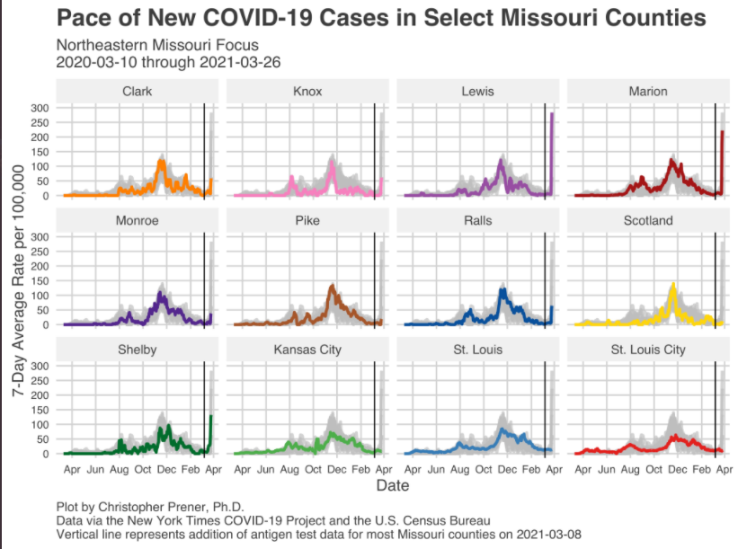
</center>


.tiny[https://twitter.com/chrisprener/status/1375937857840353280/photo/2]
---
## Rainbow Colormaps
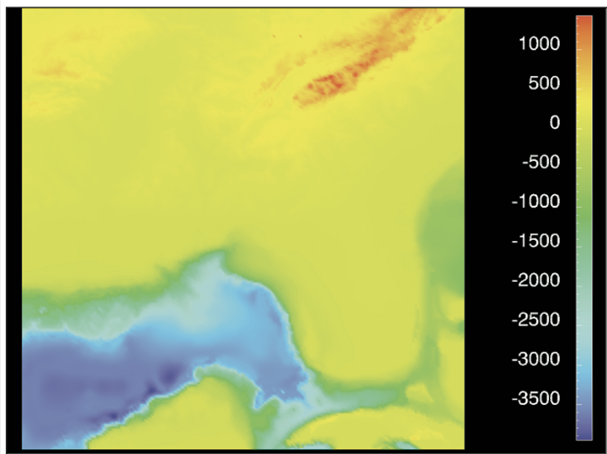
---

## Don't Use Rainbow Colormaps
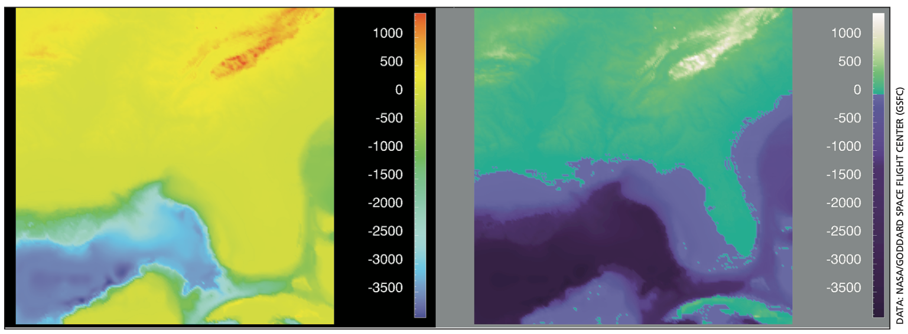

.tiny[Rogowitz & Treinish, IEEE Spectrum, 35(12):52-59. 1998]
---

## Self-evaluation

How do you know if you've made a good figure?

- Does it **EASILY** communicate what you want? 

- Do readers need to read and re-read your figure legend, or is your message clear?

- Is it accessible to people with poor eyesight or colorblindness?

- Does it **_faithfully_** reflect your data? Beauty + truth

---
name: rules

## Rules
- Don't make a plot when a table will do
- Represent data with appropriate significant figures
- Use appropriate plot types for the data types
- **Label your axes**
- Title your figures
- Whenever possible, show all the data (or at least the distribution)
- Don't rely on a legend or caption/text
- Don't rely on default plotting conventions
- If possible, show outliers rather than removing them
- Sort categorical data accordingly
- Exploit small multiples to great effect (in `R`, use faceting)
- Strive to maintain the same color conventions/palettes across all figures
- Start with what you want your plot to look like, then work backwards
- **SHOW. YOUR. CODE.**

---

## Helpful Things in `R`

- `geom_dotplot`; better than bar plots, typically (see earlier slide)
- Raincloud plots; [blog post here](https://www.cedricscherer.com/2021/06/06/visualizing-distributions-with-raincloud-plots-and-how-to-create-them-with-ggplot2/)
- Using the same theme modifications for all plots? Make a function to store that theme and call it later.
- **Google is your friend; Google is your professor**
- Want examples of good COVID plotting with open `R` code? Check out [Chris Prener's Twitter account](https://twitter.com/chrisprener). If you'd like this as a weekly newsletter, check out his [River City Data](https://chrisprener.substack.com/) tracking site!
- Interested in making generative art in `R`? Check out the Twitter accounts of [Danielle Navarro](https://twitter.com/djnavarro) and [Ijeamaka Anyene](https://twitter.com/ijeamaka_a); then look at their websites!
