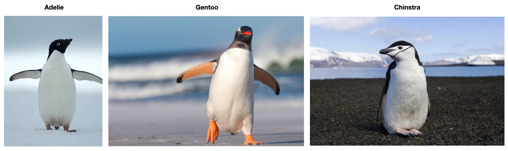

```{r setup, warning=FALSE, message=FALSE, include = FALSE}
library(tidyverse)
library(palmerpenguins)
penguins = penguins
```


# Penguins are cute



package: `palmerpenguins`

---
# Question Set 1

Convert this correlation matrix into a covariance matrix using the information below. Round to 2 digits at each step. 

```{r, echo=FALSE}
round(cor(penguins[,3:6], use = "complete.obs"), digits = 2)

sdbl = round(sd(penguins$bill_length_mm, na.rm = T), digits = 2)
sdbd = round(sd(penguins$bill_depth_mm, na.rm = T), digits = 2)
sdfl = round(sd(penguins$flipper_length_mm, na.rm = T), digits = 2)
sdbm = round(sd(penguins$body_mass_g, na.rm = T), digits = 2)

x = paste0("The standard deviation of ")

paste0(x, "bill length is ", sdbl)
paste0(x, "bill depth is ", sdbd)
paste0(x, "flipper length is ", sdfl)
paste0(x, "body mass is ", sdbm)
```

---

# Question Set 2

- Scientists have discovered that 14% of Adelie penguins have a genetic condition that prevents them from being able to reproduce. If 40 Adelie penguins are selected at random from any of the 3 islands, how many penguins could be expected to be able to reproduce?

- Say that someone ran this analysis and published it with the conclusion that this genetic condition is leading to a decline in Adelie penguins on the Biscoe island. How would you respond to this claim? Do you believe it? What aspects would you be concerned with, in regards to what we discussed with validity? 

```{r, echo=FALSE}
table(penguins$species, penguins$island)
```


---

# Question Set 3

- Get the z-scores of the `body_mass_g` variable "by hand" meaning do not use a `R` function
- Which value is furthest away from the mean? Which is closest?
- Interpret the 10th z-score
- Which of these is an outlier? How do you propose to deal with this outlier?

```{r, echo=FALSE}
tinyp = penguins[c(1:3, 5:11),3:6]
tinyp
```

---

# Question Set 4

- Which of these variables are qualitative? Quantitative?
- Which variable would be appropriate for a binomial question?
- Which variable do you assume is normally distributed? $t$ distributed?
- Calculate the standard error of the mean for `bill_depth_mm` and describe what it means

```{r, echo=FALSE}
tinyp = penguins[c(1:3, 5:11),3:6]
tinyp
```

