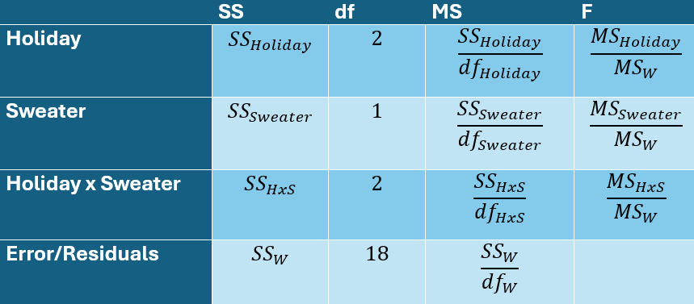
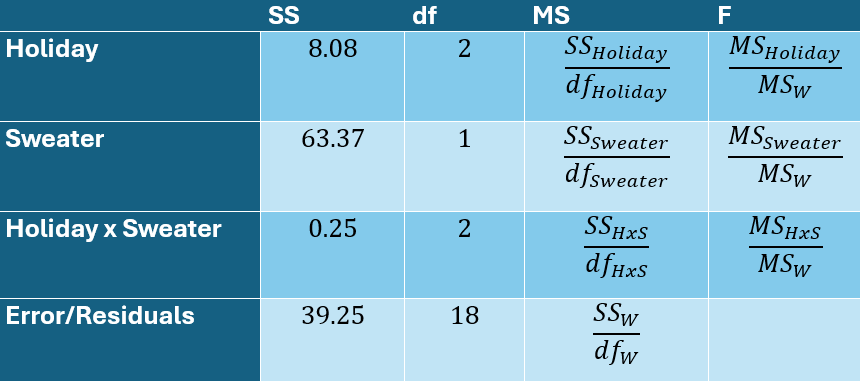
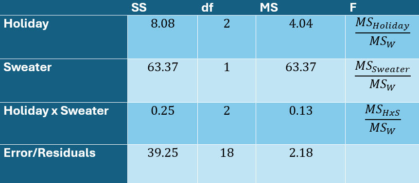
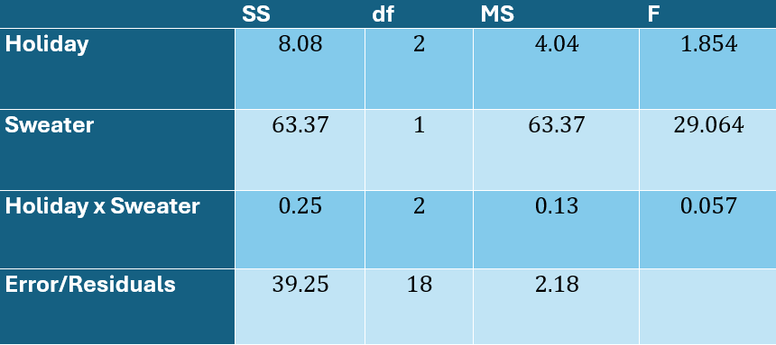

```{r setup, warning=FALSE, message=FALSE, include = FALSE}
library(tidyverse)
library(knitr)
library(kableExtra)
library(effectsize)
```


## Review 1

The holidays are upon us! You want to know if happiness (scale of 1-10) this time of year is impacted by which holiday folks celebrate (Christmas, Hanukkah, Kwanzaa) and ugly sweaters (ugly, not ugly). You're specifically interested in whether these interact. That is, you think that an ugly Christmas sweater might bring more joy than an ugly Hanukkah sweater or ugly Kwanzaa sweater. Here are the data:

|               | Ugly Sweater | Not Ugly Sweater |
|---------------|--------------|------------------|
| **Christmas** | 7, 6, 9, 8   | 4, 5, 3, 5       |
| **Hanukkah**  | 4, 8, 10, 7  | 4, 3, 4, 4       |
| **Kwanzaa**   | 8, 6, 5, 5   | 2, 3, 2, 5       |

Calculate the ANOVA for main effects and interaction. Be able to interpret all *F* tests. Do this using a model comparison approach.

---

###Fill out this table:


---

class: inverse

# Review 1 Answers

---

## Create DataFrame

```{r message=FALSE, warning=FALSE}

holidays <- data.frame(
  Happiness = c(7, 6, 9, 8, 4, 5, 3, 5, 4, 8, 10, 7,
                4, 3, 4, 4, 8, 6, 5, 5, 2, 3, 2, 5),
  Holiday = rep(c("Christmas", "Hanukkah", "Kwanzaa"), each = 8),
  Sweater = rep(c(rep("Ugly", 4), rep("Not Ugly", 4)), 3)
) %>%
  mutate(
    Holiday = as.factor(Holiday),
    Sweater = as.factor(Sweater)
  )

holidays <- holidays %>%
  select(Holiday, Sweater, Happiness)
```

---

```{r message=FALSE, warning=FALSE}
holidays %>% group_by(Holiday) %>%
  slice_head(n = 3) %>%
  kable("html") %>% 
  kable_styling(font_size = 16)
```

---

## Determine Degrees of Freedom

```{r}
# three cells for holiday: christmas, hanukkah, kwanzaa
df_holiday <- 3 - 1
df_sweater <- 2 - 1
df_interaction <- (3-1) * (2-1)

#holiday has 3 levels, sweater has 2 levels 
df_w <- 24 - (3 * 2)

c(df_holiday, df_sweater, df_interaction, df_w)
```

---

## Fill out DF Column:



---


## Sum of Squares for Holiday (Restricted Model)

```{r message=FALSE, warning=FALSE}
grandMean <- mean(holidays$Happiness)

#making a function to calc error
calculate_error <- function(data, predictions) {
  errors <- data$Happiness - predictions
  sum(errors^2)
}

#also known as the error of the restricted model
ss_restricted <- calculate_error(holidays, rep(grandMean, nrow(holidays)))
ss_restricted
```

---

## Sum of Squares for Holiday (Full Model)

```{r message=FALSE, warning=FALSE}
holiday_means <- holidays %>%
  group_by(Holiday) %>%
  summarize(mean_happiness = mean(Happiness), .groups = "drop")

predictions_holiday <- holidays %>%
  left_join(holiday_means, by = "Holiday") %>%
  pull(mean_happiness)

#also known as the error of the full model
ss_full_holiday <- calculate_error(holidays, predictions_holiday)
ss_full_holiday
```

---

## Sum of Squares Holiday is... 

```{r message=FALSE, warning=FALSE}
SSHoliday <- ss_restricted - ss_full_holiday
dfh <- nlevels(holidays$Holiday) - 1
MSHoliday <- SSHoliday / dfh
SSHoliday
```

---

## SS Sweater

```{r}
sweater_means <- holidays %>%
  group_by(Sweater) %>%
  summarize(mean_happiness = mean(Happiness), .groups = "drop")

predictions_sweater <- holidays %>%
  left_join(sweater_means, by = "Sweater") %>%
  pull(mean_happiness)

#calcing the error of the full model for sweater
ss_full_sweater <- calculate_error(holidays, predictions_sweater)
SSSweater <- ss_restricted - ss_full_sweater
SSSweater
```

---

## SS Interaction

The goal is to create a table like this, and calculate the SS Interaction: 

|                  | Ugly Sweater | Not Ugly Sweater | Row Means |
|------------------|--------------|------------------|-----------|
| **Christmas**    | 7, 6, 9, 8   | 4, 5, 3, 5       | **5.875** |
| **Hanukkah**     | 4, 8, 10, 7  | 4, 3, 4, 4       | **5.5**   |
| **Kwanzaa**      | 8, 6, 5, 5   | 2, 3, 2, 5       | **4.5**   |
| **Column Means** | **6.92**     | **3.67**         | **5.29**  |

---

## SS Interaction

```{r, message=FALSE}
means = holidays %>% 
  group_by(Holiday, Sweater) %>% 
  summarize(m = mean(Happiness))

means
```

---

## SS Interaction

```{r echo = FALSE}
#cell means
interaction_means <- holidays %>%
  group_by(Holiday, Sweater) %>%
  summarize(mean_happiness = mean(Happiness), .groups = "drop")

#row and column means
row_means <- holidays %>%
  group_by(Holiday) %>%
  summarize(row_mean = mean(Happiness), .groups = "drop")

col_means <- holidays %>%
  group_by(Sweater) %>%
  summarize(col_mean = mean(Happiness), .groups = "drop")

#table time
interaction_table <- interaction_means %>%
  left_join(row_means, by = "Holiday") %>%
  left_join(col_means, by = "Sweater") %>%
  mutate(
    interaction_effect = mean_happiness - row_mean - col_mean + grandMean
  )
```

```{r echo = FALSE}
interaction_table  %>% 
  kable("html") %>% 
  kable_styling(font_size = 16)
```
```{r}
#calcing SSInteraction
SSInteraction <- sum((interaction_table$interaction_effect)^2) * 4
SSInteraction
```

---

## SS Within

```{r}
predictions_within <- holidays %>%
  left_join(interaction_means, by = c("Holiday", "Sweater")) %>%
  pull(mean_happiness)

SSWithin <- calculate_error(holidays, predictions_within)
SSWithin
```

---

## Fill out the SS Column



---

## Calculate the Mean Squares

```{r}
MSHoliday <- SSHoliday / df_holiday
MSSweater <- SSSweater / df_sweater
MSInteraction <- SSInteraction / df_interaction
MSWithin <- SSWithin / df_w

c(MSHoliday, MSSweater, MSInteraction, MSWithin)
```

---

## Fill out the MS Column



---

## Calculate the F Statistic

```{r}
F_Holiday <- MSHoliday / MSWithin
F_Sweater <- MSSweater / MSWithin
F_Interaction <- MSInteraction / MSWithin

c(F_Holiday, F_Sweater, F_Interaction)
```

---

## Fill out the F Stat Column



---

## Double Checking w/ aov() Output

```{r}
summary(aov(Happiness ~ Holiday * Sweater, data = holidays))
```

-- 

#### What do we conclude about the main effects? 

--

#### Do the effects of Holiday and Sweater interact?

---

## Review 2

#### Do you believe these findings? Which type of validity is threatened and why?

### How about Statistical Conclusion Validity?

- low statistical power
- violations of assumptions
- fishing and the error rate problem
- unreliable measures
- restricted range
- unreliable group assignment 

---

## Review 2

#### Do you believe these findings? Which type of validity is threatened and why?

### How about Internal Validity?

- ambiguous temporal precedence
- selection
- attrition
- history
- maturation
- regression
- testing
- instrumentation


---

## Review 2

#### Do you believe these findings? Which type of validity is threatened and why?

### How about Construct Validity?

- inadequate explication of constructs
- construct confounding
- reactive self-report changes
- reactivity to the experimental situation
- experimenter expectancy
- novelty and disruption effects

---

## Review 2

#### Do you believe these findings? Which type of validity is threatened and why?

### How about External Validity?

- sampling bias
- experimenter effects
- hawthorne effect
- testing effects
- situation effects

---

## Review 3

#### What effect sizes have we learned? Eta-Squared!

---

## Review 3

#### What effect sizes have we learned? Eta-Squared!

```{r}
holiday.aov <- aov(Happiness ~ Holiday * Sweater, data = holidays)
eta_squared(holiday.aov, partial = FALSE)
```

--

```{r}
c(SSHoliday/ss_restricted, SSSweater/ss_restricted)
```

---

## Review 3

#### Now Partial Eta-Squared!

```{r}
holiday.aov <- aov(Happiness ~ Holiday * Sweater, data = holidays)
eta_squared(holiday.aov, partial = TRUE)
```

--

```{r}
c(SSHoliday/(SSWithin + SSHoliday), 
  SSSweater/(SSWithin + SSSweater),
  SSInteraction/(SSWithin + SSInteraction))
```

---

## Review 4

#### What tests did we learn about? 

- Compare sample mean to population mean with unknown sigma

- Compare 2 means with within-groups design

- Compare 2 means with between-groups design

- Compare 3+ levels of IV

- 2+ IVs (main effects/interactions)


---

## Review 4 Answers

| **Situation** | **Which Test?** |
|---------------|-----------------|
| Compare sample mean to population mean with unknown sigma | Single sample *t*  test | 
| Compare 2 means with within-groups design | Paired samples *t* test |  
| Compare 2 means with between-groups design | Independent samples *t* test |  
| Compare 3+ levels of IV | One-way ANOVA (between groups) |  
| 2+ IVs (main effects/interactions) | Two-way ANOVA |  

---

class: inverse

## End of Review

- Good luck on Exam!


