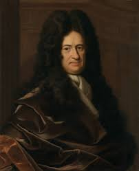

## You are a scientist

 - Roots in philosophy and theology
 
.pull-left[
```{r, echo = F, out.width='100%'}
knitr::include_graphics("images/descartes.jpg")
```
 ]
 
 .pull-right[
```{r, echo = F, out.width='200%'}

```
 ]
 
???
**Descartes (1637)** -- doubt everything and then take as axiomatic only that which proved to be indubitable ("I think therefore I am") and also division between the mind and body. 
- Descartes was also a physicist and mathematician -- developed analytic geometry (Carteisan coordinates named after deCARTES) 
- hypothesized that that bodies were governed in mechanistic ways -- the brain is a complicated system of tubes and valves for shunting animal spirits into specific nerves and therby enacting specific actions (external pressure on sensing device = reflexes) and this work inspired what became modern day neuroscience. 

contemporary of galileo.

- Tried to hide the date of his birth so that he didn't become an object of speculation by astrologers, but an indiscreet added the date Mar 31 1596 to a portrait and that's how we know.

**Locke** -- Disagreed with Descartes. the mind is passive, sensing and perceiving, denied the reality of innate ideas

**Leibniz (mid 1700s) ** -- the mind is not a neutral blank slate, but a veined block of marble whose interal lines cleavage predispose it to be sculpted more easily into some shapes than others (*New Essays on Human Understanding*, published in 1800 by written in early 1700s)

- Discovered binary arithmetic --how computers represent everything today

- developed infinitesmal calculus (a few years after Newton, but he didn't know that because Newton didn't tell anyone) and his notation system is more flexible and easier to use. we use it today

**Helmholz ()** -- developed tools to examine the structure of the eye -- lead to discoveries on perception, and also a tool to measure reaction time to fractions of seconds (galanometer, "stopwatch")
- personally replicated experimetns of other scientists to ensure accuracy

---

## Goals of this sequence

- Develop the basic quantitative skills necessary to be a research scientist
    - Not all the skills you will need (not the only courses you need)
    - Foundations of statistics, methods, and data science

- Contextualize those skills
    - Building a toolbox, not a cookbook
    - How can I use this? Under what circumstances? When should I not use this?
    
.small[- Sequence
  - **611**: Tools of statistics (distilling lots of data to interpretable numbers, sampling, hypothesis testing)
  - **612**: Building models (how do translate our theory into testable relationships using the tools of 611)
  - **613**: Taking it to the next level (special cases, data reduction, psychometics, Bayes)]

---

## Goals of this course

  - Conceptualize __statistics__ as a method for specifying and testing a model of how the world works
  
  - Execute and understand of the use and limitations of null hypothesis significance testing
  
  - (in labs) Wrangle, summarize, test, and display data using R
  
  - *Ideally* everyone will learn at least one thing they can use in their research this term.

---

## Challenges

Many basic statistical tests were developed a century ago.

  - Developed for small samples and hand calculations. 
  
  - Example: minimum sample size = 30 per cell. Why?
  
This class has variance.

???
We continue to build off of these tests today. For example, MLM is built off basics of regression and correlation. We need to understand these methods to move forward. 

But the world is changing rapidly. Heuristics don't apply, there are better ways to do things, and we've messed up these statistics a lot. We'll discuss what's often left out of most statistics courses. 

Goal: don't just do the test, understand what the test does, why you might want to use it, and how you can avoid abusing it


---
## Format

- Learn 
    - Lectures
    - Labs
    - Readings
    
- Practice 
    - Weekly Quizzes (9 total)
    - Homework (3 total)
    
- Demonstrate mastery
    - Oral exam
    
???
There will be some overlap between the readings and lectures, and also between readings and lab. Sometimes there will be overlap between lab and lecture but not always. The goal of this term is to help give you the foundations you need in theory and in tools. We'll put them together more in 612.

Quizzes are meant to test lecture and reading. 
Homework are meant to practice everything.

Talk about quiz policy.

Talk about homework policy.
    
---

## Materials

- Everything is free and available online

- Materials for this course: [uopsych.github.io/psy611](https://uopsych.github.io/psy611/)

---

## R and RMarkdown

This course will use R and RStudio for all analyses. Why?

- Statistical tool
- Reproducibility
- Workflow
- Marketability

If you want extra help, the library has an `R` workshop later this month, as well as workshops on reproducibility (data management, database and spreadsheets, version control with Git, etc).

[https://library.uoregon.edu/research-data-management/training-workshops](https://library.uoregon.edu/research-data-management/training-workshops)

---

# Questions?

For the rest of today:
- some terminology
- scales of measurement

---