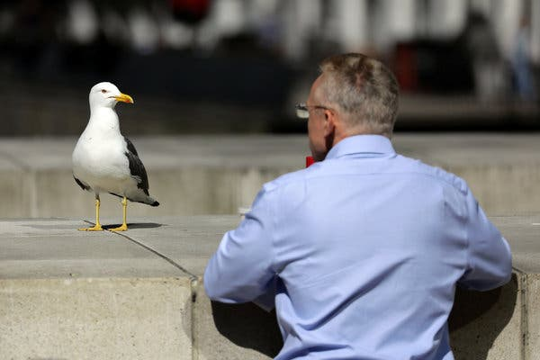
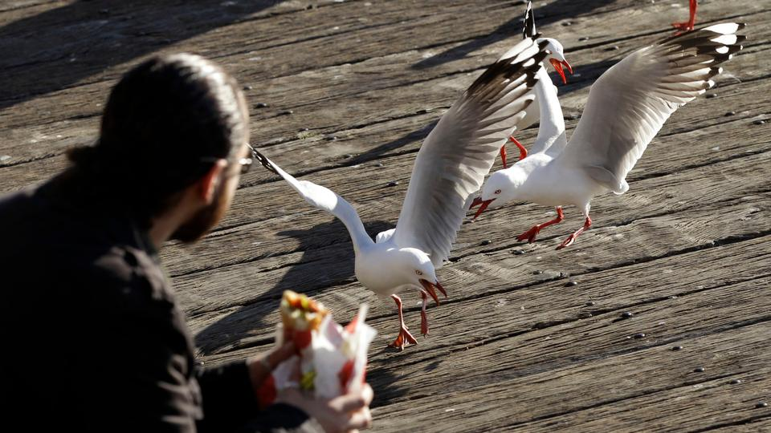
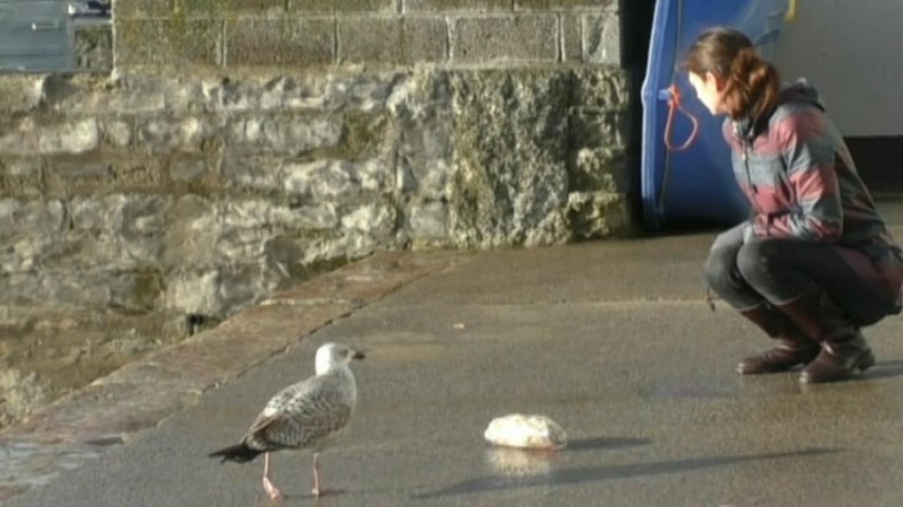
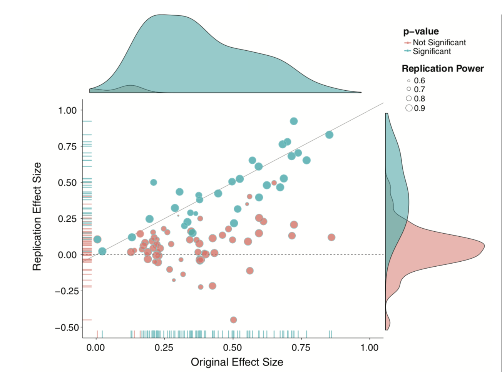
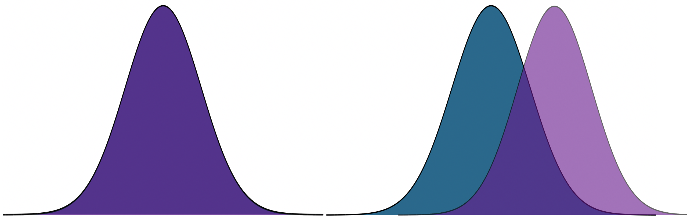

```{r setup, include=FALSE}
knitr::opts_chunk$set(echo = TRUE)
library(here)
library(tidyverse)
library(ggpubr)
library(fivethirtyeight)
library(knitr)
library(kableExtra)
```

## Previously...

* independent samples t-tests

* pooled variance

* effect sizes -- Cohen's D and distribution overlap

* assumptions and dealing with violations
  * normality -- Wilcoxon Rank Sum
  * homogeneity of variance -- Welch's *t*-test
  * independence -- ??
  
---

### Today

Dealing with that pesky independence problem

The independent samples t-test (Student's or Welch's) assumes that the responses in one group are uncorrelated with the responses in the other group.

That independence assumption is sometimes violated, as in the following common research situations:

* Longitudinal data
* Paired samples
* Paired measures 

Note that these are violations *between* groups, but not within groups. For now, we'll deal with the problem of violating independence between two groups, but these techniques won't help you if there is dependency within a group
---

In **longitudinal research**, the same people provide responses to the same measure on two occasions (the individuals in the two groups are the same).

In **paired-sample research**, the individuals in the two groups are different, but they are related and their responses are assumed to be correlated.  Examples would be responses by children and their parents, members of couples, twins, etc.

In **paired-measures research**, the same people provide responses to two different measures that assess closely related constructs.  This resembles longitudinal research, but data collection occurs at one time.

All of these are instances of repeated measures designs.

---

The advantage of repeated measures designs is that, compared to an independent groups design of the same size, the repeated measures design is **more powerful**.

* Two groups are more alike than in simple randomization


* The correlated sampling units will have less variability on "nuisance variables" because those are either the same over time (longitudinal) or over measures (paired measures), or very similar over people (paired samples).

* Nuisance variables -- anything that isn't relevant to the study. 

---

Each of these repeated measures problems can be viewed as a transformation of the original two measures into a single measure:  a difference score.  This reduces the analysis to a one-sample *t*-test on the difference score, with null mean = 0.

---

If the repeated measures are $X_1$ and $X_2$, then their difference is $D = X_1 – X_2$.  This new measure has a mean and standard deviation, like any other single measure, making it appropriate for a one-sample *t*-test.

$$t_{df = N-1} = \frac{\bar{\Delta}-\mu}{\frac{\hat{\sigma}_\Delta}{\sqrt{N}}}$$

.pull-left[
$$H_0: \bar{\Delta} = \mu$$
$$H_1: \bar{\Delta} \neq \mu$$
]

.pull-right[
$$H_0: \bar{\Delta} = 0$$
$$H_1: \bar{\Delta} \neq 0$$
]

???
Note here the signal to noise ratios

---

## Example

Human-wildlife conflict in urban areas endangers wildlife species. One species under threat is the *Larus argentatus* or herring gull, which is considered a nuisance owing to food-snatching and other behaviors. A [recent study](https://royalsocietypublishing.org/doi/10.1098/rsbl.2019.0405) examined whether herring gull behavior is influenced by human behavior cues and whether this could be used to reduce human-gull conflict. 

.pull-left[
]

.pull-right[
In this study, experimenters visited coastal towns in the UK and found locations with multiple gulls. They placed a bag of potato chips (250 g) in front of them and measured how long it took gulls to peck at the food. 
]

---
.pull-left[



In the **Looking At** treatment, the experimenter directed her gaze towards the eye(s) of the gull and turned her head, if necessary, to follow its approach path until the gull completed the trial by pecking at the food bag. 
]

.pull-right[



In the **Looking Away** treatment, the experimenter turned her head and eyes approximately 60° (randomly left or right) away from the gull and maintained this position until she heard the gull peck at the food bag. 
]

"We adopted a repeated measures design... We randomly assigned individuals to receive Looking At or Looking Away first, and trial order was counterbalanced across individuals. Second trials commenced 180 s after the completion of the first trial to allow normal behaviour to resume."

---

```{r}
gulls = read.delim(here("data/gulls/pairs.txt"))
gulls
```

???

FAL = Falmouth
PEN = Penryn

---

### Hypothesis testing

Use a paired-samples *t*-test because we have the same gulls in both conditions. 

--

$\large H_0$: There is no difference in how long it takes gulls to approach food between conditions.

$\large H_1$: Gulls take longer to approach food in one of the conditions.

---

### Sampling distribution

*t*-distribution requires two parameters, a mean and a standard deviation.

The mean of our sampling distribution comes from our null hypothesis, so 

$$\large \mu = 0$$

Our standard deviation of our sampling distribution is the **standard error of difference scores**. This can be found by
  1. calculating difference scores
  2. calculating the standard deviation of the difference scores, and 
  3. dividing the standard deviation by the square root of the number of *pairs* in your study.
  
---

```{r, echo = 1}
difference = gulls$At - gulls$Away
head(difference)
```

--

.pull-left[
We can take the mean of this new variable:

```{r}
(m_delta = mean(difference))
```

]

--
.pull-right[

And we can calculate the standard deviation

```{r, echo = 1}
(s_delta = sd(difference))
```

]

--

To calculate the standard error of our difference scores, we simply divide the standard deviation by the square root of the number of *pairs* or, in the case of repeated measures, the number of *subjects*.

```{r}
(se_delta = s_delta/sqrt(nrow(gulls)))
```

$$\frac{\hat{\sigma}_\Delta}{\sqrt{N}} = `r round(se_delta, 2)`$$
---

```{r, echo = F}
df = nrow(gulls)-1
cv_t = qt(df = df, p = .975)
t_x = seq(-3.76, 3.76)
plot_t = data.frame(t_x) %>%
  ggplot(aes(x=t_x)) +
  stat_function(fun = function(x) dt(x, df), geom = "line") +
  stat_function(fun = function(x) dt(x, df), geom = "area", 
                xlim = c(cv_t, 3.76), fill = "purple") +
  stat_function(fun = function(x) dt(x, df), geom = "area", 
                xlim = c(-3.76, -1*cv_t), fill = "purple") +
  labs(title = "Sampling distribution \n(in t)", y = "density", x = "t")+
  theme_bw(base_size = 20)

cv_x = cv_t*se_delta 
x = t_x*se_delta
plot_x = data.frame(x) %>%
  ggplot(aes(x=x)) +
  stat_function(fun = function(x) dt(x = x/se_delta, df = df), geom = "line") +
  stat_function(fun = function(x) dt(x/se_delta, df = df), geom = "area", 
                xlim = c(cv_x, max(x)), fill = "purple") +
  stat_function(fun = function(x) dt(x/se_delta, df = df), geom = "area", 
                xlim = c(min(x), -1*cv_x), fill = "purple") +
  labs(title = "Sampling distribution \n(in difference in seconds)", y = "density", x = "difference seconds")+
  theme_bw(base_size = 20)

ggarrange(plot_t, plot_x, ncol = 1)
```


---

### Test statistic

$$t_{df = N-1} = \frac{\bar{\Delta}-\mu}{\frac{\hat{\sigma}_\Delta}{\sqrt{N}}}$$

In this case, N refers to the number of pairs, not the total sample size. 


$$t_{df = N-1} = \frac{`r round(m_delta,2)`-0}{`r round(se_delta,2)`} = `r round(m_delta/se_delta,2)`$$

**Note:** A paired-samples *t*-test is *exactly* the same as a one-sample *t*-test on the difference scores. 

---

```{r, echo = F}
df = nrow(gulls)-1
cv_t = qt(df = df, p = .975)
t_x = seq(-3.76, 3.76)
statistic_t = m_delta/se_delta
plot_t = data.frame(t_x) %>%
  ggplot(aes(x=t_x)) +
  stat_function(fun = function(x) dt(x, df), geom = "line") +
  stat_function(fun = function(x) dt(x, df), geom = "area", 
                xlim = c(cv_t, 3.76), fill = "purple") +
  stat_function(fun = function(x) dt(x, df), geom = "area", 
                xlim = c(-3.76, -1*cv_t), fill = "purple") +
  geom_vline(aes(xintercept = statistic_t), linetype = 2, color = "red")+
  labs(title = "Sampling distribution \n(in t)", y = "density", x = "t")+
  scale_x_continuous(limits = c(-3.8, 3.8))+
  theme_bw(base_size = 20)

cv_x = cv_t*se_delta 
x = t_x*se_delta
statistic_x = statistic_t*se_delta
plot_x = data.frame(x) %>%
  ggplot(aes(x=x)) +
  stat_function(fun = function(x) dt(x = x/se_delta, df = df), geom = "line") +
  stat_function(fun = function(x) dt(x/se_delta, df = df), geom = "area", 
                xlim = c(cv_x, max(x)), fill = "purple") +
  stat_function(fun = function(x) dt(x/se_delta, df = df), geom = "area", 
                xlim = c(min(x), -1*cv_x), fill = "purple") +
  geom_vline(aes(xintercept = statistic_x), linetype = 2, color = "red")+
  labs(title = "Sampling distribution \n(in difference in seconds)", y = "density", x = "difference seconds")+
  scale_x_continuous(limits = c(-3.8*se_delta, 3.8*se_delta))+
  theme_bw(base_size = 20)

ggarrange(plot_t, plot_x, ncol = 1)
```


---

Another option is to calculate the area above the absolute value of the test statistic and multiply that by two -- this estimates the probability of finding this test statistic or more extreme.

```{r}
(t_statistic = m_delta/se_delta)
pt(t_statistic, df = 19-1, lower.tail = F)
pt(t_statistic, df = 19-1, lower.tail = F)*2
```

---
## t-test functions

```{r, highlight=2}
t.test(x = gulls$At, y = gulls$Away, 
       paired = TRUE)
```

---

```{r}
ggpubr::ggpaired(data = gulls, cond1 = "At", cond2 = "Away", line.color = "grey",
                 ylab = "Time to approach (seconds)", 
                 title = "Some gulls approach food more quickly when \npeople look away from them")
```

---

## Cohen's D

Calculating a standardized effect size for a paired samples t-test (and research design that includes nesting or dependency) is slightly complicated, because there are two levels at which you can describe results. 

The first level is the **within-subject** (or within-pair, or within-gull) level, and this communicates effect size in the unit of differences (of units).

$$d = \frac{\bar{\Delta}}{\hat{\sigma_\Delta}} = \frac{`r round(m_delta,2)`}{`r round(s_delta,2)`} = `r round(m_delta/s_delta,2)`$$


The interpretation is that, on average, variability within a single gull is about .72 standard deviations of differences.

---

### Cohen's D

```{r} 
lsr::cohensD(x = gulls$At, y = gulls$Away, method = "paired")
```


The second level is the **between-conditions** variance, which is in the units of your original outcome and communicates how the means of the two conditions differ.

For that, you can use the Cohen's d calculated for independent samples *t*-tests.

```{r}
lsr::cohensD(x = gulls$At, y = gulls$Away, method = "pooled")
```

---

**Which one should you use?**

The first thing to recognize is that, unlike hypothesis testing, there are no standards for effect sizes. When Cohen developed his formula in 1988, he never bothered to precisely define $\large \sigma$. Interpretations have varied, but no single method for within-subjects designs has been identified. 

Most often, textbooks will argue for the within-pairs version, because this mirrors the hypothesis test. 

Some (see below) argue the between-conditions version is actually better because the paired-design is used to reduce noise by adjusting our calculation of the standard error. But that shouldn't make our effect bigger, just easier to detect. The other argument is that using the same formula (the between-conditions version) allows us to compare effect sizes across many different designs, which are all trying to capture the same effect.

.small[Westfall, J. (2016). [Five different "Cohen's d" statistics for within-subject designs](http://jakewestfall.org/blog/index.php/2016/03/25/five-different-cohens-d-statistics-for-within-subject-designs/)]

---

### Cohen's D from *t*

This can be calculating from *t*-statistics, allowing you to calculate standardized effect sizes from manuscripts even when the authors did not provide them. 

.pull-left[
**One sample or within-subjects for paired**

$$\large d = \frac{t}{\sqrt{N-1}}$$
]
.pull-right[**Independent sample**

$$\large d = \frac{2t}{\sqrt{N_1+N_2-1}}$$
]


---

## Assumptions

* Independence (between pairs)
* Normality


**Note:** These are the same assumptions as a one-sample *t*-test.

---

## Violating normality

For two independent samples, we can use the Wilcoxon Sum Rank test if we have severe violations of normality. There is a paired-samples version as well.

```{r, warning = F}
wilcox.test(gulls$At, gulls$Away, paired = T)
```

---
background-image: url("images/wrap-up1.jpeg")
background-size: contain

---

background-image: url("images/wrap-up2.jpeg")
background-size: contain

---

background-image: url("images/wrap-up3.jpeg")
background-size: contain

---

background-image: url("images/wrap-up4.jpeg")
background-size: contain

---

background-image: url("images/wrap-up5.jpeg")
background-size: contain

---

background-image: url("images/wrap-up6.jpeg")
background-size: contain

---

Because we're using probability theory, we have to assume independence between trials.

* independent rolls of the die
* independent draws from a deck of cards
* independent... tests of hypotheses?


What happens when our tests are not independent of one another?

* For example, what happens if I only add a covariate to a model if the original covariate-less model is not significant?

* Similarly, what happens if I run multiple tests on one dataset?

---

The issue of independence between tests has long been ignored by scientists. It was only when we were confronted with impossible-to believe results (people have ESP, listening to "When I'm Sixty-Four" by The Beatles makes you younger) that we started to doubt our methods.

And an explosion of fraud cases made us revisit our incentive structures. Maybe we weren't producing the best science we could...

.pull-left[

]

.pull-right[

Since then (2011), there's been greater push to revisit "known" effects in psychology and related fields, with sobering results. 

The good news is that things seem to be changing, rapidly.
]

---

Independence isn't the only assumption we have to make to conduct hypothesis tests. 

We also make assumptions about the underlying populations.


.pull-left[Normality]
.pull-right[Homogeneity of variance]

&nbsp;&nbsp;
Sometimes we fail to meet those assumptions, in which case we may have to change course. 


.small[Picture credit: Cameron Kay]

---

How big of a violation of the assumption is too much?

--

* It depends. 


How do you know your operation X measures your construct A well?

--

* You don't. 

What should alpha be?

--

* You tell me. 


---
class: inverse

Exam 2 (omgggggg!)
