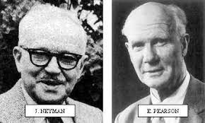
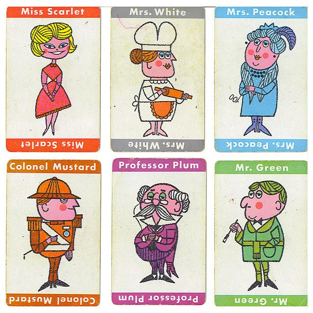
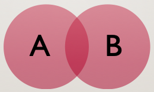

## "Fisher" tradition

.pull-left-small[

]


.pull-right-large[
- Set up a statistical null hypothesis (note that null does NOT mean "nil")
- Report the exact level of significance
- Do not use a "conventional" level, do not talk about accepting/rejecting hypotheses, do not pass GO, and do not collect $200
- Use this procedure *only* if you know very little about the problem at hand
]

---

## Neyman-Pearson

.pull-left-small[

]

.pull-right-large[
- Set up 2 hypotheses, and design a study based no the "rejection region" for each hypothesis
- If data is within the rejection range for H1, accept H2. Otherwise, accept H1. Note that accepting it doesn't mean you *believe* it...just that you act as though it was so
- Utility is limited to situations where there is a clear difference in hypotheses, when you can make a rational decision about when to accept vs. when to reject H1 and H2
]


???
Jerzy Neyman and Egon Pearson

---

## So who won?

The two ideas melded together somehow into something that neither camp would be too excited by:
  1) Set up a null hypothesis, where null almost always means "chance"
  2) Make a yes-no decision about that hypothesis
  3) Repeat

--

We want to know:
  - what is the probability that we would get the values evidenced (*or those more extreme*) given our null hypothesis
  - `r emo::ji('index_pointing_up')` $P(Data + | H_0)$ aka a **p-value**
  - assumes, among other things, that the null hypothesis is *exactly* true, that you have a random sample, and that the scores are independent


---

class: inverse, center

## Probability



---

## Sample Space & Assumptions

Our sample space is the range of possible values for a random variable. 6 Clue characters.

--

Assumption 1) Sum of all the probabilities of all outcomes needs to equal 1. $P(S) = 1$

--

Assumption 2) The probability of an event occurring must be between 0 and 1. $0 \leq P(event) \leq 1$

---

## P(Miss Scarlet)

<center>

</center>

--

- P(Miss Scarlet) = N of events / sample size
- P(Miss Scarlet) = 1 Miss Scarlet / 6 characters
- P(Miss Scarlet) = 1/6

---

## P(Female)

<center>

</center>


--

- P(Female) = N of events / sample size
- P(Female) = 3 females / 6 characters
- P(Female) = 3/6 = .5

---

## Complement

- The probability that the event does *not* occur

- $1-P(event)$

---

## P(NOT Female)

<center>

</center>

--

- P(NOT Female) = N of events / sample size
- P(NOT Female) = 3 not females / 6 characters
- P(NOT Female) = 3/6 = .5

---

## Unions

- The possbility of A _**or**_ B occurring
- All elements that are in one of A or B
- $P(A \cup B)$

<center>

</center>


--

- $P(A \cup B) = P(A) + P(B) - P(A \cap B)$

---


## P(Female or Holding Something)

<center>

</center>


---
## P(Female or Holding Something)

**P(Female)**
- P(Female) = 3/6

--

**P(Holding Something)**
- P(Holding Something) = 4/6

--

**P(Female & Holding Something)**
- P(Female & Holding Something) = 2 females with stuff / 6 characters
- P(Female & Holding Something) = 2/6

--

**P(Female OR Holding Something)**
- P(Female or Holding Something) = 3/6 + 4/6 - 2/6
- P(Female or Holding Something) = **5/6**

---

## Intersection

- The probability of A *and* B occurring
- $P(A \cap B) = P(A) \times P(B | A)$

<center>

</center>

--

**P(Baker & Female)**
- P(Baker) = 1/6
- P(Female GIVEN there is a baker) = 1 baker that's female = 1
- P(Baker & Female) = 1/6 * 1 = 1/6

---

## Intersection

- The probability of A *and* B occurring
- $P(A \cap B) = P(A) \times P(B | A)$
- P(Baker & Female) has *dependent events*; the occurrence of Event A changes the probability of Event B
- *Independent* events would be that the occurence of Event A does NOT impact the occurence of Event B
- *If independent*, $P(A \cap B) = P(A) \times P(B)$

**Independence of observations is one of the criteria for having interpretable $p$-values!**

--

- Half the class plays Clue in this room, other half plays in another room
- Finding the murderer for game 1 doesn't help you find the murderer for game 2
- P(Murderer in Game 1 & Murderer in Game 2) = 1/6 * 1/6 = **1/36**

---

## Permutations
All the ways $n$ objects can be arranged

$N = 2$

```{r, echo=FALSE}
all <- expand.grid(O1 = letters[1:2], O2 = letters[1:2], stringsAsFactors = FALSE) 
perms <- all[apply(all, 1, function(x) {length(unique(x)) == 2}),]
row.names(perms) = NULL
perms
```
---
## Permutations
All the ways $n$ objects can be arranged

$N = 3$

```{r, echo=FALSE}
all <- expand.grid(O1 = letters[1:3], O2 = letters[1:3], O3 = letters[1:3], stringsAsFactors = FALSE) 
perms <- all[apply(all, 1, function(x) {length(unique(x)) == 3}),]
row.names(perms) = NULL
perms
```
---
## Permutations

$N = 4$

```{r, echo = FALSE}
all <- expand.grid(O1 = letters[1:4], O2 = letters[1:4], O3 = letters[1:4], O4 = letters[1:4], stringsAsFactors = FALSE) 
perms <- all[apply(all, 1, function(x) {length(unique(x)) == 4}),]
row.names(perms) = NULL
perms
```
