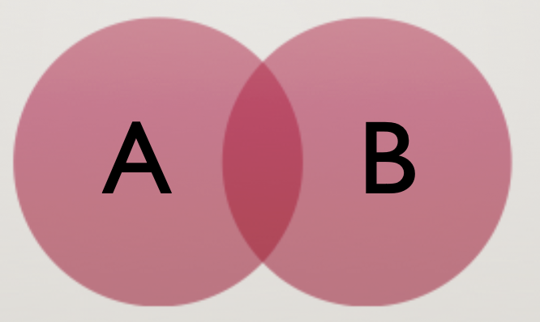

```{r, warning = FALSE, message = FALSE, include = FALSE}
library(tidyverse)
```

## "Fisher" tradition

.pull-left-small[

]


.pull-right-large[
- Set up a statistical null hypothesis (note that null does NOT mean "nil")
- Report the exact level of significance
- Do not use a "conventional" level, do not talk about accepting/rejecting hypotheses, do not pass GO, and do not collect $200
- Use this procedure *only* if you know very little about the problem at hand
]

---

## Neyman-Pearson

.pull-left-small[

]

.pull-right-large[
- Set up 2 hypotheses, and design a study based no the "rejection region" for each hypothesis
- If data is within the rejection range for H1, accept H2. Otherwise, accept H1. Note that accepting it doesn't mean you *believe* it...just that you act as though it was so
- Utility is limited to situations where there is a clear difference in hypotheses, when you can make a rational decision about when to accept vs. when to reject H1 and H2
]


???
Jerzy Neyman and Egon Pearson

---

## So who won?

The two ideas melded together somehow into something that neither camp would be too excited by:
  1) Set up a null hypothesis, where null almost always means "chance"
  2) Make a yes-no decision about that hypothesis
  3) Repeat

--

We want to know:
  - what is the probability that we would get the values evidenced (*or those more extreme*) given our null hypothesis
  - `r emo::ji('index_pointing_up')` $P(Data + | H_0)$ aka a **p-value**
  - assumes, among other things, that the null hypothesis is *exactly* true, that you have a random sample, and that the scores are independent


---

class: inverse, center

## Probability


---

## Sample Space & Assumptions

Our sample space is the range of possible values for a random variable. 6 Clue characters.

--

Assumption 1) Sum of all the probabilities of all outcomes needs to equal 1. $P(S) = 1$

--

Assumption 2) The probability of an event occurring must be between 0 and 1. $0 \leq P(event) \leq 1$

---

## P(Miss Scarlet)

<center>

</center>

--

- P(Miss Scarlet) = N of events / sample size
- P(Miss Scarlet) = 1 Miss Scarlet / 6 characters
- P(Miss Scarlet) = 1/6

---

## P(Female)

<center>

</center>


--

- P(Female) = N of events / sample size
- P(Female) = 3 females / 6 characters
- P(Female) = 3/6 = .5

---

## Complement

- The probability that the event does *not* occur

- $1-P(event)$

---

## P(NOT Female)

<center>

</center>

--

- P(NOT Female) = N of events / sample size
- P(NOT Female) = 3 not females / 6 characters
- P(NOT Female) = 3/6 = .5

---

## Unions

- The possbility of A _**or**_ B occurring
- All elements that are in one of A or B
- $P(A \cup B)$

<center>

</center>


--

- $P(A \cup B) = P(A) + P(B) - P(A \cap B)$

---


## P(Female or Holding Something)

<center>

</center>


---
## P(Female or Holding Something)

**P(Female)**
- P(Female) = 3/6

--

**P(Holding Something)**
- P(Holding Something) = 4/6

--

**P(Female & Holding Something)**
- P(Female & Holding Something) = 2 females with stuff / 6 characters
- P(Female & Holding Something) = 2/6

--

**P(Female OR Holding Something)**
- P(Female or Holding Something) = 3/6 + 4/6 - 2/6
- P(Female or Holding Something) = **5/6**

---

## Intersection

- The probability of A *and* B occurring
- $P(A \cap B) = P(A) \times P(B | A)$

<center>

</center>

--

**P(Baker & Female)**
- P(Baker) = 1/6
- P(Female GIVEN there is a baker) = 1 baker that's female = 1
- P(Baker & Female) = 1/6 * 1 = 1/6

---

## Intersection

- The probability of A *and* B occurring
- $P(A \cap B) = P(A) \times P(B | A)$
- P(Baker & Female) has *dependent events*; the occurrence of Event A changes the probability of Event B
- *Independent* events would be that the occurence of Event A does NOT impact the occurence of Event B
- *If independent*, $P(A \cap B) = P(A) \times P(B)$

**Independence of observations is one of the criteria for having interpretable $p$-values!**

--

- Half the class plays Clue in this room, other half plays in another room
- Finding the murderer for game 1 doesn't help you find the murderer for game 2
- P(Murderer in Game 1 & Murderer in Game 2) = 1/6 * 1/6 = **1/36**

---

## Permutations
All the ways $n$ objects can be arranged

$N = 2$

```{r, echo=FALSE}
all <- expand.grid(O1 = letters[1:2], O2 = letters[1:2], stringsAsFactors = FALSE) 
perms <- all[apply(all, 1, function(x) {length(unique(x)) == 2}),]
row.names(perms) = NULL
perms
```
---
## Permutations
All the ways $n$ objects can be arranged

$N = 3$

```{r, echo=FALSE}
all <- expand.grid(O1 = letters[1:3], O2 = letters[1:3], O3 = letters[1:3], stringsAsFactors = FALSE) 
perms <- all[apply(all, 1, function(x) {length(unique(x)) == 3}),]
row.names(perms) = NULL
perms
```
---
## Permutations

$N = 4$

```{r, echo = FALSE}
all <- expand.grid(O1 = letters[1:4], O2 = letters[1:4], O3 = letters[1:4], O4 = letters[1:4], stringsAsFactors = FALSE) 
perms <- all[apply(all, 1, function(x) {length(unique(x)) == 4}),]
row.names(perms) = NULL
perms
```

---
## Permutations

The number of permutations for $n$ objects is:

$$ n! = n(n-1)(n-2)... $$

--

BUT, if you're looking for the number of $r$ choices from $n$:

$$ \frac{n!}{(n-r)!} $$

--

There are 6 Clue characters, but we are now 100% sure that 2 of them are the culprits. How many possibilities are there?

- $n$ = 6, $r$ = 2
- $\frac{6!}{(6-2)!} = \frac{6!}{4!}$
- $\frac{720}{24} = 30$

---

## Combinations
1 Permutation = Miss Scarlet & Professor Plum. Another permutation is Professor Plum and Miss Scarlet. What if we don't care who comes first and who comes second? The paring of Plum/Scarlet should be good enough!

--

When order doesn't matter, we count the number of **combinations**

$$ \frac{n!}{(n-r)!r!} $$

--

- $n$ = 6, $r = 2$
- $\frac{6!}{(6-2)!2!} = \frac{6!}{4!2!}$
- $\frac{720}{24 * 2} = \frac{720}{48} = 15$
- We have a 1/15 chance of getting the correct 2 culprits out of 6 characters

---
## Combinations on Combinations

We split up the class into 2 different games of Clue. In the first game, we assume 2 culprits. In the second game, we assume 3 culprits. The intersection of these combinations is the probability that we get both the 2 culprits correct in game 1 and the 3 culprits correct in game 2.

--

.pull-left[
#### Game 1
- $n$ = 6, $r = 2$
- $\frac{6!}{(6-2)!2!} = \frac{6!}{4!2!}$
- $\frac{720}{24 * 2} = \frac{720}{48} = 15$
- 1/15
]

.pull-right[
#### Game 2
- $n$ = 6, $r = 3$
- $\frac{6!}{(6-3)!3!} = \frac{6!}{3!3!}$
- $\frac{720}{6 * 6} = \frac{720}{36} = 20$
- 1/20
]

--

<center>
$\frac{1}{15} \times \frac{1}{20} = \frac{1}{300}$

---

## Bernoulli Trials
- Exactly 2 possibilities, success or failure
- Flipping a coin. Heads = Success, Tails = Failure
- Let's say we flip a coin twice. Our possibilities are: TT, TH, HT, HH 

--

**How many ways are there to get 0 Heads out of 2 coin flips?**
- $\frac{2!}{(2-0)!0!} = 1$

--

**How many ways are there to get 1 Heads out of 2 coin flips?**
- $\frac{2!}{(2-1)!1!} = 2$

--

**How many ways are there to get 2 Heads out of 2 coin flips?**
- $\frac{2!}{(2-2)!2!} = 1$

---
## Bernoulli Trials

.pull-left-small[
**How many outcomes are there total?**
- 1 + 2 + 1 = 4
- Probabilities = 1/4, 2/4, 1/4
]

--

.pull-right-large[
```{r, echo = FALSE}
data.frame(heads = 0:2, prob = dbinom(x = 0:2, size = 2, prob = .5)) %>% 
  ggplot(aes(x = factor(heads), y = prob)) +
  geom_col(fill = "#562457") +
  geom_text(aes(label = round(prob, 2), y = prob + .01),
            position = position_dodge(.9),
            size = 5, 
            vjust = 0) +
  labs(title = "Probability of Heads",
       subtitle = "Two Flips",
       x = "Number of Successes (Heads)",
       y = "Probability(Successes)") +
  theme_classic(base_size = 16)
```
]

---
## Bernoulli Trials

.pull-left-small[
Three coin flips?
- TTT, TTH, THT, THH, HTT, HTH, HHT, HHH
]

--

.pull-right-large[
```{r, echo = FALSE}
data.frame(heads = 0:3, prob = dbinom(x = 0:3, size = 3, prob = .5)) %>% 
  ggplot(aes(x = factor(heads), y = prob)) +
  geom_col(fill = "#562457") +
  geom_text(aes(label = round(prob, 2), y = prob + .01),
            position = position_dodge(.9),
            size = 5, 
            vjust = 0) +
  labs(title = "Probability of Heads",
       subtitle = "Three Flips",
       x = "Number of Successes (Heads)",
       y = "Probability(Successes)") +
  theme_classic(base_size = 16)
```
]

---
## Bernoulli Trials

.pull-left-small[
Four coin flips?
]

--

.pull-right-large[
```{r, echo = FALSE}
data.frame(heads = 0:4, prob = dbinom(x = 0:4, size = 4, prob = .5)) %>% 
  ggplot(aes(x = factor(heads), y = prob)) +
  geom_col(fill = "#562457") +
  geom_text(aes(label = round(prob, 2), y = prob + .01),
            position = position_dodge(.9),
            size = 5, 
            vjust = 0) +
  labs(title = "Probability of Heads",
       subtitle = "Four Flips",
       x = "Number of Successes (Heads)",
       y = "Probability(Successes)") +
  theme_classic(base_size = 16)
```
]

--

**Probability Mass Function**

---

## Counting Rule: Combinations

- Previous we used $r$ for choices. Let's be more specific. Let $k$ be the number of *successes*
- Total number of ways of getting $k$ successes out of $n$ trials, irrespective of order:

$$ \Large \frac{n!}{k!(n-k)!} = \binom{n}{k}$$

- Called **binomial coefficient**
- Go back a few slides...we just did this...a lot

---

## Developing a Probability Distribution

Step 1: Get number of ways to get $k$ successes
- We know this already. It's our binomial coefficient
- $\frac{n!}{k!(n-k)!} = \binom{n}{k}$

--

Step 2: Get probability of $k$ successes in any order out of $n$ trials

- For $n$ trials, we only need to know 2 *parameters*:
  - $k$ the number of successes
  - $p$ the probability of a success
  - $q$ is the probability of NOT a success; probability of failure
  
$$p^{k}q^{n-k}$$

$$p^{k}(1-p)^{n-k}$$

---
## Developing a Probability Distribution

Step 3: Combine Steps 1 and 2

$$ 
P(Success) = \binom{n}{k}p^{k}(1-p)^{n-k}
$$
- $k \geq 0$
- Takes into account all of the possibilities! 
---

## What is the probability of getting 3 heads out of 5 coin flips?

Step 1: Binomial Coefficient for combinations

$$
\begin{gather*}
\frac{n!}{k!(n-k)!} \\[8pt]
\frac{5!}{3!(5-3)!} \\[8pt]
\frac{5!}{3!2!} \\[8pt]
\frac{120}{12} \\[8pt]
10
\end{gather*}
$$

---
## What is the probability of getting 3 heads out of 5 coin flips?

Step 2: Associate probabilities 
$$ 
\begin{gather*}
\Large p^{k}(1-p)^{n-k} \\[8pt]
\Large .5^{3}(1-.5)^{5-3} \\[8pt]
\Large .5^{3}(.5)^{2} \\[8pt]
\Large (.125)(.25) \\[8pt]
\Large .03125
\end{gather*}
$$
---
## What is the probability of getting 3 heads out of 5 coin flips?

Step 3: Combine these

$$ 
\begin{gather*}
P(Success) = \binom{5}{3}p^{k}(1-p)^{n-k} \\
P(Success) = \binom{5}{3}.5^{3}(1-.5)^{5-3} \\
P(Success) = 10 * .03125 \\
P(Success = 3_5) = .3125
\end{gather*}
$$

--

Or in `R`
```{r}
dbinom(x = 3, size = 5, prob = .5)
```

---
## Binomial Distribution

$$
\Large p(X=k); n, p = \binom{n}{k}p^k(1-p)^{n-k}
$$

- Parameters of this distribution are $n$ and $p$
- If we change the parameters, we change the distribution
- **Family** of distributions

---

## Family of Distributions

.pull-left[
```{r, echo = FALSE}
data.frame(heads = 0:10, prob = dbinom(x = 0:10, size = 10, prob = .5)) %>% 
  ggplot(aes(x = factor(heads), y = prob)) +
  geom_col(fill = "#562457") +
  geom_text(aes(label = round(prob, 2), y = prob + .01),
            position = position_dodge(.9),
            size = 5, 
            vjust = 0) +
  labs(title = "Binomial Distribution of Coin Flips",
       subtitle = "n = 10, p = .5",
       x = "Number of Successes (Heads)",
       y = "Probability(Successes)") +
  theme_classic(base_size = 16)
```
]

.pull-right[
```{r, echo = FALSE}
data.frame(heads = 0:10, prob = dbinom(x = 0:10, size = 10, prob = (1/6))) %>% 
  ggplot(aes(x = factor(heads), y = prob)) +
  geom_col(fill = "#562457") +
  geom_text(aes(label = round(prob, 2), y = prob + .01),
            position = position_dodge(.9),
            size = 5, 
            vjust = 0) +
  labs(title = "Binomial Distribution of Dice Rolls",
       subtitle = "n = 10, p = 1/6",
       x = "Number of Successes (Rolling a 4)",
       y = "Probability(Successes)") +
  theme_classic(base_size = 16)
```
]