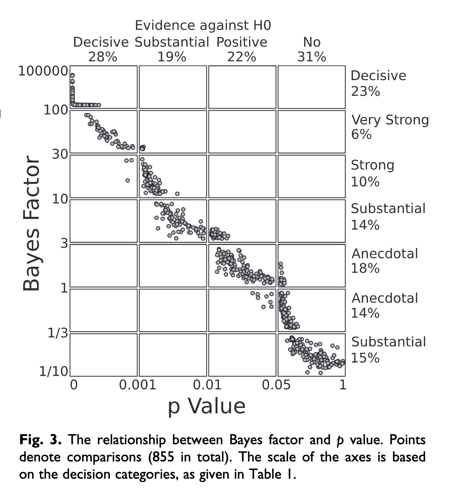

```{r, echo=FALSE, warning=FALSE, message=FALSE, results='hide'}
library(tidyverse)
```

## What the vast majority of [insert field here] do

**Frequentist** approach

  - Sometimes called the "in the long run" view
  
  - Defines probability as what is expected to happen in the long run, if the event in question (e.g., tossing a coin, rolling a die) is repeated over and over and over again
--

    - Ex: We know that a fair coin will come up on heads 50% of the time: $P(H) = .5$
  
    - A coin flipped a 2 times might come up heads both times (100%), but a head flipped 1000 times would not likely come up heads 1000 times. *In the long run, the proportion of heads will converge on the expected probability.*
    
    - This "long run" view means that in the *short run* the outcomes will not behave as expected. They will show variability around the expected probability outcome.


???
Called "frequentist" bc data is a repeatable random sample. there's frequency.

---
## The Frequentist Setup

- Define a null hypothesis & an alternative hypothesis

- Make a yes-no decision about that null hypothesis (accept or reject)

- Repeat

--

The $p$-value is the probability of getting your test statistic (or something more extreme), given that the null hypothesis is true. 
  - If it's a very low probability (less than 5%) of getting that test statistic (+) under the null hypothesis, then we reject the null in favor of the alternative
  
  - But is this explicit support of the null? Can you ever prove the null?

---
## The Upside

- Objective view of probability
- The only way to incorporate prior beliefs is in the study design (informal). There is no way to formally model the experimenter's prior beliefs.
- Assumes that paramters are fixed, unknown constants
- Less computationally intensive

.center[

]

---

## The Bayesian Idea

- Start out with a set of hypotheses. You don't know what is true, but you have some beliefs about which are plausible and which are not.

- Observe the data

- Revise those beliefs
  - If data are consistent with a hypothesis --> belief strengthened
  - If data are inconsistent with a hypothesis --> belief weakened
  
--

- Inherently subjective
- Updating beliefs based on new evidence
- Parameters are unknown and random -- wind up with distributions of parameters
- More computationally intensive

???
The bayesian view can be summarized as "belief revision"

---
## Probability vs. Likelihood

[Gallistel 2015 article](https://www.psychologicalscience.org/observer/bayes-for-beginners-probability-and-likelihood)

--


**Probability attaches to results**

**Likelihood attaches to hypotheses**


???
To frame an understanding of the Bayesian framework, it's worth focusing on the difference between **probability** and **likelihood**

---

## Probability attaches to *results*

Results are mututally exclusive & exhaustive
 - **Mututally exclusive** = 2 events cannot occur at the same time
   - In a coin flip, you can't get both a heads and tails
    
 - **Exhaustive** = events cover the entire sample space
   - Coin flip = 2 possibilities, roll of die = 6 possibilities etc.

--

Law of total probability
 - sum of all probabilities = 1
  
--
  
Ex:
 - You flip a coin 10 times. You predict the outcome of each of your 10 flips.
 - 11 possible results (0 correct predictions - 10 correct predictions)
 - The probabilities of all those possible results sum to 1
 - The actual result (what you predicted) will only be 1 of the possible results. 

---

## Likelihood attaches to *hypotheses*

Hypotheses are NOT mutually exclusive
 - Data: Participant A predicts 7 out of 10 outcomes
 - H1: Participant A guessed and got lucky
 - H2: Prticipant A might be somewhat clairvoyant
   - that *might be* part is not a statement of certainty
   - they may be or they may not be clairvoyant
   - H1 is not mutually exclusive from H2

--

Hypotheses are NOT exhaustive
 - The sky's the limit
 - IRL, we basically never test even close to all the possible hypotheses 
  
--

Can we say that the likelihood of a hypothesis + likelihood of another hypothesis sums to 1 (or to anything)?
 - Likelihoods don't have inherent meaning
 - Relative likelihoods (ratio of 2 likelihoods) do have meaning

---
## A Binomial Probabiliity Function

.pull-left[
The parameters of the binomial distribution are $N$ & $\theta$
  - We assume these are given
  - We use this to compute **probabilities**
  

```{r, echo=FALSE}
data <- data.frame(Successes = 0:10,
                   Probabilities = dbinom(x = 0:10, size = 10, prob = .5))
data
```

```{r}
sum(data$Probabilities)
```
]

.pull-right[
```{r echo=FALSE}
ggplot(data = data, aes(x = Successes, y = Probabilities)) +
  geom_col(position = "dodge", fill = "darkgreen") +
  labs(x = "Number of Successes") +
  theme_classic()
```
]

---
## A Binomial Likelihood Function

.pull-left[
We are given the number of successes & number of trials
  - 7 correct and 10 trials
  - These become the "parameters"
  - *"What are the different probabilities of success?"*
  - Continuous! AUC = 1
  

```{r, echo=FALSE}
data <- data.frame(Probabilities = seq(0,1,.01),
                   Likelihoods = dbinom(x = 7, size = 10, prob = seq(0,1,.01)))
head(data)
```

]

.pull-right[
```{r echo=FALSE}
ggplot(data = data, aes(x = Probabilities, y = Likelihoods)) +
  geom_density(stat = "identity", fill = "darkgreen") +
  theme_classic()
```
]

---
## Binomial Likelihood function

.pull-left[
What does this mean?
 - Rather than varying # of success, we're varying probabilities of getting 7 correct out of 10 trials -- a **distribution** of successful predictions
 - The probability of getting 7 correct out of 10 trials is unlikely to be .1
 - The probability of getting 7 correct out of 10 trials is more likely to be .7
 - The probability of getting 7 correct out of 10 trials being .5 is not as likely as a probability of .7, but it wouldn't be shocking either.
]

.pull-right[
```{r echo=FALSE}
ggplot(data = data, aes(x = Probabilities, y = Likelihoods)) +
  geom_density(stat = "identity", fill = "darkgreen") +
  theme_classic()
```
]

---
## Binomial Likelihood function

Hypothesis 1: The probabilitiy of getting 7 correct out of 10 trials is .7

Hypothesis 2: The probability of getting 7 correct out of 10 trials is .5

--

Which hypothesis is more *likely*? 
  - Get the likelihood of Hypothesis 1; P(.7) = L(`r round(data[71,2], digits = 2)`)
  - Get the likelihood of Hypothesis 2; P(.5) = L(`r round(data[51,2], digits = 2)`)
  - Look at the ratio of `r round(data[71,2], digits = 2)` to `r round(data[51,2], digits = 2)`, which is **`r round(x = (data[71,2]/data[51,2]), digits = 2)`**
  
--
  
Interpretation:
  - Given our experimental results, Hypothesis 1 is ~2x as likely as Hypothesis 2 (a little more than 2x as likely)
  
---
## $p$-values

.pull-left[
### Frequentist

$$p = P(\text{Data}|H_0)$$
The land of probabilities
]

.pull-right[
### Bayesian
$$\text{Bayes Factor} = \frac{P(\text{Data}|H_A)}{P(\text{Data}|H_0)}$$
The land of likelihoods
]

---
## Which is right?

* $p$-values and Bayes Factor are highly correlated ([Wetzels et al., 2011](../readings/Wetzels_etal_2011.pdf)).


???

Note that $H_A$ can be a range of possible parameters, in which case, you get the weighted probability across many, or the integral if a continuous range. 

---

```{r, echo = F, out.width='75%'}

```

.small[([Wetzels et al., 2011](../readings/Wetzels_etal_2011.pdf))]

???
But major disagreement in conclusion.

- When $p$-value falls between .01 and .05, there is a 70% chance that Bayes Factor suggests only anecdotal evidence in favor of alternative. 

Take-away -- Bayes Factor is more conservative when it comes to finding evidence against the null hypothesis. Is that better, or worse?

---

class: inverse

## Next time...

Sampling distributions

$t$-distributions